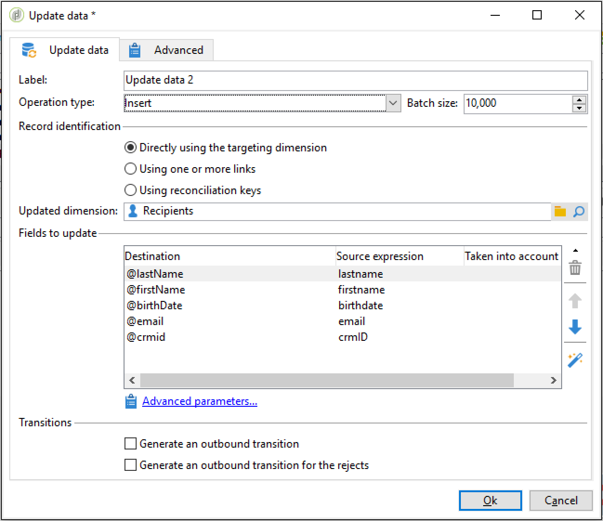

# 导入数据{#importing-data}

## 如何收集数据 {#how-to-collect-data}

### 使用列表中的数据： 读取列表 {#using-data-from-a-list--read-list}

在工作流中发送的数据可以来自列表，据此数据已事先准备好并进行结构化。

此列表可能是直接在Adobe Campaign中创建的，或由选项 **[!UICONTROL Import a list]** 导入。 For more on this option, refer to this [page](../../platform/using/generic-imports-and-exports.md).

有关在工作流中使用读取列表活动的详细信息，请参阅 [读取列表](../../workflow/using/read-list.md)。

### 从文件加载数据 {#loading-data-from-a-file}

可以从结构化文件中提取工作流中处理的数据，以便将其导入Adobe Campaign。

在“数据加载（文件）”部分可以找 [到加载活动的说](../../workflow/using/data-loading--file-.md) 明。

要导入的结构化文件示例：

```
lastname;firstname;birthdate;email;crmID
Smith;Hayden;23/05/1989;hayden.smith@example.com;124365
Mars;Daniel;17/11/1987;dannymars@example.com;123545
Smith;Clara;08/02/1989;hayden.smith@example.com;124567
Durance;Allison;15/12/1978;allison.durance@example.com;120987
```

## 在处理文件之前解压缩或解密文件 {#unzipping-or-decrypting-a-file-before-processing}

### 关于预处理阶段 {#about-pre-processing-stages}

Adobe Campaign允许您导入压缩或加密文件。 在数据加载（文件） [活动中读取它们之前](../../workflow/using/data-loading--file-.md) ，您可以定义一个预处理来解压缩或解密文件。

要做到这一点，请执行以下操作：

1. 使用 [控制面板](https://docs.adobe.com/content/help/en/control-panel/using/instances-settings/gpg-keys-management.html#decrypting-data) ，生成公钥／私钥对。

   >[!NOTE]
   >
   >控制面板适用于在AWS上托管的所有客户（预先托管其营销实例的客户除外）。

1. 如果Adobe Campaign安装由Adobe托管，请与Adobe客户服务部联系，在服务器上安装必要的实用程序。
1. 如果您的Adobe Campaign安装是事先安装的，请安装您要使用的实用程序(例如： GPG、GZIP)以及应用程序服务器上必需的密钥（加密密钥）。

然后，您可以在工作流中使用所需的预处理命令：

1. 在工作流中添 **[!UICONTROL File transfer]** 加和配置活动。
1. 添加 **[!UICONTROL Data loading (file)]** 活动并定义文件格式。
1. 选中该 **[!UICONTROL Pre-process the file]** 选项。
1. 指定要应用的预处理命令。
1. 添加其他活动以管理来自文件的数据。
1. 保存并执行您的工作流。

在下面的用例中给出一个示例。

**相关主题：**

* [数据加载（文件）活动](../../workflow/using/data-loading--file-.md)。
* [压缩或加密文件](../../workflow/using/how-to-use-workflow-data.md#zipping-or-encrypting-a-file)。

### 用例： 导入使用控制面板生成的密钥加密的数据 {#use-case-gpg-decrypt}

在此用例中，我们将构建一个工作流，以便使用控制面板中生成的密钥导入外部系统中已加密的数据。

本节还提供了一个教程视频，其中显示了如何使用GPG密钥解密 [数据](https://docs.adobe.com/content/help/en/campaign-classic-learn/tutorials/administrating/control-panel-acc/gpg-key-management/decrypting-data.html)。

执行此用例的步骤如下：

1. 使用控制面板生成密钥对（公共／私有）。 控制面板文档中提供 [了详细步骤](https://docs.adobe.com/content/help/en/control-panel/using/instances-settings/gpg-keys-management.html#decrypting-data)。

   * 公钥将与外部系统共享，外部系统将使用公钥加密要发送给活动的数据。
   * Campaign Classic将使用私钥解密传入的加密数据。

   

1. 在外部系统中，使用从控制面板下载的公钥加密要导入到Campaign Classic中的数据。

   

1. 在Campaign Classic中，构建一个工作流以导入加密数据，并使用通过控制面板安装的私钥对其进行解密。 为此，我们将按如下方式构建工作流：

   

   * **[!UICONTROL File transfer]** 活动: 将文件从外部源传输到Campaign Classic。 在此示例中，我们希望从SFTP服务器传输文件。
   * **[!UICONTROL Data loading (file)]** 活动: 将数据从文件加载到数据库中，并使用控制面板中生成的私钥对其进行解密。

1. 打开 **[!UICONTROL File transfer]** 活动，然后指定要从中导入加密的。gpg文件的外部帐户。

   

   有关如何配置活动的全局概念，请参 [阅本节](../../workflow/using/file-transfer.md)。

1. 打开 **[!UICONTROL Data loading (file)]** 活动，然后根据需要配置它。 有关如何配置活动的全局概念，请参 [阅本节](../../workflow/using/data-loading--file-.md)。

   为活动添加预处理阶段，以解密传入数据。 为此，请选择选 **[!UICONTROL Pre-process the file]** 项，然后在字段中复制并粘贴此解密命 **[!UICONTROL Command]** 令：

   `gpg --batch --passphrase passphrase --decrypt <%=vars.filename%>`

   

   >[!CAUTION]
   >
   >在本示例中，我们使用控制面板默认使用的密码短语，即“密码短语”。
   >
   >如果您过去通过客户关怀请求在实例上安装了GPG密钥，则该密码可能已更改，并且默认情况下与该密码不同。

1. 单击 **[!UICONTROL OK]** 以确认活动配置。

1. 您现在可以运行工作流。 一旦执行，您就可以检入已执行解密且已导入文件中数据的工作流日志。

   

## 导入数据时的最佳实践 {#best-practices-when-importing-data}

谨慎并遵循下面详述的几个简单规则将有助于确保数据库内数据的一致性，避免在数据库更新或数据导出过程中出现常见错误。

### 使用导入模板 {#using-import-templates}

大多数导入工作流应包含以下活动: **[!UICONTROL Data loading (file)]**、 **[!UICONTROL Enrichment]**、 **[!UICONTROL Split]**、 **[!UICONTROL Deduplication]**、 **[!UICONTROL Update data]**。

使用导入模板可以非常方便地准备类似的导入并确保数据库中的数据一致性。 在“工作流模板”部分了解如何构 [建工作流模板](../../workflow/using/building-a-workflow.md#workflow-templates) 。

在许多项目中，导入是无 **[!UICONTROL Deduplication]** 活动构建的，因为项目中使用的文件没有重复。 重复有时会从导入其他文件时显示。 因此，重复数据消除很困难。 因此，外部重复数据删除步骤是所有进口工作流的良好预防措施。

切勿假定传入数据是一致、正确的，或由IT部门或Adobe Campaign主管负责处理。 在项目过程中，请牢记数据清理。 在导入数据时，消除重复、协调和维护一致性。

导入模板示例在设置重复 [导入部分中可用](#setting-up-a-recurring-import) 。

### 使用平面文件格式 {#using-flat-file-formats}

导入的最有效格式是平面文件。 平面文件可以在数据库级别以批量模式导入。

例如：

* 分隔符： 制表符或分号
* 带标题的第一行
* 无字符串分隔符
* 日期格式： YYYY/MM/DD HH:mm:SS

Adobe Campaign无法使用标准文件导入活动导入XML文件。 可以使用JavaScript导入XML文件，但只能使用小卷： 每个文件的记录少于10K。

### 使用压缩和加密 {#using-compression-and-encryption}

尽可能使用压缩文件进行导入和导出。

在Linux上，可以解压缩文件并同时使用命令行导入。 例如：

```
zcat nl6/var/vp/import/filename.gz
```

如果文件不安全，最好对通过网络发送的文件进行加密。 GPG可用于此。

### 从文件批量加载数据 {#loading-data-in-batch-from-files}

从文件批量加载数据比实时加载一行更有效（例如，通过Web服务）。

使用Web服务导入效率不高。 最好尽可能使用文件。

调用外部Web服务来实时丰富用户档案，也会导致性能问题和内存泄漏，因为它在线级工作。

如果您需要导入数据，最好使用工作流进行批量导入，而不是使用Web 应用程序或Web服务进行实时导入。

### 使用数据管理 {#using-data-management}

使用JavaScript以迭代模式（逐行）加载应限制为小卷。

为获得更高的效率，请始终在 **[!UICONTROL Data Loading (File)]** 数据管理工作流中使用活动。

### 在增量模式下导入 {#importing-in-delta-mode}

常规导入必须在增量模式下完成。 这意味着每次只向Adobe Campaign发送修改或新数据，而不是向整个表发送。

完全导入应仅用于初始加载。

使用数据管理而非JavaScript导入数据。

### 维护一致性 {#maintaining-consistency}

要在Adobe Campaign库中保持数据一致性，请遵循以下原则：

* 如果导入的数据与Adobe Campaign中的引用表匹配，则应将其与工作流中的该表协调。 不匹配的记录应被拒绝。
* 确保导入的数据始终“ **标准化** ”（电子邮件、电话号码、直接邮件地址），并且此标准化是可靠的，并且多年内不会更改。 如果不是这样，某些重复可能会出现在Adobe Campaign库中，而由于不提供进行“模糊”匹配的工具，因此很难管理和删除这些数据。
* 事务数据应具有合并关键项并与现有数据协调，以避免创建重复。
* **按顺序导入相关文件**。

   如果导入由多个相互依赖的文件组成，则工作流应确保以正确的顺序导入文件。 文件失败时，不导入其他文件。

* **在导入**&#x200B;数据时，消除重复、协调并维护一致性。

## 设置重复导入 {#setting-up-a-recurring-import}

如果需要定期导入结构相同的文件，使用导入模板是最佳做法。

此示例说明如何预先设置一个工作流，该工作流可用于导入来自用户档案库中CRM的Adobe Campaign。 有关每个活动的所有可能设置的详细信息，请参阅此 [部分](../../workflow/using/about-activities.md)。

1. 从创建新的工作流模板 **[!UICONTROL Resources > Templates > Workflow templates]**。
1. 添加以下活动:

   * **[!UICONTROL Data loading (file)]**: 定义包含要导入的数据的文件的预期结构。
   * **[!UICONTROL Enrichment]**: 协调导入的数据与数据库数据。
   * **[!UICONTROL Split]**: 创建过滤器，根据记录是否可以对帐，以不同方式处理记录。
   * **[!UICONTROL Deduplication]**: 在将数据插入数据库之前，从传入文件中消除重复数据。
   * **[!UICONTROL Update data]**: 使用导入的用户档案更新数据库。

   

1. 配置 **[!UICONTROL Data Loading (file)]** 活动:

   * 通过上传示例文件来定义预期结构。 示例文件应仅包含几行，但包含导入所需的所有列。 检查并编辑文件格式，确保正确设置每列的类型： 文本、日期、整数等。 例如：

      ```
      lastname;firstname;birthdate;email;crmID
      Smith;Hayden;23/05/1989;hayden.smith@mailtest.com;123456
      ```

   * 在部分 **[!UICONTROL Name of the file to load]** 中，选 **[!UICONTROL Upload a file from the local machine]** 择该字段并将其留空。 每次从此模板创建新工作流时，您都可以在此处指定所需的文件，只要该文件与定义的结构相对应。

      您可以使用任何选项，但必须相应地修改模板。 例如，如果您选择 **[!UICONTROL Specified in the transition]**&#x200B;了此选项，则 **[!UICONTROL File Transfer]** 可以在之前添加活动，以检索要从FTP/SFTP服务器导入的文件。 通过S3或SFTP连接，您还可以使用Adobe实时Adobe Campaign平台将细分数据导入客户。 For more on this, refer to this [documentation](https://docs.adobe.com/content/help/en/experience-platform/rtcdp/destinations/destinations-cat/adobe-destinations/adobe-campaign-destination.html).

      

1. 配置 **[!UICONTROL Enrichment]** 活动。 此活动的目的是识别传入数据。

   * 在选项 **[!UICONTROL Enrichment]** 卡中，选 **[!UICONTROL Add data]** 择并定义导入数据与收件人定位维度之间的链接。 在此示例中， **CRM ID自定** 义字段用于创建连接条件。 只要字段允许识别唯一记录，就可以使用所需字段或字段组合。
   * 在选项卡 **[!UICONTROL Reconciliation]** 中，将选项保留 **[!UICONTROL Identify the document from the working data]** 为未选中状态。

   

1. 配置活动 **[!UICONTROL Split]** 以在一个过渡和收件人中检索已协调的收件人，这些无法协调，但在第二个过渡中具有足够的数据。

   然后，具有已协调过渡的收件人可以用于更新数据库。 如果文件中有最少一组信息可用，则具有未知过渡的收件人随后可用于在数据库中创建新收件人条目。

   在补充出站收件人中，将选择无法协调且没有足够数据的过渡，并可以在单独的文件中导出，或只是忽略。

   * 在活动 **[!UICONTROL General]** 的选项卡中，选 **[!UICONTROL Use the additional data only]** 择“筛选设置”并确保 **[!UICONTROL Targeting dimension]** 自动设置为 **[!UICONTROL Enrichment]**。

      选中 **[!UICONTROL Generate complement]** 此选项，可查看是否无法在数据库中插入任何记录。 如果需要，您随后可以对补充数据应用进一步处理： 文件导出、列表更新等。

   * 在选项卡的第一个 **[!UICONTROL Subsets]** 子集中，在入站填充上添加过滤条件，以仅选择收件人主键不等于0的记录。 这样，在该子集中选择与来自收件人库的数据协调的文件数据。

      

   * 添加第二个子集，它选择具有足够数据要插入数据库的未协调记录。 例如： 电子邮件地址、名字和姓氏。

      子集按其创建顺序进行处理，这意味着当处理第二个子集时，在第一子集中已经选择数据库中已存在的所有记录。

      

   * 在前两个子集中未选择的所有记录都在中选择 **[!UICONTROL Complement]**。

1. 配置位 **[!UICONTROL Update data]** 于之前配置的活动的第一个出站过渡 **[!UICONTROL Split]** 之后的活动。

   * 选 **[!UICONTROL Update]** 择为 **[!UICONTROL Operation type]** ，因为入站过渡只包含数据库中已存在的收件人。
   * 在部 **[!UICONTROL Record identification]** 分中，选 **[!UICONTROL Using reconciliation keys]** 择并定义定位维度和在中创建的链接之间的键 **[!UICONTROL Enrichment]**。 在此示例中， **使用CRM** ID自定义字段。
   * 在部 **[!UICONTROL Fields to update]** 分中，指示收件人维中的字段，以使用文件中的相应列的值进行更新。 如果文件列的名称与收件人维字段的名称相同或几乎相同，则可以使用魔棒按钮自动匹配不同的字段。

      

1. 配置位 **[!UICONTROL Deduplication]** 于包含未对帐活动的过渡之后的收件人:

   * 选 **[!UICONTROL Edit configuration]** 择定位维度并将其设置为从工作流的活动 **[!UICONTROL Enrichment]** 生成的临时模式。

      

   * 在此示例中，电子邮件字段用于查找唯一用户档案。 您可以使用您确定已填写的任何字段，并且它是唯一组合的一部分。
   * 在屏 **[!UICONTROL Deduplication method]** 幕中，选 **[!UICONTROL Advanced parameters]** 择并选中选 **[!UICONTROL Disable automatic filtering of 0 ID records]** 项，以确保主键等于0(该键应为此过渡的所有记录)的记录不被排除。

   

1. 配置先 **[!UICONTROL Update data]** 前配置活动之 **[!UICONTROL Deduplication]** 后的活动。

   * 选 **[!UICONTROL Insert]** 择为 **[!UICONTROL Operation type]** ，因为入站过渡只包含数据库中不存在的收件人。
   * 在节 **[!UICONTROL Record identification]** 中，选 **[!UICONTROL Directly using the targeting dimension]** 择并选择 **[!UICONTROL Recipients]** 尺寸。
   * 在部 **[!UICONTROL Fields to update]** 分中，指示收件人维中的字段，以使用文件中的相应列的值进行更新。 如果文件列的名称与收件人维字段的名称相同或几乎相同，则可以使用魔棒按钮自动匹配不同的字段。

      

1. 在活动的第三个 **[!UICONTROL Split]** 过渡之后，如 **[!UICONTROL Data extraction (file)]** 果要跟踪未插入 **[!UICONTROL File transfer]** 的数据，请添加活动和活动。 配置这些活动以导出所需列，并在FTP或SFTP服务器上传输文件，从中可以检索文件。
1. 添加 **[!UICONTROL End]** 活动并保存工作流模板。

该模板现在可以使用，并且可用于每个新工作流。 然后，需要全部指定包含要在活动中导入的数据的文 **[!UICONTROL Data loading (file)]** 件。


