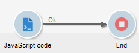
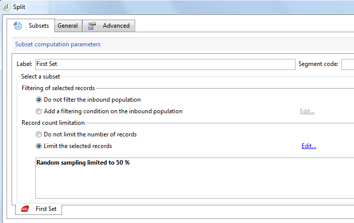

# JavaScript 脚本和模板{#javascript-scripts-and-templates}

脚本使计算值、在进程中的不同任务之间交换数据以及使用SOAP调用执行特定操作成为可能。

脚本在工作流程图中无处不在：

* 所有活动都有初始化脚本。 初始化脚本在激活活动时执行，可用于初始化变量和修改属性。
* “JavaScript代码”活动只用于执行脚本。
* “测试”活动会评估JavaScript表达式，以激活相应的过渡。
* 大多数文本字段是JavaScript模板：JavaScript表达式可以包含在&lt;%=和%>之间。 这些字段优惠一个按钮，该按钮可打开一个下拉列表，帮助您输入表达式。

   

## 公开的{#objects-exposed}对象

在工作流上下文中执行的JavaScript访问一系列附加全局对象。

* **实例**:表示正在执行的工作流。此对象的模式为&#x200B;**xtk:workflow**。
* **任务**:表示正在执行的任务。此对象的模式为&#x200B;**xtk:workflowTask**。
* **事件**:表示激活所执行任务的事件。此对象的模式为&#x200B;**xtk:workflowEvent**。 未针对从多个活动激活的&#x200B;**AND-join**&#x200B;类型过渡初始化此对象。
* **事件**:表示激活当前任务的事件的列表。此对象的模式为&#x200B;**xtk:workflowEvent**。 此表通常包含一个元素，但可能包含几个&#x200B;**AND-join**&#x200B;类型活动，这些类型已基于几个过渡激活。
* **活动**:表示正在执行的任务的模型。此对象的模式取决于活动类型。 此对象可由初始化脚本修改，在其他脚本中，修改具有不可确定的效果。

单击脚本工具栏右侧的按钮，即可在下拉列表中查看这些对象的可用属性。

>[!CAUTION]
>
>这些对象的属性是只读的，vars属性的子属性除外。
>  
>大多数这些属性仅在执行基本任务或实例被钝化后才更新。 读取的值不一定与当前状态匹配，而是与之前的状态匹配。

**示例**

在此示例中和在以下示例中，创建一个包含&#x200B;**JavaScript代码**&#x200B;活动和&#x200B;**End**&#x200B;活动的工作流，如下图所示。



多次 — 单击&#x200B;**JavaScript代码**&#x200B;活动并插入以下脚本：

```
logInfo("Label: " + instance.label)
logInfo("Start date: " + task.creationDate)
```

**[!UICONTROL logInfo(message)]**&#x200B;函数将消息插入日志。

单击&#x200B;**[!UICONTROL OK]**&#x200B;以关闭创建向导，然后使用位于工作流列表右上方的操作按钮开始工作流。 执行结束时，请查阅日志。 您应当看到与脚本对应的两条消息：一个显示工作流的标签，另一个显示激活脚本的日期。

## 变量{#variables}

变量是&#x200B;**[!UICONTROL instance]**、**[!UICONTROL task]**&#x200B;和&#x200B;**[!UICONTROL event]**&#x200B;对象的free属性。 为这些变量授权的JavaScript类型有&#x200B;**[!UICONTROL string]**、**[!UICONTROL number]**&#x200B;和&#x200B;**[!UICONTROL Date]**。

### 实例变量{#instance-variables}

实例变量(**[!UICONTROL instance.vars.xxx]**)与全局变量类似。 所有活动都共享。

### 任务变量{#task-variables}

任务变量(**[!UICONTROL task.vars.xxx]**)与局部变量类似。 它们只供当前任务使用。 持久活动使用这些变量来保留数据，有时用于在同一活动的不同脚本之间交换数据。

### 事件变量{#event-variables}

事件变量(**[!UICONTROL vars.xxx]**)支持在工作流进程的基本任务之间交换数据。 这些变量由激活进行中任务的任务传递。 可以修改它们并定义新的。 然后，它们会传递到以下活动。

>[!CAUTION]
>
>对于[AND-join](../../workflow/using/and-join.md)类型活动，将合并变量，但如果同一变量定义两次，则存在冲突，值仍未确定。

事件是最常使用的变量，它们应优先用于实例变量。

某些事件变量由各种活动修改或读取。 这些都是字符串类型变量。 例如，导出将设置&#x200B;**[!UICONTROL vars.filename]**&#x200B;变量，其名称为刚导出的文件的全名。 所有这些读取或修改的变量都记录在[关于活动](../../workflow/using/about-activities.md)中，位于活动的&#x200B;**输入参数**&#x200B;和&#x200B;**输出参数**&#x200B;部分。

### 用例 {#example}

>[!NOTE]
>
>在[本节](../../workflow/using/about-workflow-use-cases.md)中提供了其他工作流使用案例。

**示例1**

在此示例中，实例变量用于动态计算要应用于人口的拆分百分比。

1. 创建工作流并添加开始活动。

1. 添加和配置JavaScript代码活动以定义实例变量。

   例如：`instance.vars.segmentpercent = 10;`

   

1. 根据您的需要添加查询活动和目标收件人。

1. 添加“拆分”活动并将其配置为对传入人口执行随机采样。 取样百分比可以是您选择的任何内容。 在本例中，它设置为50%。

   它是动态更新的百分比，这要归功于之前定义的实例变量。

   

1. 在“拆分”活动的“高级”选项卡的“初始化脚本”部分中，定义JS条件。 JS条件选择从“拆分”过渡中出来的第一个活动的随机采样百分比，并将其更新为先前创建的实例变量设置的值。

   ```
   activity.transitions.extractOutput[0].limiter.percent = instance.vars.segmentpercent;
   ```

   

1. 确保在“拆分”活动的单独过渡中生成补码，并在每个出站过渡之后添加“结束”活动。

1. 保存并执行工作流。 根据实例变量应用动态采样。

   

**示例 2**

1. 从上例中采用工作流，将&#x200B;**JavaScript代码**&#x200B;活动的脚本替换为以下脚本：

   ```
   instance.vars.foo = "bar1"
   vars.foo = "bar2"
   task.vars.foo = "bar3"
   ```

1. 将以下脚本添加到&#x200B;**End**&#x200B;活动的初始化脚本中：

   ```
   logInfo("instance.vars.foo = " + instance.vars.foo)
   logInfo("vars.foo = " + vars.foo)
   logInfo("task.vars.foo = " + task.vars.foo)
   ```

1. 开始工作流，然后查看日志。

   ```
   Workflow finished
   task.vars.foo = undefined
   vars.foo = bar2
   instance.vars.foo = bar1
   Starting workflow (operator 'admin')
   ```

此示例说明，**JavaScript Code**&#x200B;后面的活动访问实例变量和事件变量，但任务变量无法从外部(&#39;undefined&#39;)访问。

### 在查询中调用实例变量 {#calling-an-instance-variable-in-a-query}

在活动中指定实例变量后，您可以在工作流查询中重复使用它。

因此，要在过滤器中调用变量&#x200B;**instance.vars.xxx = &quot;yyy&quot;**，请输入&#x200B;**$(instance/vars/xxx)**。

例如：

1. 创建一个实例变量，它通过&#x200B;**[!UICONTROL JavaScript code]**&#x200B;定义投放的内部名称：**instance.vars.deliveryIN = &quot;DM42&quot;**。

   

1. 创建定位和过滤维度为查询的收件人。 在条件中，指定要查找发送了变量指定的收件人的所有投放。

   作为提醒，此信息存储在投放日志中。

   要引用&#x200B;**[!UICONTROL Value]**&#x200B;列中的实例变量，请输入&#x200B;**$(instance/vars/@deliveryIN)**。

   该工作流将返回DM42收件人的投放。

   

## 高级功能 {#advanced-functions}

除了标准JavaScript函数，还有特殊函数可用于处理文件、读取或修改数据库中的数据或向日志添加消息。

### 日志{#journal}

**[!UICONTROL logInfo(message)]** 详见上例。此函数向日志添加信息消息。

**[!UICONTROL logError(message)]** 向日志中添加错误消息。脚本中断其执行，而工作流更改为错误状态（默认情况下，将暂停实例）。

## 初始化脚本{#initialization-script}

在某些条件下，您可以在执行时修改活动的属性。

大多数活动属性都可以动态计算，可以使用JavaScript模板，也可以是因为工作流属性显式允许脚本计算该值。

但是，对于其他属性，您必须使用初始化脚本。 在执行任务之前，将计算此脚本。 **[!UICONTROL activity]**&#x200B;变量引用与活动对应的任务。 此活动的属性可以修改，且仅影响此任务。
