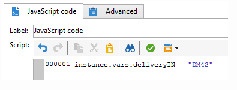

# JavaScript脚本和模板{#javascript-scripts-and-templates}

使用脚本，可以计算值、在进程中的不同任务之间交换数据以及使用SOAP调用执行特定操作。

脚本在工作流程图中无处不在：

* 所有活动都有初始化脚本。 在激活活动时执行初始化脚本，该脚本可用于初始化变量和修改属性。
* “JavaScript代码”活动只用于执行脚本。
* “测试”活动会计算JavaScript表达式，以激活相应的过渡。
* 大多数文本字段是JavaScript模板：JavaScript表达式可以包含在&lt;%=和%>之间。 这些字段提供一个按钮，用于打开一个下拉列表以帮助您输入表达式。

   

## 公开的对象 {#objects-exposed}

在工作流上下文中执行的JavaScript可访问一系列其他全局对象。

* **instance**:表示正在执行的工作流。 此对象的架构是 **xtk:workflow**。
* **任务**:表示正在执行的任务。 此对象的架构为 **xtk:workflowTask**。
* **event**:表示激活了正在执行的任务的事件。 此对象的架构是 **xtk:workflowEvent**。 对于已从多个过渡中 **激活的AND-join** type活动，此对象未初始化。
* **活动**:表示激活当前任务的事件列表。 此对象的架构是 **xtk:workflowEvent**。 此表通常包含一个元素，但对于 **AND-join** type activities，可能包含多个元素，这些活动已基于多个过渡激活。
* **活动**:表示所执行任务的模型。 此对象的架构取决于活动类型。 此对象可由初始化脚本修改，在其他脚本中，修改具有不可确定的效果。

通过单击脚本工具栏右侧的按钮，可以在下拉列表中查看这些对象的可用属性。

>[!CAUTION]
>
>这些对象的属性是只读的，vars属性的子属性除外。
>  
>大多数这些属性仅在执行基本任务或实例被钝化后才更新。 读取的值不一定与当前状态匹配，而是与先前的状态匹配。

**示例**

在本示例和以下示例中，创建一个包含 **JavaScript代码活动和** End **** 活动的工作流，如下图所示。


双击 **JavaScript代码活动** ，插入以下脚本：

```
logInfo("Label: " + instance.label)
logInfo("Start date: " + task.creationDate)
```

该函 **[!UICONTROL logInfo(message)]** 数将消息插入日志中。

单 **[!UICONTROL OK]** 击以关闭创建向导，然后使用位于工作流列表右上方的操作按钮启动工作流。 在执行结束时，请查阅日志。 您应当看到与脚本相对应的两条消息：一个显示工作流的标签，另一个显示激活脚本的日期。

## 变量 {#variables}

变量是对象和对象的 **[!UICONTROL instance]**&#x200B;自由 **[!UICONTROL task]** 属 **[!UICONTROL event]** 性。 授权这些变量的JavaScript类型 **[!UICONTROL string]**&#x200B;有 **[!UICONTROL number]** 和 **[!UICONTROL Date]**。

### 实例变量 {#instance-variables}

实例变量(**[!UICONTROL instance.vars.xxx]**)与全局变量类似。 所有活动都共享它们。

### 任务变量 {#task-variables}

任务变量(**[!UICONTROL task.vars.xxx]**)与本地变量类似。 它们仅用于当前任务。 这些变量由持续活动用来保留数据，有时用于在同一活动的不同脚本之间交换数据。

### 事件变量 {#event-variables}

事件变量(**[!UICONTROL vars.xxx]**)允许在工作流进程的基本任务之间交换数据。 这些变量由激活进行中任务的任务传递。 可以修改它们并定义新的。 然后，将其传递到以下活动。

对于 **AND-join** type活动，将合并变量，但如果同一变量定义了两次，则存在冲突，且值仍未确定。

这些变量是最常使用的变量，它们应优先用于实例变量。

某些事件变量由各种活动修改或读取。 这些都是字符串类型变量。 例如，导出设置的变 **[!UICONTROL vars.filename]** 量具有刚导出的文件的完整名称。 所有这些读取或修改的变量都记录在活 [动的](../../workflow/using/about-activities.md)“关于”( **About** )部分中， **活动的Input（输入）参数** 和Output（输出）参数中。

### 示例 {#example}

**示例1**

在此示例中，实例变量用于动态计算要应用于群体的拆分百分比。

1. 创建工作流并添加“开始”活动。

1. 添加和配置JavaScript代码活动以定义实例变量。

   For example: `instance.vars.segmentpercent = 10;`

   

1. 根据您的需求添加查询活动和目标收件人。

1. 添加拆分活动并将其配置为对传入人群执行随机采样。 抽样百分比可以是您选择的任何选项。 在本例中，它设置为50%。

   它是动态更新的百分比，这要归功于之前定义的实例变量。

   

1. 在拆分活动的高级选项卡的初始化脚本部分中，定义JS条件。 JS条件选择从拆分活动中产生的第一个过渡的随机采样百分比，并将其更新为先前创建的实例变量设置的值。

   ```
   activity.transitions.extractOutput[0].limiter.percent = instance.vars.segmentpercent;
   ```

   

1. 确保在“拆分”活动的单独过渡中生成补充，并在每个出站过渡之后添加“结束”活动。

1. 保存并执行工作流。 根据实例变量应用动态采样。

   

**示例2**

1. 从上一个示例中采用工作流，将 **JavaScript代码活动的脚本替换为以下脚本** :

   ```
   instance.vars.foo = "bar1"
   vars.foo = "bar2"
   task.vars.foo = "bar3"
   ```

1. 将以下脚本添加到“结束”活动的初始 **化脚本** :

   ```
   logInfo("instance.vars.foo = " + instance.vars.foo)
   logInfo("vars.foo = " + vars.foo)
   logInfo("task.vars.foo = " + task.vars.foo)
   ```

1. 启动工作流，然后查看日志。

   ```
   Workflow finished
   task.vars.foo = undefined
   vars.foo = bar2
   instance.vars.foo = bar1
   Starting workflow (operator 'admin')
   ```

此示例显示， **JavaScript Code** （代码）之后的活动访问实例变量和事件变量，但任务变量无法从外部访问(&#39;undefined&#39;)。

### 调用查询中的实例变量 {#calling-an-instance-variable-in-a-query}

在活动中指定实例变量后，您可以在工作流查询中重复使用它。

因此，要在过滤 **器中调用变量instance.vars.xxx = &quot;yyy&quot;** ，请输入 **$(instance/vars/xxx)**。

例如：

1. 创建一个实例变量，它通过以下方式定义分发的内部名称 **[!UICONTROL JavaScript code]**: **instance.vars.deliveryIN = &quot;DM42&quot;**。

   

1. 创建其定位和筛选维为收件人的查询。 在条件中，指定要查找发送了变量指定的递送的所有收件人。

   作为提醒，此信息存储在交付日志中。

   要引用列中的实 **[!UICONTROL Value]** 例变量， **请输入$(instance/vars/@deliveryIN)**。

   该工作流将返回DM42交付的收件人。

   

## 高级功能 {#advanced-functions}

除了标准JavaScript函数外，还有特殊函数可用于处理文件、读取或修改数据库中的数据或向日志添加消息。

### 日志 {#journal}

**[!UICONTROL logInfo(message)]** 详见上述示例。 此函数向日志中添加信息消息。

**[!UICONTROL logError(message)]** 向日志中添加错误消息。 脚本中断其执行，而工作流将更改为错误状态（默认情况下，实例将暂停）。

## 初始化脚本 {#initialization-script}

在某些情况下，您可以在执行时修改活动的属性。

活动的大多数属性都可以动态计算，这可以使用JavaScript模板，也可以是因为工作流属性明确允许脚本计算该值。

但是，对于其他属性，您必须使用初始化脚本。 执行任务之前将评估此脚本。 变量 **[!UICONTROL activity]** 引用与任务对应的活动。 此活动的属性可以修改，并且仅影响此任务。
