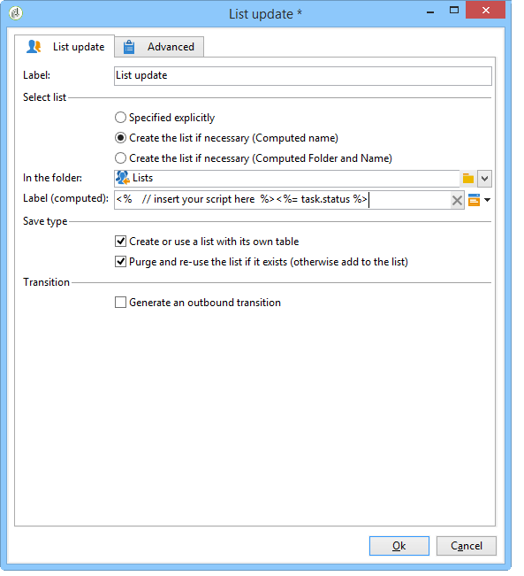

# 列表更新{#list-update}

**列表更新**&#x200B;活动将过渡中指定的群体存储在收件人列表中。

可以从现有组的列表中选择该列表。

也可以使用&#x200B;**[!UICONTROL Create the list if necessary (Computed name)]**&#x200B;和&#x200B;**[!UICONTROL Create the list if necessary (Computed Folder and Name)]**&#x200B;选项创建。 这些选项允许您选择所选的标签以创建列表，然后再选择保存列表的文件夹。 也可以通过插入动态字段或脚本自动生成标签。 标签右侧的弹出菜单中提供了不同的动态字段。

如果列表已存在，则会将收件人添加到现有内容中，除非您选中&#x200B;**[!UICONTROL Purge the list if it exists (otherwise add to the list)]**&#x200B;选项。 在这种情况下，列表内容会在更新之前删除。

如果希望创建或更新的列表使用收件人表以外的表，请选中&#x200B;**[!UICONTROL Create or use a list with its own table]**&#x200B;选项。

要使用选项，必须在Adobe Campaign实例中配置了相关的特定表。

通常，将目标保存在列表中会标记工作流的结尾。 因此，默认情况下，**[!UICONTROL List update]**&#x200B;活动不包含叫客过渡。 选中&#x200B;**[!UICONTROL Generate an outbound transition]**&#x200B;选项可添加一个。

 [了解如何在视频中从资源管理器创建收件人列表](#video)

## 示例：列表更新 {#example--list-update}

在以下示例中，列表更新活动遵循一个查询，该查询定向在法国居住的30岁以上的男性。 最初将根据查询结果创建列表。 然后，每次从工作流中启动该工作流时，都会更新该工作流。 例如，它可以定期用于针对促销活动的定向促销选件。

1. 在查询后直接添加&#x200B;**[!UICONTROL list update activity]**，然后将其打开以对其进行编辑。

   有关在工作流中创建查询的更多信息，请参阅[Query](query.md)。

1. 您可以为活动选择标签。
1. 选择&#x200B;**[!UICONTROL Create the list if necessary (Calculated name)]**&#x200B;选项，显示在执行第一个工作流后将创建列表，然后使用以下执行对列表进行更新。
1. 选择要保存列表的文件夹。
1. 输入列表的标签。 您可以插入动态字段以自动从列表中生成名称。 在此示例中，列表与查询具有相同的名称，可轻松识别其内容。
1. 保持选中&#x200B;**[!UICONTROL Purge the list if it exists (otherwise add to the list)]**&#x200B;选项，可删除与定位标准不匹配的收件人，并将新收件人插入到列表中。
1. 同时保持选中&#x200B;**[!UICONTROL Create or use a list with its own table]**&#x200B;选项。
1. 保持未选中&#x200B;**[!UICONTROL Generate an outbound transition]**&#x200B;选项。
1. 单击&#x200B;**[!UICONTROL Ok]**，然后启动工作流。

   

   然后，创建或更新匹配收件人的列表。

## 输入参数 {#input-parameters}

* tableName
* 模式

标识要保存在群组中的群体。

## 输出参数 {#output-parameters}

* groupId:组标识符。

## 教程视频 {#video}

此视频演示如何从Explorer创建收件人列表。

>[!VIDEO](https://video.tv.adobe.com/v/25602/quality=12)

其他Campaign Classic操作方法视频可在[此处](https://experienceleague.adobe.com/docs/campaign-classic-learn/tutorials/overview.html?lang=zh-Hans)获取。
