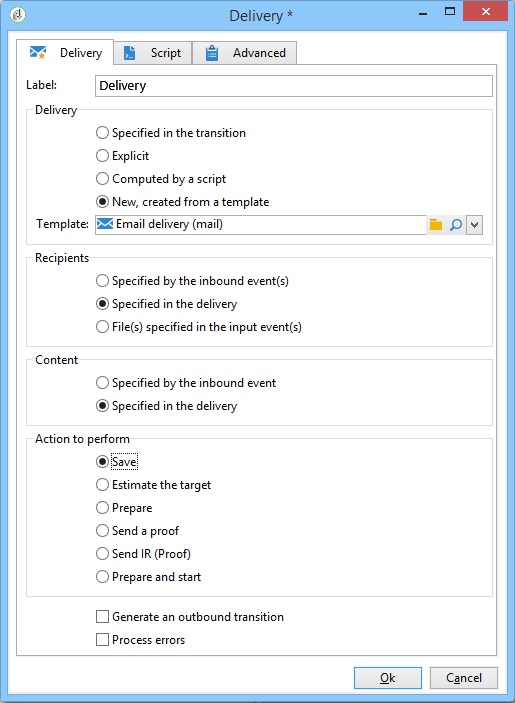
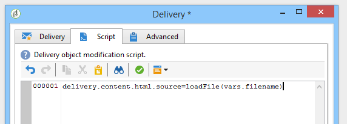

# 加载投放内容{#loading-delivery-content}

如果您的交付内容位于Amazon S3、FTP或SFTP服务器上的HTML文件中，则可以轻松将此内容加载到Adobe Campaign交付中。

操作步骤：

1. 如果您尚未在Adobe Campaign与托管内容文件的(S)FTP服务器之间定义连接，请在&#x200B;**[!UICONTROL Administration]** > **[!UICONTROL Platform]** > **[!UICONTROL External Accounts]**&#x200B;中创建新的S3、FTP或SFTP外部帐户。 在此外部帐户中指定用于建立与S3或(S)FTP服务器的连接的地址和凭据。

   以下是S3外部帐户的示例：

   

1. 创建新工作流，例如从&#x200B;**[!UICONTROL Profiles and Targets]** > **[!UICONTROL Jobs]** > **[!UICONTROL Targeting workflows]**&#x200B;创建。
1. 将&#x200B;**[!UICONTROL File transfer]**&#x200B;活动添加到工作流中，并通过指定

   * 用于连接到S3或(S)FTP服务器的外部帐户。
   * 文件在S3或(S)FTP服务器上的路径。

   

1. 添加&#x200B;**[!UICONTROL Delivery]**&#x200B;活动，并将其连接到&#x200B;**[!UICONTROL File transfer]**&#x200B;活动的叫客过渡。 按如下方式配置它：

   * 投放：根据您的需要，它可以是已在系统中创建的特定投放，也可以是基于现有模板的新投放。
   * 收件人：在本例中，被视为在投放本身中指定了目标。
   * 内容：即使内容是在上一个活动中导入的，请选择&#x200B;**[!UICONTROL Specified in the delivery]**。 由于内容直接从位于远程服务器上的文件导入，因此在工作流处理时，内容没有标识符，无法识别为来自集客事件。
   * 要执行的操作：选择&#x200B;**[!UICONTROL Save]**&#x200B;以保存投放，并在执行工作流后能够从&#x200B;**[!UICONTROL Campaign management]** > **[!UICONTROL Deliveries]**&#x200B;访问投放。

   

1. 在&#x200B;**[!UICONTROL Delivery]**&#x200B;活动的&#x200B;**[!UICONTROL Script]**&#x200B;选项卡中，添加以下命令以在投放中加载导入文件的内容：

   ```
   delivery.content.md.source=loadFile(vars.filename)
   ```

   

1. 保存并执行工作流。 将在&#x200B;**[!UICONTROL Campaign management]** > **[!UICONTROL Deliveries]**&#x200B;下创建包含加载内容的新投放。

>[!NOTE]
>
>有关SFTP服务器使用情况的最佳实践和疑难解答，请参阅本页](../../platform/using/sftp-server-usage.md)中的[。
