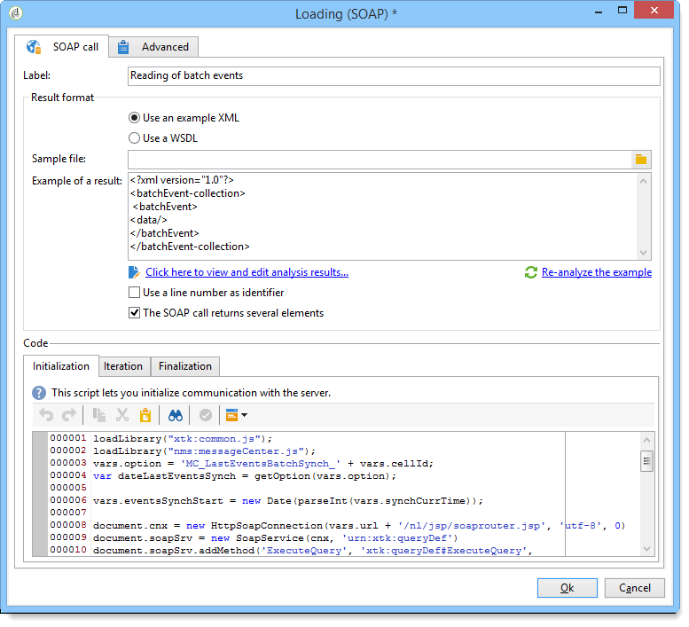

# 加载 (SOAP){#loading-soap}

>[!CAUTION]
>
>仅当您安装了&#x200B;**FDA（联合数据访问）**&#x200B;模块时，**正在加载(SOAP)**&#x200B;活动才可用。 请核实您的许可协议。

如果无法在外部数据库中直接通过FDA收集数据，则除了&#x200B;**数据加载(RDBMS)**&#x200B;活动之外，还会使用&#x200B;**加载(SOAP)**&#x200B;活动。

操作如下：

1. 选择使用XML示例或WSDL。

   以下示例来自消息中心模块的技术工作流。

   

1. 对于XML示例，请选择一个示例文件。 对文件进行分析，建立结果实例。

   对于WSDL，输入匹配的访问URL，然后生成骨架代码。 所选服务和呼叫将自动更新并显示。

   

1. 选择&#x200B;**[!UICONTROL Click here to view and edit analysis results]**&#x200B;以指定每个已识别的列。

   

   如果要更新示例，请选择&#x200B;**[!UICONTROL Re-analyze the example]**。

   您还可以通过&#x200B;**[!UICONTROL Advanced parameters]**&#x200B;链接将列数据的格式个性化。 有关格式化导入数据的详细信息，请参阅此[部分](../../platform/using/executing-import-jobs.md)。

1. 您可以将行号用作标识符和/或指定SOAP调用返回多个元素。
1. 根据功能输入以下选项卡脚本：

   * **[!UICONTROL Initialization]**：建立SOAP连接。
   * **[!UICONTROL Iteration]**：执行对SOAP服务的调用。 此函数的返回必须是一个与示例或WSDL的说明兼容的XML对象。

     此选项卡的代码将由Adobe Campaign循环调用，直到返回空的XML对象。

   * **[!UICONTROL Finalization]**：关闭连接和/或释放在处理期间创建的其他资源。
