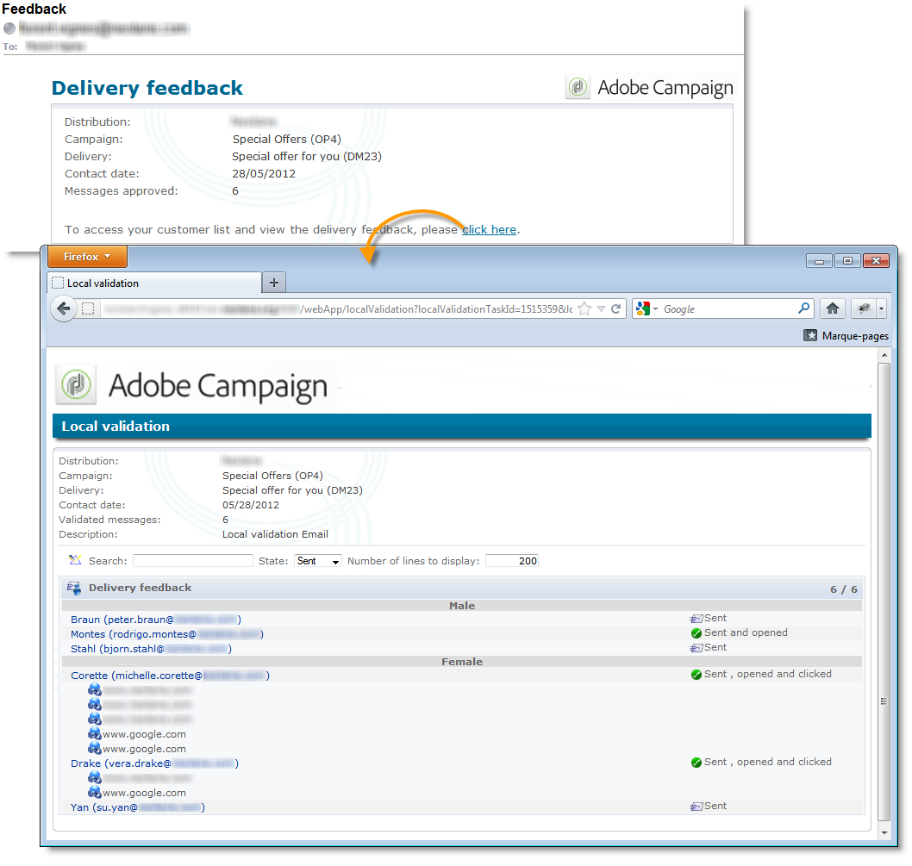
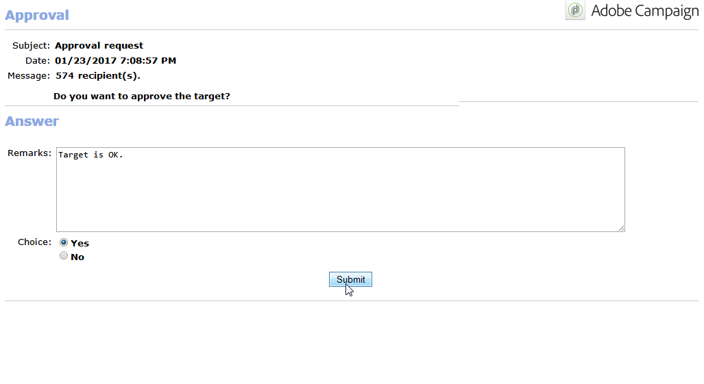

# 本地批准{#local-approval}

当集成到定位工作流中时，**[!UICONTROL Local approval]**&#x200B;活动允许您在发送收件人之前设置投放批准流程。

>[!CAUTION]
>
>要使用此活动，您需要购买分布式营销模块，这是一个活动选项。 请核实您的许可协议。

有关具有分发模板的&#x200B;**[!UICONTROL Local approval]**&#x200B;活动的示例，请参阅[使用本地批准活动](../../workflow/using/using-the-local-approval-activity.md)。

开始：为活动和&#x200B;**[!UICONTROL Action to execute]**&#x200B;字段输入标签：

* 选择&#x200B;**[!UICONTROL Target approval notification]**&#x200B;选项，在投放之前向本地主管发送通知电子邮件，要求他们批准分配给他们的收件人。

   

* **增量查询**:允许您执行查询并计划其执行。请参阅[增量查询](../../workflow/using/incremental-query.md)部分。

   

## 目标批准通知{#target-approval-notification}

在这种情况下，**[!UICONTROL Local approval]**&#x200B;活动位于上游定位和投放之间：

在通知目标审批时要输入的字段包括：

* **[!UICONTROL Distribution context]**:如果您 **[!UICONTROL Specified in the transition]** 使用类型活动来限 **[!UICONTROL Split]** 制目标人口，请选择此选项。在这种情况下，分配模板将输入拆分活动。 如果不限制目标人口，请在此处选择&#x200B;**[!UICONTROL Explicit]**&#x200B;选项，然后在&#x200B;**[!UICONTROL Data distribution]**&#x200B;字段中输入分布模板。

   有关创建数据分发模板的详细信息，请参阅[限制每个数据分发的子集记录数](../../workflow/using/split.md#limiting-the-number-of-subset-records-per-data-distribution)。

* **[!UICONTROL Approval management]**

   * 选择用于电子邮件通知的投放模板和主题。 默认模板可用：**[!UICONTROL Local approval notification]**。 您还可以添加将在批准和反馈通知中收件人列表上方显示的说明。
   * 指定与批准截止日期(批准开始的日期或截止日期)对应的&#x200B;**[!UICONTROL Approval type]**。 在此日期，定位中不会再次考虑工作流开始和尚未批准的收件人。 发送通知后，活动将排队，以便本地主管可以批准其联系人。

      >[!NOTE]
      >
      >默认情况下，当启动审批流程时，活动将暂停三天。

      您还可以添加一个或多个提醒，以通知本地主管截止时间即将到来。 为此，请单击&#x200B;**[!UICONTROL Add a reminder]**&#x200B;链接。

* **[!UICONTROL Complementary set]**:通过 **[!UICONTROL Generate complement]** 此选项，您可以生成包含所有未批准目标的第二组。

   >[!NOTE]
   >
   >此选项在默认情况下处于禁用状态。

## 投放反馈报告{#delivery-feedback-report}

在这种情况下，**[!UICONTROL Local approval]**&#x200B;活动位于投放之后：

如果是投放反馈报告，则必须输入以下字段：

* 如果在上一个投放中输入了活动，请选择&#x200B;**[!UICONTROL Specified in the transition]**&#x200B;选项。 选择&#x200B;**[!UICONTROL Explicit]**&#x200B;以在本地批准活动中指定投放。
* 选择通知电子邮件的投放模板和对象。 有一个默认模板：**[!UICONTROL Local approval notification]**。

## 示例：批准工作流投放{#example--approving-a-workflow-delivery}

此示例说明如何为工作流投放设置审批流程。 有关创建投放工作流的详细信息，请参阅[示例：投放工作流](../../workflow/using/delivery.md#example--delivery-workflow)部分。

操作员可以通过以下两种方式之一批准投放:使用电子邮件中链接的网页，或通过控制台。

* Web批准

   发送给管理员组操作员的电子邮件允许您批准投放目标。 消息使用定义的文本，JavaScript表达式将替换为计算值（本例中为&#39;574&#39;）

   要批准投放，请单击相关链接并登录到Adobe Campaign控制台。

   

   选择并单击&#x200B;**[!UICONTROL Submit]**&#x200B;按钮。

   

* 通过控制台进行批准

   在树结构中，**[!UICONTROL Administration > Production > Objects created automatically > Approvals pending]**&#x200B;节点包含要由当前连接的运算符批准的任务列表。 列表应显示一行。 多次单击此行以响应。 将显示以下窗口：

选择&#x200B;**是**，然后单击&#x200B;**[!UICONTROL Approve]**。 将显示一条消息，通知您已录制响应。

返回至工作流屏幕：大约10秒后，图显示如下：

工作流已执行&#x200B;**[!UICONTROL Delivery control]**&#x200B;任务，在本例中，这意味着启动先前创建的投放。 工作流已完成，无错误。
