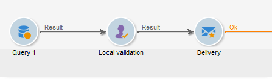
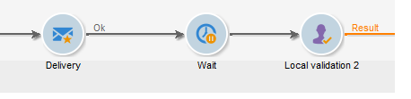

# 本地批准{#local-approval}

集成到定位工作流后，活动 **[!UICONTROL Local approval]** 允许您在发送投放之前设置收件人批准流程。

>[!CAUTION]
>
>要使用此活动，您需要购买分布式营销模块，这是一个活动选项。 请核实您的许可协议。

有关具有分发模 **[!UICONTROL Local approval]** 板的活动的示例，请参 [阅使用本地批准活动](../../workflow/using/using-the-local-approval-activity.md)。

开始，方法是为活动和字段输入标 **[!UICONTROL Action to execute]** 签：

* 选择选 **[!UICONTROL Target approval notification]** 项，在投放之前向本地主管发送电子邮件通知，要求他们批准分配给他们的收件人。

   

* **增量查询**:允许您执行查询并计划其执行。 Refer to the [Incremental query](../../workflow/using/incremental-query.md) section.

   

## 目标批准通知 {#target-approval-notification}

在这种情况下，活动 **[!UICONTROL Local approval]** 位于上游定位和投放之间：

在收到目标审批通知时要输入的字段包括：

* **[!UICONTROL Distribution context]**:如果您 **[!UICONTROL Specified in the transition]** 使用类型活动来限 **[!UICONTROL Split]** 制目标人口，请选择此选项。 在这种情况下，分配模板将输入到分解活动。 如果不限制目标人口，请在此处选 **[!UICONTROL Explicit]** 择选项，然后在字段中输入分发 **[!UICONTROL Data distribution]** 模板。

   有关创建数据分发模板的详细信息，请 [参阅限制每个数据分发的子集记录数](../../workflow/using/split.md#limiting-the-number-of-subset-records-per-data-distribution)。

* **[!UICONTROL Approval management]**

   * 选择用于电子邮件通知的投放模板和主题。 A default template is available: **[!UICONTROL Local approval notification]**. 您还可以添加将在审批和反馈通知中的收件人列表上方显示的描述。
   * 指定与 **[!UICONTROL Approval type]** 批准截止日期(批准开始的日期或截止日期)对应的日期。 在此日期，定位中不再考虑工作流开始和尚未批准的收件人。 通知发送后，活动将排队，以便本地主管可以批准其联系人。

      >[!NOTE]
      >
      >默认情况下，当启动审批流程时，活动将暂停三天。

      您还可以添加一个或多个提醒，通知当地主管截止日期即将到来。 为此，请单击链 **[!UICONTROL Add a reminder]** 接。

* **[!UICONTROL Complementary set]**:通过 **[!UICONTROL Generate complement]** 此选项，您可以生成第二个集，其中包含所有未批准的目标。

   >[!NOTE]
   >
   >此选项默认处于禁用状态。

## 投放反馈报告 {#delivery-feedback-report}

在这种情况下， **[!UICONTROL Local approval]** 活动放在投放之后：

如果是投放反馈报告，则必须输入以下字段：

* 如果投放 **[!UICONTROL Specified in the transition]** 是在上一个活动中输入的，请选择此选项。 选 **[!UICONTROL Explicit]** 择以在本地批准活动中指定投放。
* 选择通知电子邮件的投放模板和对象。 存在默认模板： **[!UICONTROL Local approval notification]**.

## 示例：批准工作流投放 {#example--approving-a-workflow-delivery}

此示例说明如何为工作流投放设置审批流程。 有关创建投放工作流的详细信息，请参阅 [示例：投放工作流](../../workflow/using/delivery.md#example--delivery-workflow) 部分。

操作员可以通过以下两种方式之一批准投放:使用电子邮件中链接的网页，或通过控制台。

* Web批准

   发送给管理员组操作员的电子邮件允许您批准投放目标。 消息使用定义的文本，JavaScript表达式由计算值替换（本例中为“574”）

   要批准投放，请单击相关链接并登录到Adobe Campaign控制台。

   

   做出选择，然后单击 **[!UICONTROL Submit]** 按钮。

   

* 通过控制台进行批准

   在树结构中，节点 **[!UICONTROL Administration > Production > Objects created automatically > Approvals pending]** 包含要由当前连接的操作员批准的列表。 列表应显示一行。 多次单击此行以进行响应。 此时将显示以下窗口：

选择 **是**，然后单击 **[!UICONTROL Approve]**。 将显示一条消息，通知您已录制响应。

返回工作流屏幕：大约10秒后，图显示如下：

工作流已执行 **[!UICONTROL Delivery control]** 任务，在本例中，这意味着启动先前创建的投放。 工作流已完成且无错误。
