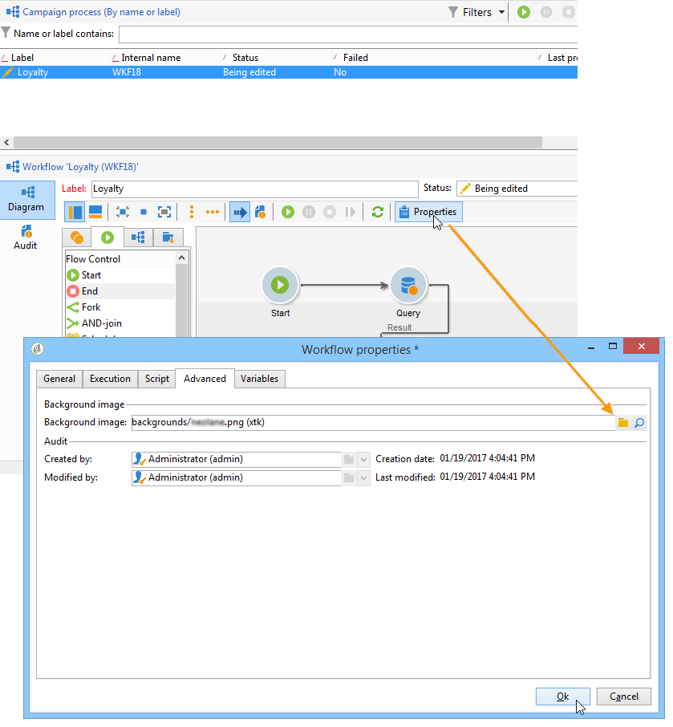
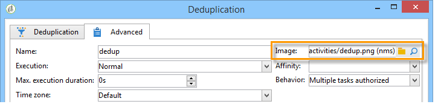

# 更改活动图像{#change-activity-images}

可以更改各种工作流的图中使用的图像。 但是，它们必须符合某些限制。 以下是实施阶段：

* 要更改背景图像，请选择所需的定位工作流，然后单击&#x200B;**[!UICONTROL Properties]**&#x200B;选项卡。

  

  要选择要使用的图像，请单击&#x200B;**[!UICONTROL Background image]**&#x200B;字段右侧的&#x200B;**[!UICONTROL Select link]**&#x200B;图标。

  >[!NOTE]
  >
  >背景图像的宽度（以像素为单位）必须为4的倍数。

  

  **[!UICONTROL Edit link]**&#x200B;图标允许您查看选定的图像。

* 要更改与活动关联的图像，请双击该对象，然后单击&#x200B;**[!UICONTROL Advanced]**&#x200B;选项卡。

  要选择要使用的图像，请单击&#x200B;**[!UICONTROL Image]**&#x200B;字段右侧的&#x200B;**[!UICONTROL Select link]**&#x200B;图标。

  

  **[!UICONTROL Edit link]**&#x200B;图标允许您查看选定的图像。

  

>[!NOTE]
>
>保存在树的&#x200B;**[!UICONTROL Administration > Configuration > Images]**&#x200B;节点中的图像可供选择。
>  
>图像必须是PNG格式，具有48x48像素、1600万颜色和透明背景。
