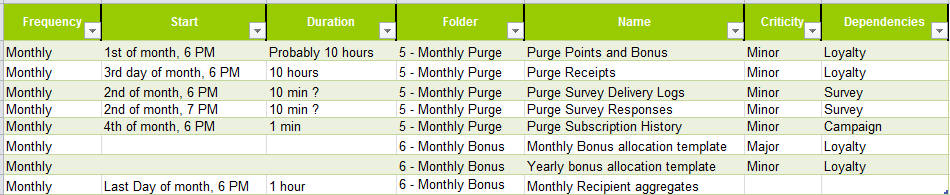

# 监控技术工作流 {#monitoring-technical-workflows}

技术工作流需要被监控，并且在失败时需要采取相应的操作。

[本页](../../production/using/monitoring-guidelines.md)中提供了监控不同活动过程的其他方法。

## 实例监视仪表板{#instance-monitoring-dashboard}

可以通过&#x200B;**[!UICONTROL Monitoring]**&#x200B;选项卡访问实例监视仪表板。

在“System Indicators（系统指示器）”和核心文件下，检查是否没有以红色突出显示任何指示器。 如果情况确实如此，某些情况确实如此，您应：

* 检查所需的进程是否始终运行，
* 检查所有过程都不太老，
* 检查不同进程的日志文件中是否不包含警告和重复错误。

## 技术工作流 {#technical-workflows}

技术工作流可从&#x200B;**[!UICONTROL Administration]** > **[!UICONTROL Production]** > **[!UICONTROL Technical workflows]**&#x200B;获得。

根据技术工作流程的不同，请按照以下详细步骤确保一切正常工作。

要更好地了解每个技术工作流应执行的操作，请参阅此[部分](../../workflow/using/about-technical-workflows.md)。

对于&#x200B;**[!UICONTROL Database Cleanup workflow (‘cleanup’)]**:

1. 检查&#x200B;**[!UICONTROL Database Cleanup]**&#x200B;工作流是否每天成功运行并完成。 有关详细信息，请参见此 [ 页面](../../workflow/using/delivery.md)。
1. 查看日志，确认已用时间随时间相对恒定，并且不干扰其他工作流。
1. 有关详细信息，请检查此[页面](../../production/using/database-cleanup-workflow.md)。

对于&#x200B;**[!UICONTROL Tracking workflow (‘tracking’)]**:

检查跟踪工作流是否按计划运行（默认为每小时），以及日志是否不突出显示重复错误。 有关更多信息，请参阅此](../../workflow/using/delivery.md)章节[。

对于&#x200B;**[!UICONTROL Deliverability update (‘deliverabilityUpdate’)]**:

1. 检查&#x200B;**[!UICONTROL Deliverability update]**&#x200B;工作流是否每天成功运行并完成。 有关详细信息，请参见此 [ 页面](../../workflow/using/delivery.md)。
1. 在日志中验证规则是否定期更新。

对于&#x200B;**[!UICONTROL Campaign process ('operationMgt', 'deliveryMgt', ...)]**:

1. 查看&#x200B;**[!UICONTROL Campaign process]**&#x200B;文件夹下的所有工作流。 有关详细信息，请参见此 [ 页面](../../workflow/using/about-technical-workflows.md)。
1. 检查工作流是否按计划运行，以及日志是否不突出显示重复错误。

## 工作流监视{#workflow-supervision}

**[!UICONTROL Workflow supervisors]**&#x200B;组应包含需要向用户通知故障以及可以及时采取行动的运算符。

如果出现问题，应生成警报并将其发送到正确的组。

确保每个操作员都有有效的电子邮件地址。

为保持平台正常工作应运行的任何工作流（如每日数据导入）都应声明为“生产”（复选框）并以粗体显示。

## 工作流维护列表{#workflow-maintenance-list}

所有自定义技术工作流都应记录在包含以下内容的工作表中：

* 工作流的名称和位置。
* 目的。
* 计划和依赖关系。
* 负责监控的操作员。
* 关于在出错时要执行什么操作的说明。

## {#planning-and-automation-of-monitoring}监控的规划和自动化

规划工作流监控提高了其效率。 某些任务需要每天进行，而其他任务可以每周或每月进行。

在按循环命名的文件夹中设置工作流，并按执行计划排序，从而提高监视效率。

自动监控减少了资源开销，并确保任务以适当的频率计划。

您可以构建一个监视工作流，以便在某些任务失败或关键表过大时发送电子邮件。

您可以创建视图，以便监视某个功能区域或系统范围内的所有工作流。

您还可以使用Adobe Campaign作业或报表功能按需构建文档，该文档始终是最新的。
