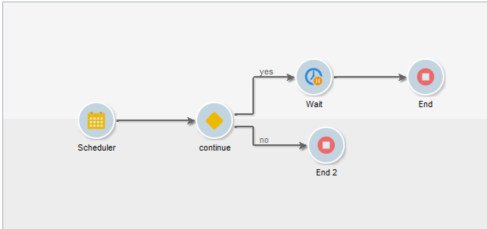

# 监控工作流执行 {#monitoring-workflow-execution}

本节介绍有关如何监控工作流执行情况的信息。

[此部分](../../workflow/using/supervising-workflows.md#supervising-workflows)中还提供了有关如何创建工作流以监视一组“已暂停”、“已停止”或“有错误”的工作流的状态的用例。

此外，实例的管理员还可以使用&#x200B;**审核跟踪**&#x200B;来检查活动和对工作流所做的最后修改以及工作流的状态。 有关更多信息，请参阅[专用部分](../../production/using/audit-trail.md)。

[本页](../../production/using/monitoring-guidelines.md)中提供了监控不同Campaign流程的其他方法。

## 显示进度{#displaying-progress}

您可以使用工具栏上的相应图标显示进度，以监控执行情况。

通过&#x200B;**[!UICONTROL Display progress information]**&#x200B;图标，可在执行屏幕中显示状态和活动结果。


选择此选项后，已执行的活动以蓝色显示，待处理活动闪烁，警告以橙色显示，错误以红色显示。 此选项还显示活动在其叫客过渡时的结果，后跟活动属性中定义的结果标签，以及作业持续时间（如果超过一秒）


## 显示日志{#displaying-logs}

日志包含工作流的历史记录或审核跟踪。 它记录所有用户操作、执行的所有操作和遇到的错误。 您可以：

* 在详细信息中选择&#x200B;**[!UICONTROL Tracking]**&#x200B;选项卡。 此列表包含所有工作流消息。

   

* 按活动过滤日志消息。 要实现此目的，请单击图表上方工具栏上的&#x200B;**[!UICONTROL Display the tasks and the log]** ，以在图表下方显示&#x200B;**[!UICONTROL Log]**&#x200B;和&#x200B;**[!UICONTROL Tasks]**&#x200B;选项卡。 选择活动以查看所有相关消息。 此列表包含未选择活动时的所有消息。

   

   >[!NOTE]
   >
   >单击图表背景以取消选择所有元素。

* 仅查看链接到给定任务的消息。 要执行此操作，请选择&#x200B;**[!UICONTROL Tasks]**&#x200B;选项卡，然后在图表中选择活动以限制列表。 双击任务以显示信息；窗口中的最后一个选项卡包含日志。

   

   通过&#x200B;**[!UICONTROL Details...]**&#x200B;按钮，可显示有关活动执行的所有其他信息。 例如，您可以查看验证运算符，以及在审批期间输入的注释（如果适用），如以下示例所示：

   

>[!NOTE]
>
>重新启动工作流时，不会清除日志。 所有留言都保留。 如果要放弃先前执行中的消息，则必须清除历史记录。

日志按时间顺序显示与定向工作流活动相关的执行消息列表。

* 定位营销活动的日志

   执行定位营销活动后，单击&#x200B;**[!UICONTROL Tracking]**&#x200B;选项卡以查看执行跟踪。

   

   显示所有营销活动消息：执行的营销活动以及警告或错误。

* 活动日志

   您还可以查看执行日志和每个活动的详细信息。 可以通过两种方式来执行此操作：

   1. 选择目标活动，然后单击&#x200B;**[!UICONTROL Display the tasks and the log]**&#x200B;图标。

      

      图表的下部显示了两个选项卡：日志和任务。

      在图表中选择的活动将用作日志和任务列表的过滤器。

      

   1. 右键单击目标活动并选择&#x200B;**[!UICONTROL Display logs]**。

      

      日志显示在单独的窗口中。

## 清除日志{#purging-the-logs}

工作流历史记录不会自动清除：默认情况下，会保留所有消息。 可以通过&#x200B;**[!UICONTROL File > Actions]**&#x200B;菜单或单击列表上方工具栏中的&#x200B;**[!UICONTROL Actions]**&#x200B;按钮清除历史记录。 选择 **[!UICONTROL Purge history]**。**[!UICONTROL Actions]**&#x200B;菜单中可用的选项详见[操作工具栏](../../workflow/using/starting-a-workflow.md)部分。


## 工作表和工作流架构{#worktables-and-workflow-schema}

该工作流传达了可通过特定活动处理的工作表。 Adobe Campaign允许您通过数据管理活动修改、重命名和扩充工作流工作表的列，例如，根据客户的需求使其与术语保持一致，以收集有关合同共同受益人的其他信息等。

也可以在各种工作维度之间创建链接并定义维度更改。 例如，对于数据库中记录的每个合同，寻址主持人并在附加信息中使用共同持有人数据。

当工作流被钝化时，工作流的工作表会被自动删除。 如果希望保留工作表，请通过&#x200B;**[!UICONTROL List update]**&#x200B;活动将其保存在列表中（请参阅[列表更新](../../workflow/using/list-update.md)）。

## 管理错误{#managing-errors}

发生错误时，工作流暂停，发生错误时执行的活动闪烁红色。 在工作流概述的&#x200B;**[!UICONTROL Monitoring]**&#x200B;选项卡 — **[!UICONTROL Workflows]**&#x200B;链接下，您只能显示出错的工作流，如下所示。


在Adobe Campaign Explorer中，默认情况下工作流列表显示&#x200B;**[!UICONTROL Failed]**&#x200B;列。


当工作流出错时，只要其电子邮件地址列在其用户档案中，就会通过电子邮件通知属于工作流监督组的操作员。 此组在工作流属性的&#x200B;**[!UICONTROL Supervisor(s)]**&#x200B;字段中选择。


通知内容在&#x200B;**[!UICONTROL Workflow manager notification]**&#x200B;默认模板中配置：此模板在工作流属性的&#x200B;**[!UICONTROL Execution]**&#x200B;选项卡中进行选择。 通知会显示错误工作流的名称和相关任务。

通知示例：


利用链接，可在Web模式下访问Adobe Campaign控制台，并在您登录后处理错误工作流。


您可以配置工作流，以便在发生错误时不会暂停并继续执行。 为此，请编辑工作流&#x200B;**[!UICONTROL Properties]**，并在&#x200B;**[!UICONTROL Error management]**&#x200B;部分的&#x200B;**[!UICONTROL Ignore]**&#x200B;字段中选择&#x200B;**[!UICONTROL In case of error]**&#x200B;选项。 然后，您可以指定在暂停进程之前可忽略的连续错误数。

在这种情况下，错误任务被中止。 此模式特别适用于设计为稍后重新尝试营销活动（定期操作）的工作流。


>[!NOTE]
>
>您可以为每个活动单独应用此配置。 为此，请编辑活动属性，并在&#x200B;**[!UICONTROL Advanced]**&#x200B;选项卡中选择错误管理模式。

有关工作流执行疑难解答的更多信息，请参阅[专述章节](../../production/using/workflow-execution.md)。

## 处理错误{#processing-errors}

关于活动，**[!UICONTROL Process errors]**&#x200B;选项显示一个特定过渡，如果生成错误，该过渡将被启用。 在这种情况下，工作流不会进入错误模式，并且会继续执行。

需考虑的错误是文件系统错误（无法移动文件、无法访问目录等）。

此选项不处理与活动配置相关的错误，即无效值。 与错误配置相关的错误将不会启用此过渡（目录不存在等）。

如果暂停工作流（手动或在出错后自动），**[!UICONTROL Start]**&#x200B;按钮将重新启动停止工作流的工作流执行。 将重新执行错误的活动（或暂停的活动）。 不会重新执行以前的活动。

要重新执行所有工作流活动，请使用&#x200B;**[!UICONTROL Restart]**&#x200B;按钮。

如果修改已执行的活动，则重新启动工作流执行时，不会考虑这些更改。

如果修改未执行的活动，则在重新启动工作流执行时，会考虑这些活动。

如果修改暂停的活动，则重新启动工作流时无法正确考虑所做的更改。

如果可能，我们建议在进行修改后完全重新启动工作流。

## 实例监督{#instance-supervision}

在&#x200B;**[!UICONTROL Instance supervision]**&#x200B;页面中，您可以查看Adobe Campaign服务器活动，并显示有错误的工作流和投放列表。

要访问此页面，请转到&#x200B;**[!UICONTROL Monitoring]**&#x200B;选项卡，然后单击&#x200B;**[!UICONTROL General view]**&#x200B;链接。


要显示所有工作流，请单击&#x200B;**[!UICONTROL Workflows]**&#x200B;链接。 使用下拉列表根据工作流的状态显示平台中的工作流。


单击工作流中存在错误的链接以将其打开并查看其日志。


## 防止同时执行多次{#preventing-simultaneous-multiple-executions}

单个工作流可以同时运行多个执行。 在某些情况下，您应该阻止这种情况发生。

例如，您可以让调度程序每小时触发一次工作流执行，但有时整个工作流的执行需要超过一小时。 如果工作流已经运行，您可能需要跳过执行。

如果您在工作流的开始处有信号活动，则当工作流正在运行时，您可能希望跳过该信号。

一般原则如下：


解决方案是使用实例变量。 实例变量由工作流的所有并行执行共享。

以下是一个简单的测试工作流：



**[!UICONTROL Scheduler]**&#x200B;每分钟触发一个事件。 以下&#x200B;**[!UICONTROL Test]**&#x200B;活动将测试&#x200B;**isRunning**&#x200B;实例变量，以确定是否继续执行：


>[!NOTE]
>
>**** isRunning是为此示例选择的变量名称。这不是内置变量。

**yes**&#x200B;分支中紧靠&#x200B;**[!UICONTROL Test]**&#x200B;的活动必须在其&#x200B;**Initializationscript**&#x200B;中设置实例变量：

```
instance.vars.isRunning = true
```

**yes**&#x200B;分支中的最后一个活动必须将其&#x200B;**Initializationscript**&#x200B;中的变量还原为false:

```
instance.vars.isRunning = false
```

请注意：

* 您可以通过工作流&#x200B;**属性**&#x200B;中的&#x200B;**变量**&#x200B;选项卡检查实例变量的当前值。
* 重新启动工作流时，会重置实例变量。
* 在JavaScript中，测试中未定义的值为false，这允许在初始化实例变量之前对其进行测试。
* 您可以通过向“no”结尾的初始化脚本中添加日志记录指令来监视由于此机制而未处理的活动。

   ```
   logInfo("Workflow already running, parallel execution not allowed.");
   ```

本节将介绍一个用例：[协调数据更新](../../workflow/using/coordinating-data-updates.md)。

## 数据库维护 {#database-maintenance}

工作流使用大量工作表，这些工作表会占用空间，如果不进行维护，最终会减慢整个平台的速度。 有关数据库维护的更多信息，请参阅此[部分](../../production/using/tables-to-maintain.md) 。

通过&#x200B;**管理>生产>技术工作流**&#x200B;节点可访问&#x200B;**数据库清理**&#x200B;工作流，可删除过时的数据以避免数据库呈指数级增长。 工作流会自动触发，无需用户干预。 请参阅此[部分](../../production/using/database-cleanup-workflow.md)。

您还可以创建特定的技术工作流，以清除不必要的数据占用空间。 请参阅此[部分](../../production/using/application-objects.md)和此[页面](#purging-the-logs)。

## 处理暂停的工作流{#handling-of-paused-workflows}

默认情况下，如果工作流暂停，则永远不会清除其工作表。 从版本8880开始，处于暂停状态太长的工作流将自动停止并清除其工作表。 此行为的触发方式如下：

* 自超过7天以来已暂停的工作流在监控功能板（和监控API）中显示为警告，并且会向监控组发送通知。
* 每周触发&#x200B;**[!UICONTROL cleanupPausedWorkflows]**&#x200B;技术工作流时都会发生同样的情况。 有关工作流的更多详细信息，请参阅[此部分](../../workflow/using/delivery.md)。
* 在4个通知（即默认处于暂停状态一个月）之后，将无条件停止工作流。 日志停止后，工作流中会显示该日志。 下次执行&#x200B;**[!UICONTROL cleanup]**&#x200B;工作流时会清除这些表

可通过NmsServer_PausedWorkflowPeriod选项配置这些时段。

工作流监管者会收到通知。 此外，还会通知创建者和修改工作流的最后一个用户。 管理员不会收到通知。

## 根据工作流的状态{#filtering-workflows-status}筛选工作流

Campaign Classic界面允许您使用预定义的&#x200B;**视图**&#x200B;监控实例上所有工作流的执行状态。 要访问这些视图，请打开&#x200B;**[!UICONTROL Administration]** / **[!UICONTROL Audit]** / **[!UICONTROL Workflows Status]**&#x200B;节点。

提供了以下视图：

* **[!UICONTROL Running]**：列出所有正在运行的工作流。
* **[!UICONTROL Paused]**：列出所有暂停的工作流。
* **[!UICONTROL Failed]**：列出所有失败的工作流。
* **[!UICONTROL Start Pending]**：列出operationMgt进程正在等待启动的所有工作流。此视图仅适用于&#x200B;**营销活动**&#x200B;包（请参阅[安装Campaign内置包](../../installation/using/installing-campaign-standard-packages.md)）。


默认情况下，这些视图可在&#x200B;**[!UICONTROL Audit]**&#x200B;文件夹中访问。 但是，您可以在文件夹树中选择的位置重新创建它们。 这样，它们便可用于没有管理权限的标准用户。

要执行此操作，请执行以下操作：

1. 右键单击要添加视图的文件夹。
1. 在&#x200B;**[!UICONTROL Add new folder]** / **[!UICONTROL Administration]**&#x200B;中，选择要添加的视图。
1. 将文件夹添加到树中后，请确保将其配置为视图，以便显示所有工作流（无论其源文件夹是什么）。有关如何配置视图的更多信息，请参阅[此部分](../../platform/using/access-management-folders.md)。

除了这些视图之外，您还可以设置过滤器文件夹，以便根据工作流的执行状态对其列表进行过滤。 操作步骤：

1. 访问工作流类型文件夹，然后选择&#x200B;**[!UICONTROL Filters]** / **[!UICONTROL Advanced filter]**&#x200B;菜单。
1. 配置过滤器，以使工作流的&#x200B;**[!UICONTROL @status]**&#x200B;字段等于您选择的状态。
1. 保存并命名过滤器。 然后，该过滤器将直接从过滤器列表中提供。


有关更多信息，请参阅以下章节：

* [创建高级过滤器](../../platform/using/creating-filters.md#creating-an-advanced-filter)
* [保存过滤器](../../platform/using/creating-filters.md#saving-a-filter)
