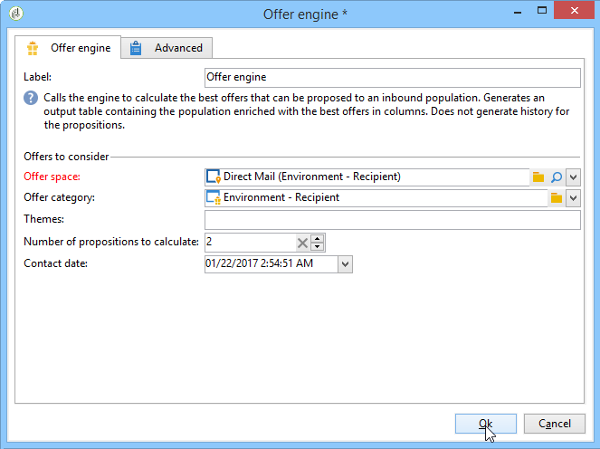

# 优惠引擎{#offer-engine}

通过 **[!UICONTROL Offer engine]** 此活动，您可以在交付之前定义对选件引擎的调用。

通过在交付之前使用引擎计算的优惠来丰富入站人口数据，该活动与使用引擎调用的富集活动遵循相同的原则。

配置查询后(请参阅此 [部分](../../workflow/using/query.md)):

1. 添加和打开活 **[!UICONTROL Offer engine]** 动。
1. 填写各种可用字段以指定对选件引擎参数（选件空间、类别或主题、联系日期、要保留的选件数量）的调用。 引擎将根据这些参数自动计算要添加的选件。

   >[!CAUTION]
   >
   >如果您使用此活动，则仅存储交付中使用的选件建议。

   

1. 然后，配置与所选渠道对应的交付活动。 请参阅 [跨渠道交付](../../workflow/using/cross-channel-deliveries.md)。

