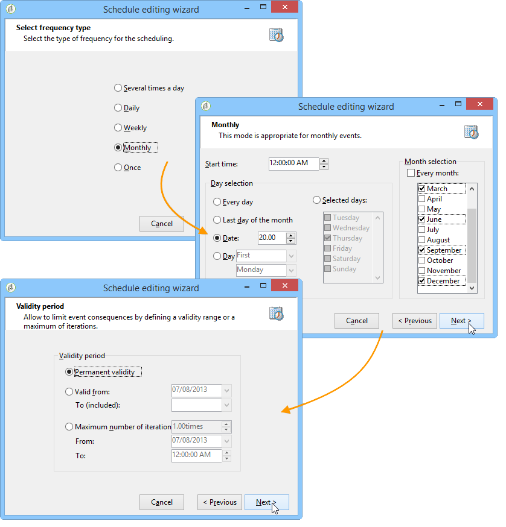

# 使用增量查询每季度更新列表 {#quarterly-list-update}

在以下示例中，使用[增量查询](../../workflow/using/incremental-query.md)自动更新收件人列表。 这些收件人是季节性营销活动的一部分。

由于每季初推出这些活动以优惠相关体育活动，因此每季更新这些列表。 但是，此收件人每9个月只能针对此活动一次。 这样，您就可以排除收件人的资格频率，并可以优惠活动多年来的不同季节。

1. 将增量查询和列表更新活动添加到新工作流中。
1. 配置[创建活动](../../workflow/using/query.md#creating-a-query)中指定的查询的&#x200B;**[!UICONTROL Incremental query]**&#x200B;选项卡。
1. 选择&#x200B;**[!UICONTROL Scheduling & History]**&#x200B;选项卡，然后指定270天历史记录。 已经成为目标的收件人在270天或大约9个月内不再成为目标。

   然后单击&#x200B;**[!UICONTROL Change...]**&#x200B;按钮。

1. 要确保在每个季节的开始之前更新列表，请选择&#x200B;**[!UICONTROL Monthly]**。
1. 在下一个屏幕上，选择3月、6月、9月和12月。 选择当月的20日，然后选择要启动工作流的时间。
1. 接下来，选择查询的有效期。 例如，如果希望此活动永久处于活动状态，请选择&#x200B;**[!UICONTROL Permanent validity]**。

   

1. 批准增量查询后，请配置列表更新活动，如[列表更新](../../workflow/using/list-update.md)中所述。

因此，工作流将在每个季的开始之前自动启动。 列表将更新为新的合格收件人以接收优惠。
