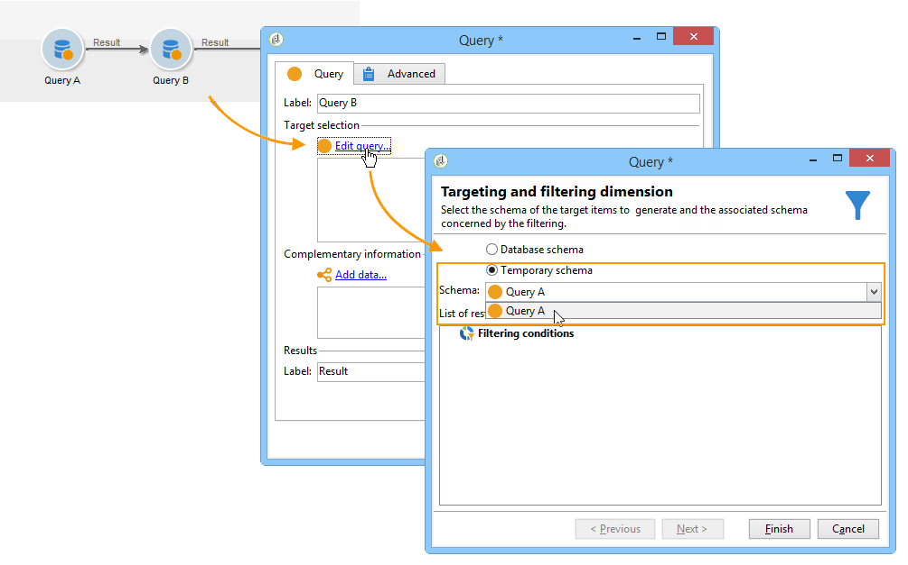
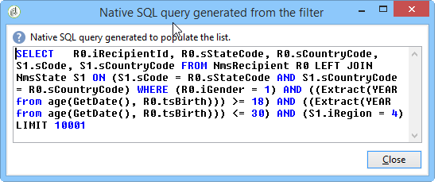

# 查询{#query}

## 创建查询{#creating-a-query}

查询允许您根据条件选择目标。 您可以将段代码与查询结果关联，并在其中插入其他数据。
有关查询示例的详细信息，请参阅此[本节](../../workflow/using/querying-recipient-table.md)。

>[!NOTE]
>
>查询活动在使用Oracle时与CLOB字段不兼容。

有关使用和管理其他数据的详细信息，请参阅[添加数据](#adding-data)。

通过&#x200B;**[!UICONTROL Edit query...]**&#x200B;链接，可以通过以下方式定义人群的定位类型、限制和选择条件：

1. 选择定位和过滤维度。 默认情况下，目标会从收件人中选择。 限制过滤器的列表与用于投放定位的相同。

   该定位维度与我们将处理的元素类型一致，例如操作所针对的群体。

   过滤维度能够收集这些要素，例如与目标人员有关的信息（合同、全额和最终结算等）。

   有关详细信息，请参阅[定位和过滤维度](../../workflow/using/building-a-workflow.md#targeting-and-filtering-dimensions)。

   

   查询可以根据入站过渡中的数据（如有必要），在选择定位和过滤维度时选择&#x200B;**[!UICONTROL Temporary schema]**。

   

1. 使用向导定义人口。 要输入的字段可能因目标类型而异。 您可以使用&#x200B;**[!UICONTROL Preview]**&#x200B;选项卡将目标人口与当前条件预览。

   有关创建和使用过滤器或查询的详细信息，请参阅此[部分](../../platform/using/filtering-options.md)。

   

1. 如果您在步骤1选择了&#x200B;**[!UICONTROL Filtering conditions]**&#x200B;或使用&#x200B;**[!UICONTROL Filters]** > **[!UICONTROL Advanced filter...]**&#x200B;选项，则以后必须手动添加筛选条件。

   您还可以通过选中相应的框来添加数据分组条件。 为此，过滤维度必须与查询的定位维度不同。 有关分组的详细信息，请参阅此[部分](../../workflow/using/querying-using-grouping-management.md)。

   您还可以使用表达式生成器并将其与逻辑选项AND、OR和EXCEPT组合，来添加更多条件。 然后，您可以预览&#x200B;**[!UICONTROL Corresponding SQL query...]**&#x200B;作为条件组合。 有关详细信息，请参阅此[部分](../../platform/using/defining-filter-conditions.md#building-expressions)。

   如果您希望以后再使用过滤器，请保存过滤器。

   

## 添加数据{#adding-data}

附加的列允许您收集有关目标人口的其他信息，例如合同编号、新闻稿订阅或来源。 此数据可以存储在Adobe Campaign库或外部数据库中。

通过&#x200B;**[!UICONTROL Add data...]**&#x200B;链接可选择要收集的其他数据。

开始，方法是选择要添加的数据类型：

* 选择&#x200B;**[!UICONTROL Data linked to the filtering dimension]**&#x200B;以选择Adobe Campaign库中的数据。
* 选择&#x200B;**[!UICONTROL External data]**&#x200B;以从外部数据库添加数据。 仅当您购买了&#x200B;**联合数据访问**&#x200B;选项时，此选项才可用。 有关详细信息，请参阅[访问外部数据库(联合数据访问)](../../workflow/using/accessing-an-external-database--fda-.md)。
* 选择&#x200B;**[!UICONTROL An offer proposition]**&#x200B;选项可添加一组列，这些列可存储优惠引擎生成的最佳主张。 仅当您购买了&#x200B;**Interaction**&#x200B;模块时，此选项才可用。

如果平台上未安装可选模块，则不显示此阶段。 你会被带到下一个舞台。

要从Adobe Campaign库添加数据，请执行以下操作：

1. 选择要添加的数据类型。 这可以是属于过滤维度的数据或存储在链接表中的数据。

   

1. 如果查询属于过滤维度，只需在可用字段的列表中选择该数据，即可在输出列中显示它。

   

   您可以添加：

   * 根据从目标人口或聚合获取的数据（上个月的待定购买数、接收的平均数等）计算的字段。 例如，转至[选择数据](../../workflow/using/targeting-data.md#selecting-data)。
   * 使用输出列列表右侧的&#x200B;**[!UICONTROL Add]**&#x200B;按钮创建的新字段。

      您还可以添加信息集合，例如合同列表、最后5个投放等。 集合与可具有相同用户档案（1-N关系）的多个值的字段重合。 有关详细信息，请参阅[编辑其他数据](../../workflow/using/targeting-data.md#editing-additional-data)。

要添加链接到目标人群的信息集合，请执行以下操作：

1. 在向导的第一步，选择&#x200B;**[!UICONTROL Data linked to the filtering dimension]**&#x200B;选项：
1. 选择包含要收集的信息的表，然后单击&#x200B;**[!UICONTROL Next]**。

   

1. 如有必要，请通过在&#x200B;**[!UICONTROL Data collected]**&#x200B;字段中选择一个值来指定要保留的集合元素数。 默认情况下，将恢复集合的所有行，然后根据在以下步骤中指定的条件进行筛选。

   * 如果集合的单个元素与此集合的筛选条件一致，请在&#x200B;**[!UICONTROL Data collected]**&#x200B;字段中选择&#x200B;**[!UICONTROL Single row]**。

      >[!IMPORTANT]
      >
      >此模式优化了由于集合元素上的直接连接而生成的SQL查询。
      >
      >如果初始条件不得到遵守，结果可能有缺陷（缺少线或重叠线）。

   * 如果选择恢复多行(**[!UICONTROL Limit the line count]**)，可指定要收集的行数。
   * 如果收集的列包含聚合，例如已声明的故障数、站点平均支出等。 可以使用&#x200B;**[!UICONTROL Aggregates]**&#x200B;值。

   

1. 指定集合的子选择。 例如：仅限过去15天内购买。

   

1. 如果已选择&#x200B;**[!UICONTROL Limit the line count]**&#x200B;选项，则定义过滤所收集数据的顺序。 一旦收集的行数超过您指定要保留的行数，筛选顺序就允许您指定要保留的行数。

## 示例：根据简单的收件人属性{#example--targeting-on-simple-recipient-attributes}进行定位

在以下例子中，查询试图查明居住在法国的18至30岁男子。 此查询将用于旨在使其成为例如专用优惠的工作流。

>[!NOTE]
>
>此部分[中显示了其他查询示例。](../../workflow/using/querying-recipient-table.md)

1. 命名查询，然后选择&#x200B;**[!UICONTROL Edit query...]**&#x200B;链接。
1. 在可用筛选器类型列表中选择&#x200B;**[!UICONTROL Filtering conditions]**。
1. 输入建议目标的不同标准。 此处条件使用AND选项组合。 要被纳入选择，收件人必须满足以下四个条件：

   * 标题为“Mr”的收件人（也可以使用&#x200B;**Gender**&#x200B;字段并选择&#x200B;**Male**&#x200B;作为值）。
   * 收件人30岁以下。
   * 收件人18岁以上。
   * 收件人住在法国。

   

   您可以视图符合条件组合的SQL:

   

1. 您可以通过在相关选项卡中预览与您的收件人匹配的查询来检查标准是否正确：

   

1. 保存过滤器，以便在以后的日期再次使用它们，方法是单击&#x200B;**[!UICONTROL Finish]** > **[!UICONTROL OK]**。
1. 通过向工作流中添加其他活动，继续编辑工作流。 启动查询并完成上一个收件人步骤后，将显示找到的数据数。 您可以使用鼠标弹出菜单显示更多详细信息(右键单击过渡> **[!UICONTROL Display the target...]**)。

   

## 输出参数{#output-parameters}

* tableName
* 模式
* recCount

这三组值标识查询所针对的人群。 **[!UICONTROL tableName]** 是记录目标标识符的表的名称， **[!UICONTROL schema]** 是人口的模式(通常是nms:收件人) **[!UICONTROL recCount]** ，是表中元素的数量。

此值是工作表的模式。 此参数对于具有&#x200B;**[!UICONTROL tableName]**&#x200B;和&#x200B;**[!UICONTROL schema]**&#x200B;的所有过渡都有效。

## 优化查询{#optimizing-queries}

以下部分提供优化Adobe Campaign上运行的查询的最佳实践，以限制数据库的工作量并改善用户体验。

### 连接和索引{#joins-and-indexes}

* 高效的查询依赖索引。
* 对所有联接使用索引。
* 在模式上定义链接将确定连接条件。 链接的表在主键上应有唯一的索引，且连接应在此字段上。
* 通过在数字字段而不是字符串字段上定义键来执行联接。
* 避免执行外部连接。 尽可能使用零ID记录来实现外连接功能。
* 对连接使用正确的数据类型。

   确保`where`子句与字段的类型相同。

   一个常见错误是：`iBlacklist='3'`其中`iBlacklist`是数字字段，`3`表示文本值。

   确保您知道查询的执行计划。 避免全表扫描，尤其是实时查询或几乎每分钟运行的实时查询。

有关详细信息，请参阅[数据模型最佳实践](https://helpx.adobe.com/cn/campaign/kb/acc-data-model-best-practices.html)和[数据库映射](../../configuration/using/database-mapping.md)部分。

### 函数 {#functions}

* 注意`Lower(...)`等函数。 使用Lower函数时，不使用Index。
* 仔细检查使用“like”指令或“upper”或“lower”指令的查询。 对用户输入应用“大写”，而不是对数据库字段应用“大写”。

   有关函数的详细信息，请参阅[本节](../../platform/using/defining-filter-conditions.md#list-of-functions)。

### 过滤维度{#filtering-dimensions}

使用查询的过滤维度，而不是使用“exists such”运算符。

在查询中，过滤器中的“存在如”条件是无效的。 它们等同于SQL中的子查询:

`select iRecipientId from nmsRecipient where iRecipientId IN (select iRecipientId from nmsBroadLog where (...))`

最佳做法是改用查询的过滤维度:

SQL中过滤维度的等效项是内部连接：

`select iRecipientId from nmsRecipient INNER JOIN nmsBroadLog ON (...)`

有关过滤维度的详细信息，请参阅[此部分](../../workflow/using/building-a-workflow.md#targeting-and-filtering-dimensions)。

### 架构 {#architecture}

* 构建一个与生产平台具有相似卷、参数和体系结构的开发平台。
* 对开发和生产环境使用相同的值。 尽可能多地使用相同的功能：

   * 操作系统,
   * 版本、
   * 数据、
   * 应用程序、
   * 卷。

   >[!NOTE]
   >
   >在开发环境有效的功能在数据可能不同的生产环境可能无效。 尝试确定主要差异，以预测风险并准备解决方案。

* 建立与目标卷匹配的配置。 大型卷需要特定配置。 对于100,000个收件人有效的配置对于10,000,000个收件人无效。

   考虑系统在启动时将如何缩放。 仅仅因为某种东西可以小规模地工作，并不意味着它适合更大的体积。 应使用与生产中的卷相似的卷进行测试。 您还应评估在高峰时段、高峰时段以及整个项目生命周期中卷数量（调用数量、数据库大小）发生更改的影响。
