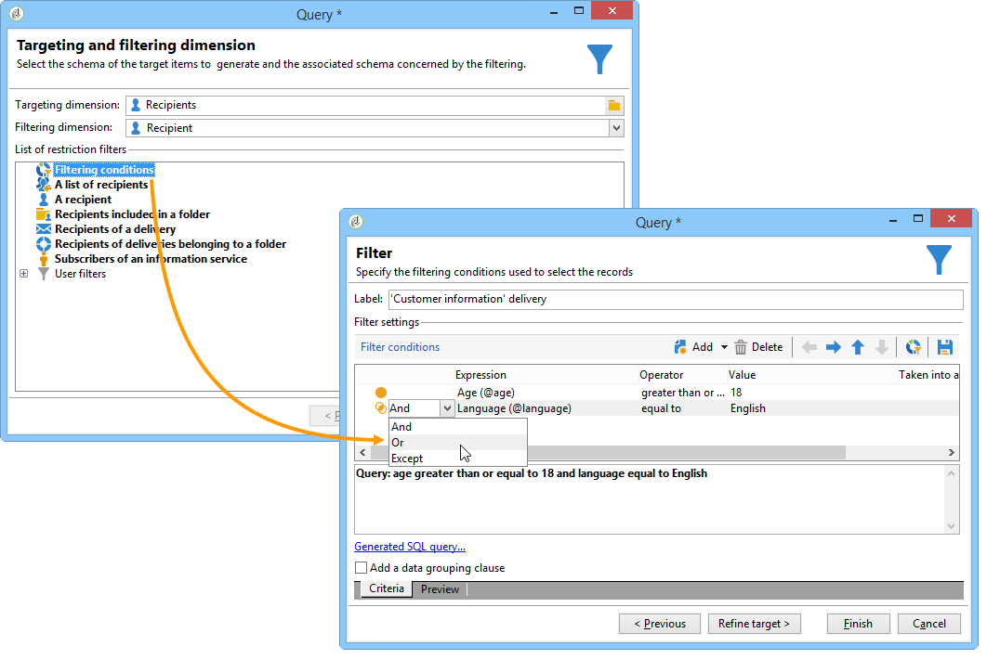

# 查询{#query}

## 创建查询 {#creating-a-query}

查询允许您根据条件选择目标。 您可以将区段代码与查询结果关联，并在查询结果中插入其他数据。
有关查询范例的详细信息，请参阅此 [部分](../../workflow/using/querying-recipient-table.md)。

>[!NOTE]
>
>使用Oracle时，查询活动与CLOB字段不兼容。

有关使用和管理其他数据的详细信息，请参阅添 [加数据](#adding-data)。

通过 **[!UICONTROL Edit query...]** 该链接，您可以通过以下方式为人群定义定位类型、限制和选择标准：

1. 选择定位和筛选维度。 默认情况下，目标将从收件人中选择。 限制筛选器列表与用于分发定位的筛选器列表相同。

   定位维度与我们要处理的元素类型一致，例如工序所定位的人群。

   过滤维度能够收集这些元素，例如与目标人员相关的信息（合同、完全和最终结算等）。

   有关此功能的详细信息，请参阅定 [位和筛选维](../../workflow/using/building-a-workflow.md#targeting-and-filtering-dimensions)。

   

   如果需要，可通过在选择定位和筛选维时进行选择，基于入站过渡中 **[!UICONTROL Temporary schema]** 的数据来查询。

   

1. 使用向导定义人群。 要输入的字段可能因目标类型而异。 您可以使用选项卡使用当前条件预览目标人群 **[!UICONTROL Preview]** 。

   有关创建和使用过滤器或查询的详细信息，请参阅此 [部分](../../platform/using/filtering-options.md)。

   

1. 如果您在步骤1 **[!UICONTROL Filtering conditions]** 中选择或使用 **[!UICONTROL Filters]** >选 **[!UICONTROL Advanced filter...]** 项，则以后必须手动添加筛选条件。

   您还可以通过选中相应的框来添加数据分组条件。 为此，筛选维度必须与查询的定位维度不同。 For more information on grouping, refer to this [section](../../workflow/using/querying-using-grouping-management.md).

   您还可以使用表达式构建器并将其与逻辑选项AND、OR和EXCEPT组合，从而添加更多条件。 然后，可以预览 **[!UICONTROL Corresponding SQL query...]** 条件组合的显示。 For more on this refer to this [section](../../platform/using/defining-filter-conditions.md#building-expressions).

   如果您希望以后再使用过滤器，请保存过滤器。

   

## 添加数据 {#adding-data}

通过附加的列，您可以收集有关目标人群的其他信息，例如合同编号、新闻稿订阅或来源。 此数据可以存储在Adobe Campaign数据库或外部数据库中。

通过 **[!UICONTROL Add data...]** 该链接，您可以选择要收集的其他数据。

首先，选择要添加的数据类型：

* 选 **[!UICONTROL Data linked to the filtering dimension]** 择以选择Adobe Campaign数据库中的数据。
* 选择 **[!UICONTROL External data]** 以从外部数据库添加数据。 仅当您购买了Federated Data Access选项时，此选 **项才可用** 。 有关详细信息，请参阅 [访问外部数据库(FDA)](../../workflow/using/accessing-an-external-database--fda-.md)。
* 选择 **[!UICONTROL An offer proposition]** 此选项可添加一组列，这些列允许您存储选件引擎生成的最佳主张。 此选项仅在您购买了“交互”模块时 **可用** 。

如果平台上未安装可选模块，则不显示此阶段。 你会被带到下一个舞台。

要从Adobe Campaign数据库添加数据，请执行以下操作：

1. 选择要添加的数据类型。 这可以是属于筛选维的数据或存储在链接表中的数据。

   

1. 如果数据属于查询的筛选维，只需在可用字段列表中选择它，即可在输出列中显示它。

   

   您可以添加：

   * 根据从目标人口或汇总中获取的数据（上个月内的待定购买数、接收的平均数等）计算的字段。 例如，转到选择 [数据](../../workflow/using/targeting-data.md#selecting-data)。
   * 使用输出列列表右 **[!UICONTROL Add]** 侧的按钮创建的新字段。

      您还可以添加信息集合，例如合同列表、最后5个交货等。 集合与同一配置文件（1-N关系）可具有多个值的字段一致。 有关此内容的详细信息，请参阅 [编辑其他数据](../../workflow/using/targeting-data.md#editing-additional-data)。

要添加链接到目标人群的信息集合，请执行以下操作：

1. 在向导的第一步，选择以下 **[!UICONTROL Data linked to the filtering dimension]** 选项：
1. 选择包含要收集的信息的表，然后单击 **[!UICONTROL Next]**。

   

1. 如有必要，请通过在字段中选择一个值来指定要保留的集合元素数 **[!UICONTROL Data collected]** 量。 默认情况下，将恢复集合的所有行，然后根据在以下步骤中指定的条件筛选这些行。

   * 如果集合的单个元素与此集合的筛选条件一致，请在字段 **[!UICONTROL Single row]** 中进行 **[!UICONTROL Data collected]** 选择。

      >[!IMPORTANT]
      >
      >此模式优化了由于集合元素上的直接接合而生成的SQL查询。
      >
      >如果不考虑初始条件，结果可能有缺陷（缺少线或重叠线）。

   * 如果选择恢复多行(**[!UICONTROL Limit the line count]**)，则可以指定要收集的行数。
   * 如果收集的列包含汇总，例如已声明的故障数、站点平均支出等。 您可以使用该 **[!UICONTROL Aggregates]** 值。
   

1. 指定集合的子选择。 例如：仅限过去15天内购买。

   

1. 如果已选择该选 **[!UICONTROL Limit the line count]** 项，请定义过滤所收集数据的顺序。 一旦收集的行数大于您指定要保留的行数，筛选顺序就允许您指定要保留的行数。

## 示例：根据简单的收件人属性进行定位 {#example--targeting-on-simple-recipient-attributes}

在以下示例中，查询旨在识别18至30岁在法国生活的男子。 此查询将用于一个工作流，例如，旨在使其成为独家优惠。

>[!NOTE]
>
>本节将介绍其他查 [询范例](../../workflow/using/querying-recipient-table.md)。

1. 命名查询，然后选择链 **[!UICONTROL Edit query...]** 接。
1. 在可 **[!UICONTROL Filtering conditions]** 用过滤器的类型列表中进行选择。
1. 输入建议目标的不同标准。 此处的条件使用“与”选项组合。 要纳入选择，收件人必须满足以下四个条件：

   * 标题为“Mr”的收件人(也可使用“性别”字段 **找到** ，然后选择“ **Male** ”作为值)。
   * 年龄在30岁以下的收件人。
   * 年龄超过18岁的收件人。
   * 住在法国的收件人。
   

   您可以查看与条件组合匹配的SQL:

   

1. 您可以通过预览与相关选项卡中的查询匹配的收件人来检查标准是否正确：

   

1. 保存您的过滤器，以便您可以在以后的日期通过单击 **[!UICONTROL Finish]** >再次使用它们 **[!UICONTROL OK]**。
1. 通过向工作流中添加其他活动，继续编辑工作流。 启动它并完成上一个查询步骤后，将显示找到的收件人数。 您可以使用鼠标弹出菜单(右键单击过渡> **[!UICONTROL Display the target...]**)显示更多详细信息。

   

## 输出参数 {#output-parameters}

* tableName
* 架构
* recCount

这三个值集标识查询所定位的人群。 **[!UICONTROL tableName]** 是记录目标标识符的表的名称， **[!UICONTROL schema]** 是人口（通常nms:recipient）的模式， **[!UICONTROL recCount]** 是表中的元素数。

此值是工作表的架构。 此参数适用于包含和的所有过 **[!UICONTROL tableName]** 渡 **[!UICONTROL schema]**。

## 优化查询 {#optimizing-queries}

以下部分提供了优化Adobe Campaign上运行的查询的最佳实践，以限制数据库的工作量并改善用户体验。

### 连接和索引 {#joins-and-indexes}

* 高效查询依赖索引。
* 对所有连接使用索引。
* 在架构上定义链接将确定连接条件。 链接的表在主键上应有唯一的索引，连接应在此字段上。
* 通过在数字字段而不是字符串字段上定义键来执行联接。
* 避免执行外部连接。 尽可能使用零ID记录来实现外连接功能。
* 为联接使用正确的数据类型。

   确保子 `where` 句的类型与字段相同。

   一个常见的错误是：其 `iBlacklist='3'` 中 `iBlacklist` 是数字字段，并 `3` 表示文本值。

   确保您知道查询的执行计划。 避免全表扫描，尤其是实时查询或几乎每分钟运行的实时查询。

有关详细信息，请参[阅数据模型最佳实践](https://helpx.adobe.com/campaign/kb/acc-data-model-best-practices.html)[和数据库映射部分](../../configuration/using/database-mapping.md) 。

### 函数 {#functions}

* 提防类似的功能 `Lower(...)`。 使用Lower函数时，不使用Index。
* 使用“like”说明或“upper”或“lower”说明仔细检查查询。 在用户输入上应用“大写”，而不是在数据库字段上应用。

   For more on functions, refer to [this section](../../platform/using/defining-filter-conditions.md#list-of-functions).

### 筛选维度 {#filtering-dimensions}

使用查询的筛选维度，而不是使用“exists sach”运算符。

在查询中，过滤器中的“exists such”条件无效。 它们等效于SQL中的子查询：

`select iRecipientId from nmsRecipient where iRecipientId IN (select iRecipientId from nmsBroadLog where (...))`

最佳实践是改用查询的筛选维度：

SQL中过滤维的等效项是内部连接：

`select iRecipientId from nmsRecipient INNER JOIN nmsBroadLog ON (...)`

For more on filtering dimensions, refer to [this section](../../workflow/using/building-a-workflow.md#targeting-and-filtering-dimensions).

### 架构 {#architecture}

* 构建一个开发平台，其卷、参数和架构与生产平台相似。
* 对开发和生产环境使用相同的值。 请尽可能使用相同的功能：

   * 操作系统、
   * 版本，
   * 数据、
   * 应用程序、
   * 卷。
   >[!NOTE]
   >
   >在开发环境中有效的功能在数据可能不同的生产环境中可能无效。 尝试识别主要差异，以预测风险并准备解决方案。

* 建立与目标卷匹配的配置。 大型卷需要特定的配置。 对于100,000个收件人有效的配置对于10,000,000个收件人无效。

   考虑系统在启动时的缩放方式。 仅仅因为某种东西可以小规模地工作并不意味着它适合更大的体积。 应使用与生产中的卷相似的卷进行测试。 您还应评估在高峰时段、高峰时段以及整个项目生命周期中卷数量（调用数量、数据库大小）变化的影响。
