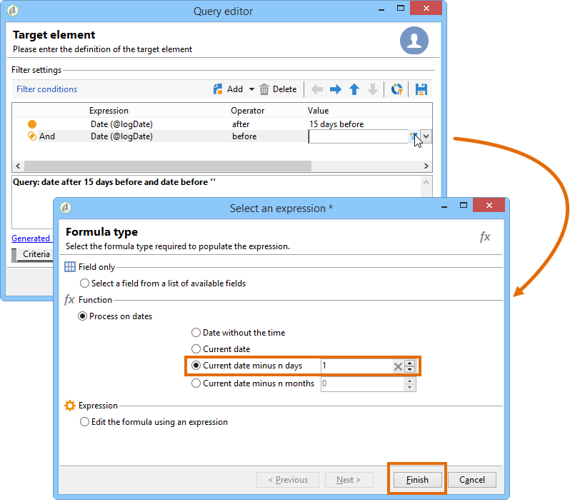

# 查询投放信息 {#querying-delivery-information}

## 特定投放的点击次数 {#number-of-clicks-for-a-specific-delivery}

在此示例中，我们希望恢复特定投放的点击次数。 这些点击量由于收件人跟踪日志在指定时间段内被占用而被记录。 收件人通过其电子邮件地址进行标识。 此查询使用 **[!UICONTROL Recipient tracking logs]** 表。

* 需要选择哪个表？

   收件人日志跟踪表(**[!UICONTROL nms:trackingLogRcp]**)

* 要为输出列选择的字段？

   主键（含计数）和电子邮件

* 将根据哪些条件筛选信息？

   特定期间和投放标签的元素

要执行此示例，请应用以下步骤：

1. 打开 **[!UICONTROL Generic query editor]** 并选择 **[!UICONTROL Recipient tracking logs]** 模式。

   

1. 在窗 **[!UICONTROL Data to extract]** 口中，我们要创建一个聚合来收集信息。 为此，请添加主键(位于主元素上 **[!UICONTROL Recipient tracking logs]** 方):跟踪日志计数将在此字段中 **[!UICONTROL Primary key]** 执行。 编辑的表达式将 **[!UICONTROL x=count(primary key)]**&#x200B;是。 它将各种跟踪日志的总和链接到单个电子邮件地址。

   操作步骤：

   * 单击 **[!UICONTROL Add]** 字段右侧的图 **[!UICONTROL Output columns]** 标。 在窗口 **[!UICONTROL Formula type]** 中，选择选 **[!UICONTROL Edit the formula using an expression]** 项并单击 **[!UICONTROL Next]**。 In the **[!UICONTROL Field to select]** window, click **[!UICONTROL Advanced selection]**.

      

   * 在窗 **[!UICONTROL Formula type]** 口中，对聚合函数运行进程。 此过程将是主键计数。

      在部 **[!UICONTROL Process on an aggregate function]** 分中选 **[!UICONTROL Aggregate]** 择并单击 **[!UICONTROL Count]**。

      

      单击 **[!UICONTROL Next]**.

   * 选择字 **[!UICONTROL Primary key (@id)]** 段。 已 **[!UICONTROL count (primary key)]** 配置输出列。

      

1. 选择要在输出列中显示的其他字段。 在列 **[!UICONTROL Available fields]** 中，打开节 **[!UICONTROL Recipient]** 点并选择 **[!UICONTROL Email]**。 选中此 **[!UICONTROL Group]** 框，按 **[!UICONTROL Yes]** 电子邮件地址对跟踪日志进行分组：此组将每个日志链接到其收件人。

   

1. 配置列排序，以便首先显示最活动的收件人(具有最多的跟踪日志)。 检 **[!UICONTROL Yes]** 入列 **[!UICONTROL Descending sort]** 中。

   

1. 然后，您必须过滤您感兴趣的日志，即2周以下、与销售相关的投放相关的日志。

   操作步骤：

   * 配置数据过滤。 要执行此操作，请选 **[!UICONTROL Filter conditions]** 择，然后单 **[!UICONTROL Next]**&#x200B;击。

      

   * 在特定跟踪日志的指定时间段内恢复投放。 有三种过滤条件：设置当前日期前2周到当前日期前2周的搜索期；以及限制搜索到特定投放的其他条件。

      在窗 **[!UICONTROL Target element]** 口中，配置开始时将考虑跟踪日志的日期。 单击 **[!UICONTROL Add]**。将显示条件行。 通过单 **[!UICONTROL Expression]** 击函数编辑 **[!UICONTROL Edit expression]** 列。 在窗口 **[!UICONTROL Field to select]** 中，选择 **[!UICONTROL Date (@logDate)]**。

      

      选择运 **[!UICONTROL greater than]** 算符。 在列 **[!UICONTROL Value]** 中，单 **[!UICONTROL Edit expression]**&#x200B;击，然后在窗 **[!UICONTROL Formula type]** 口中选择 **[!UICONTROL Process on dates]**。 最后，在 **[!UICONTROL Current date minus n days]**&#x200B;中输入“15”。

      单击 **[!UICONTROL Finish]**.

      

   * 要选择跟踪日志搜索结束日期，请单击以创建第二个条件 **[!UICONTROL Add]**。 在列 **[!UICONTROL Expression]** 中，再次 **[!UICONTROL Date (@logDate)]** 选择。

      选择运 **[!UICONTROL less than]** 算符。 In the **[!UICONTROL Value]** column, click **[!UICONTROL Edit expression]**. 对于日期处理，请转 **[!UICONTROL Formula type]** 至窗口，在中输入“1 **[!UICONTROL Current date minus n days]**”。

      单击 **[!UICONTROL Finish]**.

      

      现在，我们要配置第三个筛选条件，即我们的投放所关注的查询标签。

   * 单击该函 **[!UICONTROL Add]** 数可创建另一个筛选条件。 In the **[!UICONTROL Expression]** column, click **[!UICONTROL Edit expression]**. 在窗 **[!UICONTROL Field to select]** 口中， **[!UICONTROL Label]** 在节点 **[!UICONTROL Delivery]** 中选择。

      单击 **[!UICONTROL Finish]**.

      

      查找包含“sales”字样的投放。 由于您不记得其确切标签，因此可以选择运 **[!UICONTROL contains]** 算符并在列中输入“ **[!UICONTROL Value]** sales”。

      

1. 单击 **[!UICONTROL Next]** 直到您到达窗口 **[!UICONTROL Data preview]** :此处无需格式设置。
1. 在窗 **[!UICONTROL Data preview]** 口中，单 **[!UICONTROL Start the preview of the data]** 击查看每个跟踪日志收件人的投放数。

   结果以降序显示。

   

   此投放的用户最多日志数为6。 5个不同的用户打开了投放电子邮件或单击了电子邮件中的链接之一。

## 收件人未打开任何投放 {#recipients-who-did-not-open-any-delivery}

在此示例中，我们希望过滤过去7天内未打开电子邮件的收件人。

要创建此示例，请应用以下步骤：

1. 在工作流中拖 **[!UICONTROL Query]** 放活动并打开活动。
1. 单击 **[!UICONTROL Edit query]** 并将目标和过滤维度设置为 **[!UICONTROL Recipients]**。

   

1. 选择 **[!UICONTROL Filtering conditions]** ，然后单 **[!UICONTROL Next]**&#x200B;击。
1. Click the **[!UICONTROL Add]** button and select **[!UICONTROL Tracking logs]**.
1. 将 **[!UICONTROL Operator]** 表达式 **[!UICONTROL Tracking logs]** 设置为 **[!UICONTROL Do not exist such as]**。

   

1. 添加其他表达式。 在 **[!UICONTROL Type]** 类别 **[!UICONTROL URL]** 中选择。
1. 然后，将其设 **[!UICONTROL Operator]** 置 **[!UICONTROL equal to]** 为，将其 **[!UICONTROL Value]** 设置为 **[!UICONTROL Open]**。

   

1. 添加其他表达式并选 **[!UICONTROL Date]**&#x200B;择。 **[!UICONTROL Operator]** 应该设置为 **[!UICONTROL on or after]**。

   

1. 要设置最近7天的值，请单击 **[!UICONTROL Edit expression]** 字段中的按 **[!UICONTROL Value]** 钮。
1. 在类别 **[!UICONTROL Function]** 中，选 **[!UICONTROL Current date minus n days]** 择并添加要目标的天数。 这里，我们要目标过去7天。

   

您的出站过渡将包含过去7天内未打开电子邮件的收件人。

相反，如果您要过滤至少打开一封电子邮件的收件人,查询应如下所示。 请注意，在本例中，应 **[!UICONTROL Filtering dimension]** 将其设置为 **[!UICONTROL Tracking logs (Recipients)]**。

## 收件人开办了投放 {#recipients-who-have-opened-a-delivery}

以下示例演示如何目标最近2周内打开投放的用户档案:

1. 要目标已打开投放的用户档案，您需要使用跟踪日志。 它们存储在链接的表中：开始，方法是在字段的下拉列表中选 **[!UICONTROL Filtering dimension]** 择此表，如下所示：

   

1. 有关筛选条件，请 **[!UICONTROL Edit expression]** 单击跟踪日志子树结构中显示的标准图标。 选择字 **[!UICONTROL Date]** 段。

   

   Click **[!UICONTROL Finish]** to confirm selection.

   要仅恢复不到两周的跟踪日志，请选择运 **[!UICONTROL Greater than]** 算符。

   

   然后，单 **[!UICONTROL Edit expression]** 击列中的 **[!UICONTROL Value]** 图标以定义要应用的计算公式。 选择公 **[!UICONTROL Current date minus n days]** 式，并在相关字段中输入15。

   

   单击 **[!UICONTROL Finish]** 公式窗口的按钮。 在筛选窗口中，单击选 **[!UICONTROL Preview]** 项卡以检查定位条件。

   

## 按照收件人过滤投放行为 {#filtering-recipients--behavior-folllowing-a-delivery}

在工作流中，您 **[!UICONTROL Query]** 可以 **[!UICONTROL Split]** 通过和框选择上一个投放之后的行为。 该选择通过过滤器 **[!UICONTROL Delivery recipient]** 进行。

* 示例的目的

   在投放工作流程中，有多种方法跟踪第一次电子邮件通信。 此类操作涉及使用 **[!UICONTROL Split]** 框。

* 上下文

   酒店还发送“夏季运动优惠”投放。 投放四天后，另外两个投放被发送。 其中一个是“水上运动优惠”，另一个是第一个“夏季运动优惠”投放的后续活动。

   “水上运动优惠”投放发送给在第一个投放点击“水上运动”链接的收件人。 这些点击表明收件人对主题感兴趣。 引导他们走向类似的优惠是合理的。 但是，未点击“夏季体育优惠”的收件人将再次收到相同的内容。

以下步骤显示了如何通过集成两 **[!UICONTROL Split]** 种不同的行为来配置框：

1. 将框插 **[!UICONTROL Split]** 入工作流。 这个盒子将第一个投放的收件人分解为下两个投放。 在第一个投放中，根据与收件人行为链接的过滤条件进行细分。

   

1. 打开 **[!UICONTROL Split]** 包装盒。 在选项卡 **[!UICONTROL General]** 中，输入标签： **根据实例的行为** 进行拆分。

   

1. 在选项卡 **[!UICONTROL Subsets]** 中，定义第一个拆分分支。 例如，输入此 **分支的** “已单击”标签。
1. 选择选 **[!UICONTROL Add a filtering condition on the incoming population]** 项。 单击 **[!UICONTROL Edit]**.
1. 在窗 **[!UICONTROL Targeting and filtering dimension]** 口中，多次单击 **[!UICONTROL Recipients of a delivery]** 筛选器。

   

1. 在窗 **[!UICONTROL Target element]** 口中，选择要应用于此分支的行为： **[!UICONTROL Recipients having clicked (email)]**.

   在下面，选择 **[!UICONTROL Delivery specified by the transition]** 选项。 此功能将在第一个投放自动恢复目标用户。

   这是&quot;水运优惠&quot;投放。

   

1. 定义第二个分支。 此分支将包含与第一个投放内容相同的后续电子邮件。 转到选项卡 **[!UICONTROL Subsets]** 并单击以 **[!UICONTROL Add]** 创建它。

   

1. 将显示另一个子选项卡。 将其命名&#x200B;**为“未单击**”。
1. 单击 **[!UICONTROL Add a filtering condition for the incoming population]**。然后单击 **[!UICONTROL Edit...]**。

   

1. 在窗 **[!UICONTROL Delivery recipients]** 口中单 **[!UICONTROL Targeting and filtering dimension]** 击。
1. 在窗 **[!UICONTROL Target element]** 口中，选择 **[!UICONTROL Recipients who did not click (email)]** 行为。 选择 **[!UICONTROL Delivery specified by the transition]** 最后一个分支的选项。

   现 **[!UICONTROL Split]** 在已完全配置该框。

   

以下是默认配置的各种组件的列表:

* **[!UICONTROL All recipients]**
* **[!UICONTROL Recipients of successfully sent messages,]**
* **[!UICONTROL Recipients who opened or clicked (email),]**
* **[!UICONTROL Recipients who clicked (email),]**
* **[!UICONTROL Recipients of a failed message,]**
* **[!UICONTROL Recipients who didn't open or click (email),]**
* **[!UICONTROL Recipients who didn't click (email).]**

   
