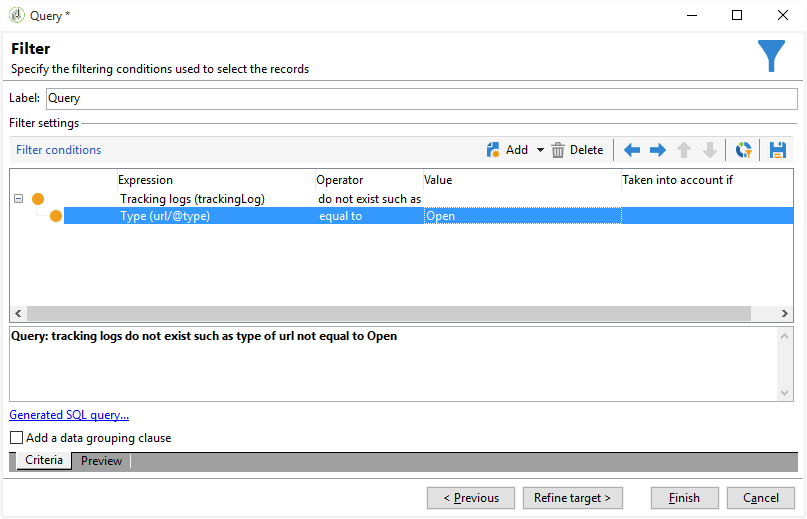
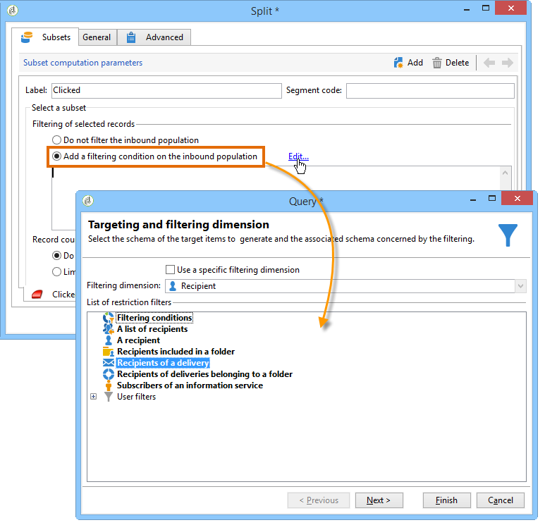

# 查询投放信息 {#querying-delivery-information}

## 特定投放的点击次数{#number-of-clicks-for-a-specific-delivery}

在本例中，我们希望恢复特定投放的点击次数。 由于收件人在给定时间段内获取的跟踪日志，因此会记录这些点击。 收件人通过其电子邮件地址进行标识。 此查询使用&#x200B;**[!UICONTROL Recipient tracking logs]**&#x200B;表。

* 需要选择哪个表？

   收件人日志跟踪表(**[!UICONTROL nms:trackingLogRcp]**)

* 要为输出列选择的字段？

   主键（包含计数）和电子邮件

* 将根据哪些标准过滤信息？

   投放标签的特定时段和元素

要执行此示例，请应用以下步骤：

1. 打开&#x200B;**[!UICONTROL Generic query editor]**&#x200B;并选择&#x200B;**[!UICONTROL Recipient tracking logs]**&#x200B;架构。

   

1. 在&#x200B;**[!UICONTROL Data to extract]**&#x200B;窗口中，我们要创建聚合以收集信息。 为此，请添加主键（位于主&#x200B;**[!UICONTROL Recipient tracking logs]**&#x200B;元素上方）：对此&#x200B;**[!UICONTROL Primary key]**&#x200B;字段执行跟踪日志计数。 编辑后的表达式将为&#x200B;**[!UICONTROL x=count(primary key)]**。 它会将各种跟踪日志的总和链接到单个电子邮件地址。

   操作步骤：

   * 单击&#x200B;**[!UICONTROL Output columns]**&#x200B;字段右侧的&#x200B;**[!UICONTROL Add]**&#x200B;图标。 在&#x200B;**[!UICONTROL Formula type]**&#x200B;窗口中，选择&#x200B;**[!UICONTROL Edit the formula using an expression]**&#x200B;选项，然后单击&#x200B;**[!UICONTROL Next]**。 在&#x200B;**[!UICONTROL Field to select]**&#x200B;窗口中，单击&#x200B;**[!UICONTROL Advanced selection]**。

      

   * 在&#x200B;**[!UICONTROL Formula type]**&#x200B;窗口中，对聚合函数运行进程。 此过程将是主键计数。

      在&#x200B;**[!UICONTROL Aggregate]**&#x200B;部分中选择&#x200B;**[!UICONTROL Process on an aggregate function]**，然后单击&#x200B;**[!UICONTROL Count]**。

      

      单击 **[!UICONTROL Next]**。

   * 选择&#x200B;**[!UICONTROL Primary key (@id)]**&#x200B;字段。 已配置&#x200B;**[!UICONTROL count (primary key)]**&#x200B;输出列。

      

1. 选择要在输出列中显示的其他字段。 在&#x200B;**[!UICONTROL Available fields]**&#x200B;列中，打开&#x200B;**[!UICONTROL Recipient]**&#x200B;节点并选择&#x200B;**[!UICONTROL Email]**。 选中&#x200B;**[!UICONTROL Group]**&#x200B;复选框&#x200B;**[!UICONTROL Yes]** ，按电子邮件地址对跟踪日志进行分组：此组将每个日志链接到其收件人。

   

1. 配置列排序，以便最先显示最活跃的收件人（具有最多的跟踪日志）。 检查&#x200B;**[!UICONTROL Descending sort]**&#x200B;列中的&#x200B;**[!UICONTROL Yes]**。

   

1. 然后，您必须过滤您感兴趣的日志，即2周以下且与销售相关的投放相关的日志。

   操作步骤：

   * 配置数据过滤。 要执行此操作，请选择&#x200B;**[!UICONTROL Filter conditions]**，然后单击&#x200B;**[!UICONTROL Next]**。

      

   * 在特定投放的给定时间段内恢复跟踪日志。 需要满足以下三个筛选条件：两个日期条件来设置在当前日期之前2周到当前日期之前1天之间的搜索期；以及将搜索限制为特定投放的其他条件。

      在&#x200B;**[!UICONTROL Target element]**&#x200B;窗口中，配置开始跟踪日志的日期，从该日期开始，将考虑跟踪日志。 单击 **[!UICONTROL Add]**。将显示条件行。 通过单击&#x200B;**[!UICONTROL Edit expression]**&#x200B;函数，编辑&#x200B;**[!UICONTROL Expression]**&#x200B;列。 在&#x200B;**[!UICONTROL Field to select]**&#x200B;窗口中，选择&#x200B;**[!UICONTROL Date (@logDate)]**。

      

      选择&#x200B;**[!UICONTROL greater than]**&#x200B;运算符。 在&#x200B;**[!UICONTROL Value]**&#x200B;列中，单击&#x200B;**[!UICONTROL Edit expression]**，然后在&#x200B;**[!UICONTROL Formula type]**&#x200B;窗口中，选择&#x200B;**[!UICONTROL Process on dates]**。 最后，在&#x200B;**[!UICONTROL Current date minus n days]**&#x200B;中，输入&quot;15&quot;。

      单击 **[!UICONTROL Finish]**。

      

   * 要选择跟踪日志搜索结束日期，请通过单击&#x200B;**[!UICONTROL Add]**&#x200B;创建第二个条件。 在&#x200B;**[!UICONTROL Expression]**&#x200B;列中，再次选择&#x200B;**[!UICONTROL Date (@logDate)]**。

      选择&#x200B;**[!UICONTROL less than]**&#x200B;运算符。 在&#x200B;**[!UICONTROL Value]**&#x200B;列中，单击&#x200B;**[!UICONTROL Edit expression]**。 对于日期处理，请转到&#x200B;**[!UICONTROL Formula type]**&#x200B;窗口，在&#x200B;**[!UICONTROL Current date minus n days]**&#x200B;中输入“1”。

      单击 **[!UICONTROL Finish]**。

      

      现在，我们要配置第三个筛选条件，即查询所关注的投放标签。

   * 单击&#x200B;**[!UICONTROL Add]**&#x200B;函数以创建另一个筛选条件。 在&#x200B;**[!UICONTROL Expression]**&#x200B;列中，单击&#x200B;**[!UICONTROL Edit expression]**。 在&#x200B;**[!UICONTROL Field to select]**&#x200B;窗口中，在&#x200B;**[!UICONTROL Delivery]**&#x200B;节点中选择&#x200B;**[!UICONTROL Label]**。

      单击 **[!UICONTROL Finish]**。

      

      查找包含“sales”字样的投放。 由于您不记得其确切标签，因此可以选择&#x200B;**[!UICONTROL contains]**&#x200B;运算符，并在&#x200B;**[!UICONTROL Value]**&#x200B;列中输入“sales”。

      

1. 单击&#x200B;**[!UICONTROL Next]**&#x200B;直到进入&#x200B;**[!UICONTROL Data preview]**&#x200B;窗口：此处不需要格式设置。
1. 在&#x200B;**[!UICONTROL Data preview]**&#x200B;窗口中，单击&#x200B;**[!UICONTROL Start the preview of the data]**&#x200B;以查看每个投放收件人的跟踪日志数。

   结果以降序显示。

   

   此投放的用户最多日志数为6。 5个不同的用户打开了投放电子邮件，或单击了电子邮件中的一个链接。

## 未打开任何投放的收件人{#recipients-who-did-not-open-any-delivery}

在本例中，我们希望过滤过去7天内未打开电子邮件的收件人。

要创建此示例，请应用以下步骤：

1. 在工作流中拖放&#x200B;**[!UICONTROL Query]**&#x200B;活动并打开该活动。
1. 单击&#x200B;**[!UICONTROL Edit query]**&#x200B;并将目标和筛选维度设置为&#x200B;**[!UICONTROL Recipients]**。

   

1. 选择&#x200B;**[!UICONTROL Filtering conditions]**，然后单击&#x200B;**[!UICONTROL Next]**。
1. 单击&#x200B;**[!UICONTROL Add]**&#x200B;按钮并选择&#x200B;**[!UICONTROL Tracking logs]**。
1. 将&#x200B;**[!UICONTROL Tracking logs]**&#x200B;表达式的&#x200B;**[!UICONTROL Operator]**&#x200B;设置为&#x200B;**[!UICONTROL Do not exist such as]**。

   

1. 添加其他表达式。 在&#x200B;**[!UICONTROL URL]**&#x200B;类别中选择&#x200B;**[!UICONTROL Type]**。
1. 然后，将其&#x200B;**[!UICONTROL Operator]**&#x200B;设置为&#x200B;**[!UICONTROL equal to]**，将其&#x200B;**[!UICONTROL Value]**&#x200B;设置为&#x200B;**[!UICONTROL Open]**。

   

1. 添加另一个表达式并选择&#x200B;**[!UICONTROL Date]**。 **[!UICONTROL Operator]** 应设置为 **[!UICONTROL on or after]**。

   

1. 要设置最近7天的值，请单击&#x200B;**[!UICONTROL Value]**&#x200B;字段中的&#x200B;**[!UICONTROL Edit expression]**&#x200B;按钮。
1. 在&#x200B;**[!UICONTROL Function]**&#x200B;类别中，选择&#x200B;**[!UICONTROL Current date minus n days]**&#x200B;并添加要定位的天数。 在这里，我们想定位过去7天。

   

您的叫客过渡将包含过去7天内未打开电子邮件的收件人。

相反，如果要筛选至少打开了一封电子邮件的收件人，则查询应如下所示。 请注意，在这种情况下，应将&#x200B;**[!UICONTROL Filtering dimension]**&#x200B;设置为&#x200B;**[!UICONTROL Tracking logs (Recipients)]**。

## 已打开投放的收件人{#recipients-who-have-opened-a-delivery}

以下示例显示如何定位在过去2周内打开了投放的用户档案：

1. 要定位已打开投放的用户档案，您需要使用跟踪日志。 它们存储在链接的表中：首先，在&#x200B;**[!UICONTROL Filtering dimension]**&#x200B;字段的下拉列表中选择此表，如下所示：

   

1. 有关筛选条件，请单击跟踪日志子树结构中显示的标准的&#x200B;**[!UICONTROL Edit expression]**&#x200B;图标。 选择&#x200B;**[!UICONTROL Date]**&#x200B;字段。

   

   单击&#x200B;**[!UICONTROL Finish]**&#x200B;以确认选择。

   要仅恢复不到两周前的跟踪日志，请选择&#x200B;**[!UICONTROL Greater than]**&#x200B;运算符。

   

   然后，单击&#x200B;**[!UICONTROL Value]**&#x200B;列中的&#x200B;**[!UICONTROL Edit expression]**&#x200B;图标以定义要应用的计算公式。 选择&#x200B;**[!UICONTROL Current date minus n days]**&#x200B;公式，然后在相关字段中输入15。

   

   单击公式窗口的&#x200B;**[!UICONTROL Finish]**&#x200B;按钮。 在筛选窗口中，单击&#x200B;**[!UICONTROL Preview]**&#x200B;选项卡以检查定位标准。

   

## 筛选投放后收件人的行为{#filtering-recipients--behavior-folllowing-a-delivery}

在工作流中，通过&#x200B;**[!UICONTROL Query]**&#x200B;和&#x200B;**[!UICONTROL Split]**&#x200B;框，您可以选择上次投放后的行为。 此选择通过&#x200B;**[!UICONTROL Delivery recipient]**&#x200B;筛选器执行。

* 示例的目标

   在投放工作流中，有多种方法跟踪第一次电子邮件通信。 此类操作涉及使用&#x200B;**[!UICONTROL Split]**&#x200B;框。

* 上下文

   将发送“夏季体育优惠”投放。 投放四天后，会发送其他两个投放。 其中一个是“水上运动服务”，另一个是“夏季运动服务”首次投放的后续活动。

   “水上运动选件”投放将发送给在首次投放中单击“水上运动”链接的收件人。 这些点击表示收件人对主题感兴趣。 将他们引导至类似的报价是明智的。 但是，未在“夏季体育选件”中单击的收件人将再次收到相同的内容。

以下步骤将向您展示如何通过集成两种不同的行为来配置&#x200B;**[!UICONTROL Split]**&#x200B;框：

1. 将&#x200B;**[!UICONTROL Split]**&#x200B;框插入工作流。 此框会将第一个投放的收件人划分为接下来的两个投放。 划分基于在首次投放期间链接到收件人行为的筛选条件。

   

1. 打开&#x200B;**[!UICONTROL Split]**&#x200B;框。 在&#x200B;**[!UICONTROL General]**&#x200B;选项卡中，输入标签：例如，**根据行为**&#x200B;进行拆分。

   

1. 在&#x200B;**[!UICONTROL Subsets]**&#x200B;选项卡中，定义第一个拆分分支。 例如，输入此分支的&#x200B;**Clicked**&#x200B;标签。
1. 选择&#x200B;**[!UICONTROL Add a filtering condition on the incoming population]**&#x200B;选项。 单击 **[!UICONTROL Edit]**。
1. 在&#x200B;**[!UICONTROL Targeting and filtering dimension]**&#x200B;窗口中，双击&#x200B;**[!UICONTROL Recipients of a delivery]**&#x200B;过滤器。

   

1. 在&#x200B;**[!UICONTROL Target element]**&#x200B;窗口中，选择要应用于此分支的行为：**[!UICONTROL Recipients having clicked (email)]**。

   在下面，选择&#x200B;**[!UICONTROL Delivery specified by the transition]**&#x200B;选项。 此功能将在首次投放期间自动恢复目标人员。

   这是“水上运动优惠”投放。

   

1. 定义第二个分支。 此分支将包含与首次投放内容相同的后续电子邮件。 转到&#x200B;**[!UICONTROL Subsets]**&#x200B;选项卡，然后单击&#x200B;**[!UICONTROL Add]**&#x200B;以创建该选项卡。

   

1. 将显示另一个子选项卡。 将其命名为“**Did not click**”。
1. 单击 **[!UICONTROL Add a filtering condition for the incoming population]**。然后单击 **[!UICONTROL Edit...]**。

   

1. 在&#x200B;**[!UICONTROL Targeting and filtering dimension]**&#x200B;窗口中单击&#x200B;**[!UICONTROL Delivery recipients]**。
1. 在&#x200B;**[!UICONTROL Target element]**&#x200B;窗口中，选择&#x200B;**[!UICONTROL Recipients who did not click (email)]**&#x200B;行为。 选择&#x200B;**[!UICONTROL Delivery specified by the transition]**&#x200B;选项，如最后一个分支所示。

   **[!UICONTROL Split]**&#x200B;框现已完全配置。

   

以下是默认配置的各种组件列表：

* **[!UICONTROL All recipients]**
* **[!UICONTROL Recipients of successfully sent messages,]**
* **[!UICONTROL Recipients who opened or clicked (email),]**
* **[!UICONTROL Recipients who clicked (email),]**
* **[!UICONTROL Recipients of a failed message,]**
* **[!UICONTROL Recipients who didn't open or click (email),]**
* **[!UICONTROL Recipients who didn't click (email).]**

   
