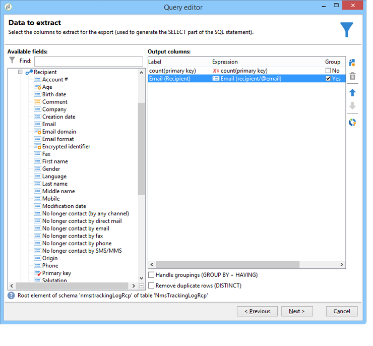

# 查询交付信息 {#querying-delivery-information}

## 特定交付的点击次数 {#number-of-clicks-for-a-specific-delivery}

在此示例中，我们希望恢复特定交付的点击次数。 由于在给定时间段内接收了收件人跟踪日志，因此会记录这些点击。 收件人通过其电子邮件地址进行标识。 此查询使用 **[!UICONTROL Recipient tracking logs]** 表。

* 需要选择哪个表？

   收件人日志跟踪表(**[!UICONTROL nms:trackingLogRcp]**)

* 要为输出列选择的字段？

   主键（含数）和电子邮件

* 信息将根据哪些条件进行筛选？

   特定期间和传送标签的元素

要执行此示例，请应用以下步骤：

1. 打开架 **[!UICONTROL Generic query editor]** 构，然后选 **[!UICONTROL Recipient tracking logs]** 择架构。

   

1. 在窗 **[!UICONTROL Data to extract]** 口中，我们要创建聚合来收集信息。 为此，请添加主键(位于主元素上 **[!UICONTROL Recipient tracking logs]** 方):跟踪日志计数将在此字段中执 **[!UICONTROL Primary key]** 行。 编辑后的表达式将为 **[!UICONTROL x=count(primary key)]**。 它将各种跟踪日志的总和链接到单个电子邮件地址。

   操作步骤：

   * 单击 **[!UICONTROL Add]** 字段右侧的图 **[!UICONTROL Output columns]** 标。 在窗 **[!UICONTROL Formula type]** 口中，选择选 **[!UICONTROL Edit the formula using an expression]** 项并单击 **[!UICONTROL Next]**。 在窗口 **[!UICONTROL Field to select]** 中，单击 **[!UICONTROL Advanced selection]**。

      

   * 在窗 **[!UICONTROL Formula type]** 口中，对聚合函数运行进程。 此过程将是主键计数。

      在部 **[!UICONTROL Process on an aggregate function]** 分中选 **[!UICONTROL Aggregate]** 择并单击 **[!UICONTROL Count]**。

      

      单击 **[!UICONTROL Next]**.

   * 选择字 **[!UICONTROL Primary key (@id)]** 段。 输 **[!UICONTROL count (primary key)]** 出列已配置。

      

1. 选择要在输出列中显示的其他字段。 在列中， **[!UICONTROL Available fields]** 打开节点并 **[!UICONTROL Recipient]** 选择 **[!UICONTROL Email]**。 选中此 **[!UICONTROL Group]** 框可按 **[!UICONTROL Yes]** 电子邮件地址对跟踪日志分组：该组将每个日志链接到其收件人。

   

1. 配置列排序，以便首先显示最活跃的收件人（具有最多的跟踪日志）。 检 **[!UICONTROL Yes]** 查列 **[!UICONTROL Descending sort]** 中。

   

1. 然后，您必须过滤您感兴趣的日志，即存在2周以下且与销售相关的交货的日志。

   操作步骤：

   * 配置数据过滤。 为此，请选择， **[!UICONTROL Filter conditions]** 然后单击 **[!UICONTROL Next]**。

      

   * 在特定交付的给定时间段内恢复跟踪日志。 有三个过滤条件是必需的：设置当前日期前2周到当前日期前2周的搜索期；以及将搜索限制到特定交付的其他条件。

      在窗 **[!UICONTROL Target element]** 口中，配置开始日期，从该日期开始，将跟踪日志考虑在内。 单击 **[!UICONTROL Add]**. 此时将显示条件行。 通过单 **[!UICONTROL Expression]** 击函数编辑 **[!UICONTROL Edit expression]** 列。 在窗口 **[!UICONTROL Field to select]** 中，选择 **[!UICONTROL Date (@logDate)]**。

      

      选择运 **[!UICONTROL greater than]** 算符。 在列 **[!UICONTROL Value]** 中，单 **[!UICONTROL Edit expression]**&#x200B;击，然后在窗口 **[!UICONTROL Formula type]** 中选择 **[!UICONTROL Process on dates]**。 最后，在 **[!UICONTROL Current date minus n days]**&#x200B;中输入“15”。

      单击 **[!UICONTROL Finish]**.

      

   * 要选择跟踪日志搜索结束日期，请单击以创建第二个条件 **[!UICONTROL Add]**。 在列中， **[!UICONTROL Expression]** 再次选择 **[!UICONTROL Date (@logDate)]** 该选项。

      选择运 **[!UICONTROL less than]** 算符。 在列 **[!UICONTROL Value]** 中，单击 **[!UICONTROL Edit expression]**。 对于日期处理，请转至 **[!UICONTROL Formula type]** 窗口，在中输入“1” **[!UICONTROL Current date minus n days]**。

      单击 **[!UICONTROL Finish]**.

      

      现在，我们要配置第三个过滤条件，即查询所关注的传送标签。

   * 单击该函 **[!UICONTROL Add]** 数可创建另一个筛选条件。 在列 **[!UICONTROL Expression]** 中，单击 **[!UICONTROL Edit expression]**。 在窗口 **[!UICONTROL Field to select]** 中，在节 **[!UICONTROL Label]** 点中选 **[!UICONTROL Delivery]** 择。

      单击 **[!UICONTROL Finish]**.

      

      查找包含“sales”字样的递送。 由于您不记得其确切标签，因此可以选择运 **[!UICONTROL contains]** 算符并在列中输入“sales” **[!UICONTROL Value]** 。

      

1. 单击 **[!UICONTROL Next]** 直到您到达窗口 **[!UICONTROL Data preview]** 为止：此处不需要格式设置。
1. 在窗 **[!UICONTROL Data preview]** 口中，单 **[!UICONTROL Start the preview of the data]** 击查看每个交付收件人的跟踪日志数。

   结果以降序显示。

   

   此分发的用户最多日志数为6。 5个不同的用户打开了分发电子邮件或单击了电子邮件中的链接之一。

## 未打开任何分发的收件人 {#recipients-who-did-not-open-any-delivery}

在此示例中，我们希望过滤过去7天内未打开电子邮件的收件人。

要创建此示例，请应用以下步骤：

1. 在工作流中拖 **[!UICONTROL Query]** 放活动，然后打开该活动。
1. 单击 **[!UICONTROL Edit query]** 并将目标和筛选维设置为 **[!UICONTROL Recipients]**。

   

1. 选择， **[!UICONTROL Filtering conditions]** 然后单击 **[!UICONTROL Next]**。
1. Click the **[!UICONTROL Add]** button and select **[!UICONTROL Tracking logs]**.
1. 将表 **[!UICONTROL Operator]** 达式的 **[!UICONTROL Tracking logs]** 值设置为 **[!UICONTROL Do not exist such as]**。

   

1. 添加另一个表达式。 在类 **[!UICONTROL Type]** 别中选 **[!UICONTROL URL]** 择。
1. 然后，将其设 **[!UICONTROL Operator]** 置为 **[!UICONTROL equal to]** ，将其 **[!UICONTROL Value]** 设置为 **[!UICONTROL Open]**。

   

1. 添加另一个表达式并选择 **[!UICONTROL Date]**。 **[!UICONTROL Operator]** 应该设置为 **[!UICONTROL on or after]**。

   

1. 要设置最近7天的值，请单击字 **[!UICONTROL Edit expression]** 段中的按 **[!UICONTROL Value]** 钮。
1. 在类 **[!UICONTROL Function]** 别中，选 **[!UICONTROL Current date minus n days]** 择并添加要定位的天数。 这里，我们要把最后7天定为目标。

   

您的出站过渡将包含在过去7天内未打开电子邮件的收件人。

相反，如果要过滤至少打开了一封电子邮件的收件人，则您的查询应如下。 请注意，在这种情况下， **[!UICONTROL Filtering dimension]** 应将其设置为 **[!UICONTROL Tracking logs (Recipients)]**。

## 已打开分发的收件人 {#recipients-who-have-opened-a-delivery}

以下示例显示了如何定位在过去2周内已开始分发的配置文件：

1. 要定位已打开分发的配置文件，您需要使用跟踪日志。 它们存储在链接的表中：首先，在字段的下拉列表中选择此 **[!UICONTROL Filtering dimension]** 表，如下所示：

   

1. 关于筛选条件，请单 **[!UICONTROL Edit expression]** 击跟踪日志的子树结构中显示的标准图标。 选择字 **[!UICONTROL Date]** 段。

   

   单击 **[!UICONTROL Finish]** 以确认选择。

   要仅恢复不到两周的跟踪日志，请选择运 **[!UICONTROL Greater than]** 算符。

   

   然后，单 **[!UICONTROL Edit expression]** 击列中的图 **[!UICONTROL Value]** 标以定义要应用的计算公式。 选择公 **[!UICONTROL Current date minus n days]** 式，然后在相关字段中输入15。

   

   单击 **[!UICONTROL Finish]** 公式窗口的按钮。 在筛选窗口中，单击选 **[!UICONTROL Preview]** 项卡以检查定位条件。

   

## 过滤收件人在分发后的行为 {#filtering-recipients--behavior-folllowing-a-delivery}

在工作流中，您可以 **[!UICONTROL Query]** 通过和 **[!UICONTROL Split]** 框选择上一个分发后的行为。 该选择通过该滤波器 **[!UICONTROL Delivery recipient]** 执行。

* 示例的目的

   在交付工作流中，有多种方法跟踪第一封电子邮件通信。 此类操作涉及使用框 **[!UICONTROL Split]** 。

* 上下文

   送送“夏季体育优惠”。 交货四天后，另外两个交货被送来。 其中一个是“水上运动”，另一个是“夏季运动”第一次投递的后续活动。

   “水上运动优惠”送货将发送给在第一次送货中点击“水上运动”链接的收件人。 这些点击表明收件人对主题感兴趣。 将他们引向类似的报价是明智的。 但是，未点击“夏季体育优惠”的收件人将再次收到相同的内容。

以下步骤显示了如何通过集成两 **[!UICONTROL Split]** 种不同的行为来配置框：

1. 将框插 **[!UICONTROL Split]** 入工作流。 此框将第一个递送的收件人分为后两个递送。 根据在第一次分发期间链接到收件人行为的过滤条件进行细分。

   

1. 打开 **[!UICONTROL Split]** 包装盒。 在选项卡 **[!UICONTROL General]** 中，输入一个标签：根 **据实例的行为进行拆分** 。

   

1. 在选项卡 **[!UICONTROL Subsets]** 中，定义第一个拆分分支。 例如，输入此分 **支的** “已单击”标签。
1. 选择选 **[!UICONTROL Add a filtering condition on the incoming population]** 项。 单击 **[!UICONTROL Edit]**.
1. 在窗 **[!UICONTROL Targeting and filtering dimension]** 口中，双击滤镜 **[!UICONTROL Recipients of a delivery]** 。

   

1. 在窗 **[!UICONTROL Target element]** 口中，选择要应用到此分支的行为： **[!UICONTROL Recipients having clicked (email)]**.

   在下面，选择 **[!UICONTROL Delivery specified by the transition]** 选项。 此功能将在第一次交付期间自动恢复目标人员。

   这是&quot;水上运动&quot;的送货方式。

   

1. 定义第二个分支。 此分支将包含与第一次分发内容相同的后续电子邮件。 转到选项卡 **[!UICONTROL Subsets]** 并单击以 **[!UICONTROL Add]** 创建它。

   

1. 将显示另一个子选项卡。 将其命名为“**未单击**”。
1. 单击 **[!UICONTROL Add a filtering condition for the incoming population]**. 然后单击 **[!UICONTROL Edit...]**。

   

1. 在窗 **[!UICONTROL Delivery recipients]** 口中单 **[!UICONTROL Targeting and filtering dimension]** 击。
1. 在窗 **[!UICONTROL Target element]** 口中，选择行 **[!UICONTROL Recipients who did not click (email)]** 为。 选择 **[!UICONTROL Delivery specified by the transition]** 最后一个分支的选项。

   现 **[!UICONTROL Split]** 在已完全配置该框。

   

以下是默认配置的各种组件列表：

* **[!UICONTROL All recipients]**
* **[!UICONTROL Recipients of successfully sent messages,]**
* **[!UICONTROL Recipients who opened or clicked (email),]**
* **[!UICONTROL Recipients who clicked (email),]**
* **[!UICONTROL Recipients of a failed message,]**
* **[!UICONTROL Recipients who didn't open or click (email),]**
* **[!UICONTROL Recipients who didn't click (email).]**

   
