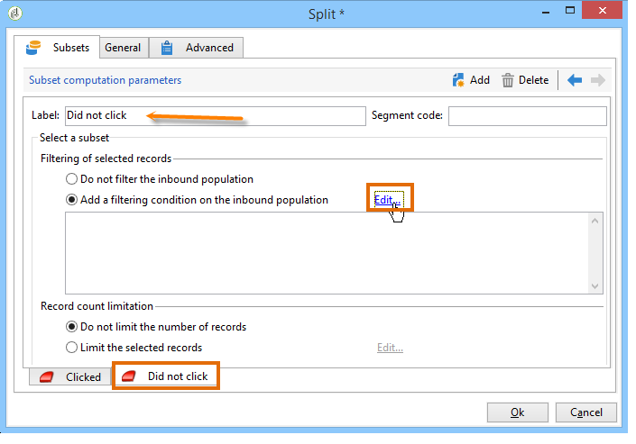

# 查询投放信息 {#querying-delivery-information}

## 特定投放{#number-of-clicks-for-a-specific-delivery}的点击次数

在此示例中，我们希望恢复特定投放的点击次数。 这些点击量由于在指定时间段内进行的收件人跟踪日志而被记录。 收件人通过其电子邮件地址进行标识。 此查询使用&#x200B;**[!UICONTROL Recipient tracking logs]**&#x200B;表。

* 需要选择哪个表？

   收件人日志跟踪表(**[!UICONTROL nms:trackingLogRcp]**)

* 要为输出列选择的字段？

   主键（含计数）和电子邮件

* 将根据哪些标准筛选信息？

   特定期间和投放标签的元素

要执行此示例，请应用以下步骤：

1. 打开&#x200B;**[!UICONTROL Generic query editor]**&#x200B;并选择&#x200B;**[!UICONTROL Recipient tracking logs]**&#x200B;模式。

   

1. 在&#x200B;**[!UICONTROL Data to extract]**&#x200B;窗口中，我们要创建一个聚合来收集信息。 为此，请添加主键（位于主&#x200B;**[!UICONTROL Recipient tracking logs]**&#x200B;元素上方）：此&#x200B;**[!UICONTROL Primary key]**&#x200B;字段将执行跟踪日志计数。 编辑的表达式为&#x200B;**[!UICONTROL x=count(primary key)]**。 它将各种跟踪日志的总和链接到单个电子邮件地址。

   操作步骤：

   * 单击&#x200B;**[!UICONTROL Output columns]**&#x200B;字段右侧的&#x200B;**[!UICONTROL Add]**&#x200B;图标。 在&#x200B;**[!UICONTROL Formula type]**&#x200B;窗口中，选择&#x200B;**[!UICONTROL Edit the formula using an expression]**&#x200B;选项，然后单击&#x200B;**[!UICONTROL Next]**。 在&#x200B;**[!UICONTROL Field to select]**&#x200B;窗口中，单击&#x200B;**[!UICONTROL Advanced selection]**。

      

   * 在&#x200B;**[!UICONTROL Formula type]**&#x200B;窗口中，对聚合函数运行进程。 此进程将是主键计数。

      在&#x200B;**[!UICONTROL Aggregate]**&#x200B;部分选择&#x200B;**[!UICONTROL Process on an aggregate function]**，然后单击&#x200B;**[!UICONTROL Count]**。

      

      单击 **[!UICONTROL Next]**.

   * 选择&#x200B;**[!UICONTROL Primary key (@id)]**&#x200B;字段。 已配置&#x200B;**[!UICONTROL count (primary key)]**&#x200B;输出列。

      

1. 选择要在输出列中显示的其他字段。 在&#x200B;**[!UICONTROL Available fields]**&#x200B;列中，打开&#x200B;**[!UICONTROL Recipient]**&#x200B;节点并选择&#x200B;**[!UICONTROL Email]**。 选中&#x200B;**[!UICONTROL Group]**&#x200B;框至&#x200B;**[!UICONTROL Yes]**，按电子邮件地址对跟踪日志进行分组：该组将每个日志链接到其收件人。

   

1. 配置列排序，以便首先显示最活跃的收件人(具有最多的跟踪日志)。 检查&#x200B;**[!UICONTROL Descending sort]**&#x200B;列中的&#x200B;**[!UICONTROL Yes]**。

   

1. 然后，您必须过滤您感兴趣的日志，即那些2周以下且与销售相关的投放相关的日志。

   操作步骤：

   * 配置数据过滤。 要执行此操作，请选择&#x200B;**[!UICONTROL Filter conditions]**，然后单击&#x200B;**[!UICONTROL Next]**。

      

   * 在特定跟踪日志的指定时间段内恢复投放。 有三个过滤条件：两个日期条件设置当前日期前2周到当前日期前2周的搜索期；以及将搜索限制到特定投放的其他条件。

      在&#x200B;**[!UICONTROL Target element]**&#x200B;窗口中，配置将从中考虑跟踪日志的开始日期。 单击 **[!UICONTROL Add]**。将显示条件行。 单击&#x200B;**[!UICONTROL Edit expression]**&#x200B;函数编辑&#x200B;**[!UICONTROL Expression]**&#x200B;列。 在&#x200B;**[!UICONTROL Field to select]**&#x200B;窗口中，选择&#x200B;**[!UICONTROL Date (@logDate)]**。

      

      选择&#x200B;**[!UICONTROL greater than]**&#x200B;运算符。 在&#x200B;**[!UICONTROL Value]**&#x200B;列中，单击&#x200B;**[!UICONTROL Edit expression]**，在&#x200B;**[!UICONTROL Formula type]**&#x200B;窗口中，选择&#x200B;**[!UICONTROL Process on dates]**。 最后，在&#x200B;**[!UICONTROL Current date minus n days]**&#x200B;中，输入“15”。

      单击 **[!UICONTROL Finish]**.

      

   * 要选择跟踪日志搜索结束日期，请单击&#x200B;**[!UICONTROL Add]**&#x200B;创建第二个条件。 在&#x200B;**[!UICONTROL Expression]**&#x200B;列中，再次选择&#x200B;**[!UICONTROL Date (@logDate)]**。

      选择&#x200B;**[!UICONTROL less than]**&#x200B;运算符。 在&#x200B;**[!UICONTROL Value]**&#x200B;列中，单击&#x200B;**[!UICONTROL Edit expression]**。 对于日期处理，请转到&#x200B;**[!UICONTROL Formula type]**&#x200B;窗口，在&#x200B;**[!UICONTROL Current date minus n days]**&#x200B;中输入“1”。

      单击 **[!UICONTROL Finish]**.

      

      现在，我们要配置第三个过滤器条件，即我们的查询所关注的投放标签。

   * 单击&#x200B;**[!UICONTROL Add]**&#x200B;函数可创建另一个筛选条件。 在&#x200B;**[!UICONTROL Expression]**&#x200B;列中，单击&#x200B;**[!UICONTROL Edit expression]**。 在&#x200B;**[!UICONTROL Field to select]**&#x200B;窗口中，选择&#x200B;**[!UICONTROL Delivery]**&#x200B;节点中的&#x200B;**[!UICONTROL Label]**。

      单击 **[!UICONTROL Finish]**.

      

      查找包含“sales”字样的投放。 由于您不记得其确切标签，因此可以选择&#x200B;**[!UICONTROL contains]**&#x200B;运算符，并在&#x200B;**[!UICONTROL Value]**&#x200B;列中输入“sales”。

      

1. 单击&#x200B;**[!UICONTROL Next]**，直到进入&#x200B;**[!UICONTROL Data preview]**&#x200B;窗口：此处不需要格式设置。
1. 在&#x200B;**[!UICONTROL Data preview]**&#x200B;窗口中，单击&#x200B;**[!UICONTROL Start the preview of the data]**&#x200B;查看每个投放收件人的跟踪日志数。

   结果按降序显示。

   

   此投放的用户最多日志数为6。 5个不同的用户打开了投放电子邮件或单击了电子邮件中的一个链接。

## 未打开任何投放{#recipients-who-did-not-open-any-delivery}的收件人

在此示例中，我们希望过滤过去7天内未打开电子邮件的收件人。

要创建此示例，请应用以下步骤：

1. 在工作流中拖放&#x200B;**[!UICONTROL Query]**&#x200B;活动并打开活动。
1. 单击&#x200B;**[!UICONTROL Edit query]**，将目标和过滤维度设置为&#x200B;**[!UICONTROL Recipients]**。

   

1. 选择&#x200B;**[!UICONTROL Filtering conditions]**，然后单击&#x200B;**[!UICONTROL Next]**。
1. 单击&#x200B;**[!UICONTROL Add]**&#x200B;按钮并选择&#x200B;**[!UICONTROL Tracking logs]**。
1. 将&#x200B;**[!UICONTROL Tracking logs]**&#x200B;表达式的&#x200B;**[!UICONTROL Operator]**&#x200B;设置为&#x200B;**[!UICONTROL Do not exist such as]**。

   

1. 添加其他表达式。 在&#x200B;**[!UICONTROL URL]**&#x200B;类别中选择&#x200B;**[!UICONTROL Type]**。
1. 然后，将其&#x200B;**[!UICONTROL Operator]**&#x200B;设置为&#x200B;**[!UICONTROL equal to]**，将其&#x200B;**[!UICONTROL Value]**&#x200B;设置为&#x200B;**[!UICONTROL Open]**。

   

1. 添加另一个表达式，然后选择&#x200B;**[!UICONTROL Date]**。 **[!UICONTROL Operator]** 应设置为 **[!UICONTROL on or after]**。

   

1. 要设置最近7天的值，请单击&#x200B;**[!UICONTROL Value]**&#x200B;字段中的&#x200B;**[!UICONTROL Edit expression]**&#x200B;按钮。
1. 在&#x200B;**[!UICONTROL Function]**&#x200B;类别中，选择&#x200B;**[!UICONTROL Current date minus n days]**&#x200B;并添加要目标的天数。 这里，我们要目标过去7天。

   

您的出站过渡将包含过去7天内未打开电子邮件的收件人。

相反，如果您要过滤至少打开一封电子邮件的收件人，则查询应如下所示。 请注意，在这种情况下，**[!UICONTROL Filtering dimension]**&#x200B;应设置为&#x200B;**[!UICONTROL Tracking logs (Recipients)]**。

## 收件人已打开投放{#recipients-who-have-opened-a-delivery}

以下示例说明如何目标最近2周内打开投放的用户档案:

1. 要目标已打开投放的用户档案，您需要使用跟踪日志。 它们存储在链接表中：开始，方法是在&#x200B;**[!UICONTROL Filtering dimension]**&#x200B;字段的下拉列表中选择此表，如下所示：

   

1. 有关筛选条件，请单击跟踪日志子树结构中显示的标准的&#x200B;**[!UICONTROL Edit expression]**&#x200B;图标。 选择&#x200B;**[!UICONTROL Date]**&#x200B;字段。

   

   单击&#x200B;**[!UICONTROL Finish]**&#x200B;确认选择。

   要仅恢复不到两周的跟踪日志，请选择&#x200B;**[!UICONTROL Greater than]**&#x200B;运算符。

   

   然后单击&#x200B;**[!UICONTROL Value]**&#x200B;列中的&#x200B;**[!UICONTROL Edit expression]**&#x200B;图标以定义要应用的计算公式。 选择&#x200B;**[!UICONTROL Current date minus n days]**&#x200B;公式，并在相关字段中输入15。

   

   单击公式窗口的&#x200B;**[!UICONTROL Finish]**&#x200B;按钮。 在筛选窗口中，单击&#x200B;**[!UICONTROL Preview]**&#x200B;选项卡以检查定位条件。

   

## 筛选收件人遵循投放{#filtering-recipients--behavior-folllowing-a-delivery}的行为

在工作流中，**[!UICONTROL Query]**&#x200B;和&#x200B;**[!UICONTROL Split]**&#x200B;框允许您选择上一个投放后的行为。 通过&#x200B;**[!UICONTROL Delivery recipient]**&#x200B;滤镜进行此选择。

* 示例的目的

   在投放工作流程中，有几种方法可跟踪第一封电子邮件通信。 此类操作涉及使用&#x200B;**[!UICONTROL Split]**&#x200B;框。

* 上下文

   将发送“夏季运动优惠”投放。 投放四天后，将发送另外两个投放。 其中一个是“水上运动优惠”，另一个是第一个“夏季运动优惠”投放的后续活动。

   “水上运动优惠”投放发送给在第一个投放中点击“水上运动”链接的收件人。 这些点击表明收件人对主题感兴趣。 将他们引导到类似的优惠是有道理的。 但是，未点击“夏季体育优惠”的收件人将再次收到相同的内容。

以下步骤显示了如何通过集成两种不同的行为来配置&#x200B;**[!UICONTROL Split]**&#x200B;框：

1. 将&#x200B;**[!UICONTROL Split]**&#x200B;框插入工作流。 此框将第一个投放的收件人分解为下两个投放。 在第一个投放中，根据与收件人行为链接的筛选条件进行划分。

   

1. 打开&#x200B;**[!UICONTROL Split]**&#x200B;框。 在&#x200B;**[!UICONTROL General]**&#x200B;选项卡中，输入标签：例如，**根据行为**&#x200B;进行拆分。

   

1. 在&#x200B;**[!UICONTROL Subsets]**&#x200B;选项卡中，定义第一个拆分分支。 例如，输入此分支的&#x200B;**已单击**&#x200B;标签。
1. 选择&#x200B;**[!UICONTROL Add a filtering condition on the incoming population]**&#x200B;选项。 单击 **[!UICONTROL Edit]**.
1. 在&#x200B;**[!UICONTROL Targeting and filtering dimension]**&#x200B;窗口中，多次单击&#x200B;**[!UICONTROL Recipients of a delivery]**&#x200B;滤镜。

   

1. 在&#x200B;**[!UICONTROL Target element]**&#x200B;窗口中，选择要应用到此分支的行为：**[!UICONTROL Recipients having clicked (email)]**。

   在下面，选择&#x200B;**[!UICONTROL Delivery specified by the transition]**&#x200B;选项。 此功能将在第一个投放自动恢复目标用户。

   这是&quot;水上运动优惠&quot;投放。

   

1. 定义第二个分支。 此分支将包含与第一个投放内容相同的后续电子邮件。 转到&#x200B;**[!UICONTROL Subsets]**&#x200B;选项卡并单击&#x200B;**[!UICONTROL Add]**&#x200B;以创建它。

   

1. 将显示另一个子选项卡。 将其命名为“**未单击**”。
1. 单击 **[!UICONTROL Add a filtering condition for the incoming population]**。然后单击 **[!UICONTROL Edit...]**。

   

1. 在&#x200B;**[!UICONTROL Targeting and filtering dimension]**&#x200B;窗口中单击&#x200B;**[!UICONTROL Delivery recipients]**。
1. 在&#x200B;**[!UICONTROL Target element]**&#x200B;窗口中，选择&#x200B;**[!UICONTROL Recipients who did not click (email)]**&#x200B;行为。 选择&#x200B;**[!UICONTROL Delivery specified by the transition]**&#x200B;选项，如最后一个分支所示。

   **[!UICONTROL Split]**&#x200B;框现已完全配置。

   

下面是默认配置的各种组件的列表:

* **[!UICONTROL All recipients]**
* **[!UICONTROL Recipients of successfully sent messages,]**
* **[!UICONTROL Recipients who opened or clicked (email),]**
* **[!UICONTROL Recipients who clicked (email),]**
* **[!UICONTROL Recipients of a failed message,]**
* **[!UICONTROL Recipients who didn't open or click (email),]**
* **[!UICONTROL Recipients who didn't click (email).]**

   
