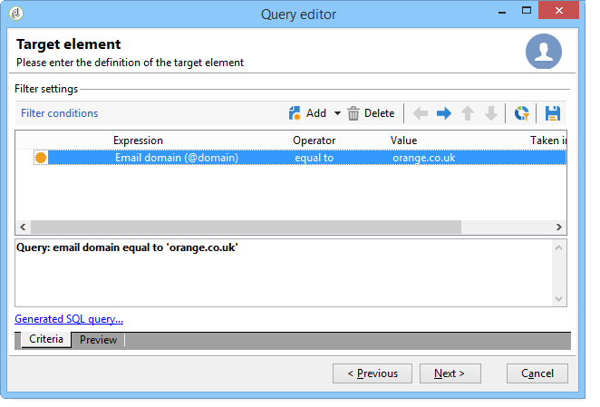

# 查询收件人表 {#querying-recipient-table}

在此示例中，我们要恢复电子邮件域为“orange.co.uk”且不住在伦敦的收件人的姓名和电子邮件。

* 我们应选择哪个表？

   收件人表(nms:收件人)

* 要选作输出列的字段

   电子邮件、姓名、城市和帐号

* 收件人的过滤条件是什么？

   城市和电子邮件域

* 是否配置了类型？

   是，基于 **[!UICONTROL Account number]** 和 **[!UICONTROL Last name]**

要创建此示例，请应用以下步骤：

1. 单 **[!UICONTROL Tools > Generic query editor...]** 击并选择 **收件人** (**nms:收件人**)表。 然后单击 **[!UICONTROL Next]**。
1. 选择： **[!UICONTROL Last name]**、 **[!UICONTROL First name]**、 **[!UICONTROL Email]**&#x200B;以 **[!UICONTROL City]** 及 **[!UICONTROL Account number]**。 这些字段将添加到 **[!UICONTROL Output columns]**。 然后单击 **[!UICONTROL Next]**。

   

1. 对列进行排序以按正确的顺序显示它们。 在此，我们希望按降序对帐户编号排序，按字母顺序对名称排序。 然后单击 **[!UICONTROL Next]**。

   

1. 在窗口 **[!UICONTROL Data filtering]** 中，细化您的搜索：选择 **[!UICONTROL Filtering conditions]** 并单击 **[!UICONTROL Next]**。
1. 在窗 **[!UICONTROL Target element]** 口中可输入筛选器设置。

   定义以下筛选条件：电子邮件域等于“orange.co.uk”的收件人。 为此，请在列 **中选择“电子邮件域** (@email)” **[!UICONTROL Expression]** ，在列 **中选** 择 **[!UICONTROL Operator]** “等于” **[!UICONTROL Value]** ，并在列中输入“orange.co.uk”。

   

1. 如果需要，请单 **[!UICONTROL Distribution of values]** 击按钮以根据潜在客户的电子邮件域视图分发。 数据库中每个电子邮件域都有一个百分比。 应用过滤器之前，将显示“orange.co.uk”以外的域。

   查询的摘要显示在窗口底部： **电子邮件域等于“orange.co.uk”**。

1. 单击 **[!UICONTROL Preview]** 以了解查询结果：只显示“orange.co.uk”电子邮件域。

   

1. 我们现在将改变查询，寻找不住在伦敦的人。

   在列 **[!UICONTROL City (location/@city)]** 中选 **[!UICONTROL Expression]** 择，作 **[!UICONTROL different from]** 为运算符，然后 **[!UICONTROL London]** 在列中 **[!UICONTROL Value]** 输入。

   

1. 这会带你到窗 **[!UICONTROL Data formatting]** 户。 检查列顺序。 将“Account number”列下的“City”列向上移动。

   取消选中“名”列，将其从列表中删除。

   

1. In the **[!UICONTROL Data preview]** window, click **[!UICONTROL Start the preview of the data]**. 此函数计算查询的结果。

   该选 **[!UICONTROL Column results]** 项卡在列中显示查询结果。

   结果会显示所有不住在伦敦的具有“orange.co.uk”电子邮件域的收件人。 不显示“名”列，因为在上一阶段未选中该列。 帐号按降序排序。

   

   该选 **[!UICONTROL XML result]** 项卡以XML格式显示结果。

   

   该选 **[!UICONTROL Generated QSL queries]** 项卡以SQL格式显示查询结果。

   
