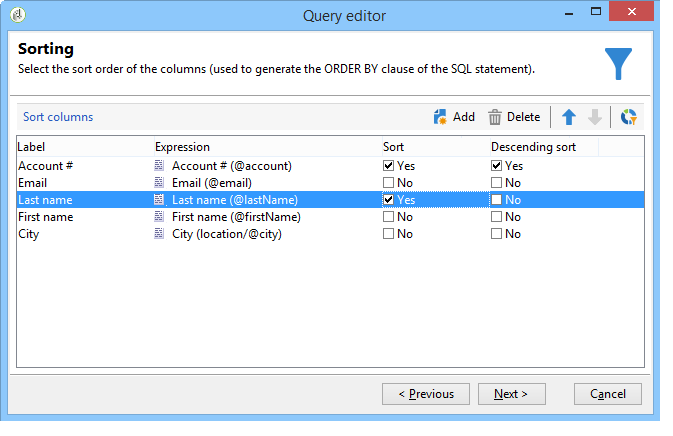

# 查询收件人表 {#querying-recipient-table}

在此示例中，我们希望恢复电子邮件域名为“orange.co.uk”且不居住在伦敦的收件人的姓名和电子邮件。

* 我们应该选择哪个表？

   收件人表(nms:recipient)

* 要选作输出列的字段

   电子邮件、名称、城市和帐号

* 收件人的筛选条件是什么？

   城市和电子邮件域

* 是否配置了类型？

   是，基于&#x200B;**[!UICONTROL Account number]**&#x200B;和&#x200B;**[!UICONTROL Last name]**

要创建此示例，请应用以下步骤：

1. 单击&#x200B;**[!UICONTROL Tools > Generic query editor...]**&#x200B;并选择&#x200B;**收件人**(**nms:recipient**)表。 然后单击 **[!UICONTROL Next]**。
1. 选择：**[!UICONTROL Last name]**、**[!UICONTROL First name]**、**[!UICONTROL Email]**、**[!UICONTROL City]**&#x200B;和&#x200B;**[!UICONTROL Account number]**。 这些字段将添加到&#x200B;**[!UICONTROL Output columns]**&#x200B;中。 然后单击 **[!UICONTROL Next]**。

   

1. 对列进行排序以按正确顺序显示列。 在此，我们希望按降序排列帐号，按字母顺序排列名称。 然后单击 **[!UICONTROL Next]**。

   

1. 在&#x200B;**[!UICONTROL Data filtering]**&#x200B;窗口中，优化搜索：选择&#x200B;**[!UICONTROL Filtering conditions]**&#x200B;并单击&#x200B;**[!UICONTROL Next]**。
1. 在&#x200B;**[!UICONTROL Target element]**&#x200B;窗口中可以输入过滤器设置。

   定义以下过滤条件：电子邮件域等于“orange.co.uk”的收件人。 要执行此操作，请在&#x200B;**[!UICONTROL Expression]**&#x200B;列中选择&#x200B;**电子邮件域(@email)**，在&#x200B;**[!UICONTROL Operator]**&#x200B;列中选择&#x200B;**等于**，然后在&#x200B;**[!UICONTROL Value]**&#x200B;列中输入“orange.co.uk”。

   

1. 如果需要，请单击&#x200B;**[!UICONTROL Distribution of values]**&#x200B;按钮以查看基于潜在电子邮件域的分发。 数据库中每个电子邮件域都有一个百分比。 在应用过滤器之前，将显示“orange.co.uk”以外的域。

   查询的摘要将显示在窗口底部：**电子邮件域等于“orange.co.uk”**。

1. 单击&#x200B;**[!UICONTROL Preview]**&#x200B;可了解查询结果：仅显示“orange.co.uk”电子邮件域。

   

1. 我们现在将更改查询，以查找不住在伦敦的联系人。

   选择&#x200B;**[!UICONTROL Expression]**&#x200B;列中的&#x200B;**[!UICONTROL City (location/@city)]**&#x200B;作为运算符，然后在&#x200B;**[!UICONTROL Value]**&#x200B;列中输入&#x200B;**[!UICONTROL London]**。**[!UICONTROL different from]**

   

1. 这会将您转到&#x200B;**[!UICONTROL Data formatting]**&#x200B;窗口。 检查列顺序。 在“帐号”列下将“城市”列向上移动。

   取消选中“名字”列，将其从列表中删除。

   

1. 在&#x200B;**[!UICONTROL Data preview]**&#x200B;窗口中，单击&#x200B;**[!UICONTROL Start the preview of the data]**。 此函数计算查询的结果。

   **[!UICONTROL Column results]**&#x200B;选项卡在列中显示查询结果。

   结果会显示不住在伦敦的所有拥有“orange.co.uk”电子邮件域的收件人。 未显示“名字”列，因为在上一阶段中未选中该列。 帐号按降序排序。

   

   **[!UICONTROL XML result]**&#x200B;选项卡以XML格式显示结果。

   

   **[!UICONTROL Generated QSL queries]**&#x200B;选项卡以SQL格式显示查询结果。

   
