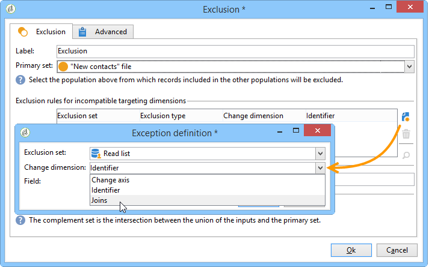

# 读取列表{#read-list}

在工作流中处理的列表可以来自数据，据此数据已预先准备或结构化（在以前的分段或文件上传之后）。

活动 **[!UICONTROL Read list]** 允许您从工作流工作台中的列表复制数据，如从查询复制数据。 然后，可以在整个工作流程中访问它。

要处理的列表可以显式指定，由脚本计算，或根据所选选项和活动中定义的参数动态地进行本 **[!UICONTROL Read list]** 地化。

如果未明确指定列表，则必须提供一个列表作为模板来查找其结构。

配置列表选择后，您可以使用选项添加过滤器， **[!UICONTROL Edit query]** 以保留下一个工作流的一部分填充。

>[!CAUTION]
>
>要能够在读取列表活动中创建过滤器，相关列表必须是“文件”类型。

列表可以通过Adobe Campaign的链接直接 **[!UICONTROL Profiles and Targets > Lists]** 在主页中创建。 还可以使用活动在工作流中创建这些 **[!UICONTROL List update]** 内容。

**示例：排除发送地址列表**

以下示例允许您使用电子邮件地址列表从电子邮件投放目标中排除。

New Contacts文件夹中包 **含的用户档案** ，必须通过投放操作来定位。 要从目标中排除的电子邮件地址存储在外部列表中。 在我们的示例中，排除时只需提供电子邮件地址相关信息。

1. “新 **联系人** ”文件夹选择查询必须允许您加载选定用户档案的电子邮件地址，以便与列表中的信息保持一致。

   

1. 此处，列表存储在 **列表** 文件夹中，并计算其标签。

   

1. 要从主列表中排除外部目标的电子邮件地址，必须配置排除活动，并指定 **New Contacts** （新联系人）文件夹包含要保留的数据。 此集与来自排除活动的任何其他入站集之间的联合数据将从该目标中删除。

   

   排除规则在编辑工具的中央部分进行配置。 单击 **[!UICONTROL Add]** 按钮以定义要应用的排除类型。

   您可以根据活动的传入过渡数定义多个排除。

1. 在字 **[!UICONTROL Exclusion set]** 段中，选择 **[!UICONTROL Read list]** 活动:此活动中的数据将从主集中排除。

   在我们的示例中，我们在连接上有一个排除：列表中包含的数据将通过包含电子邮件地址的字段与主集的数据进行协调。 要配置连接，请在字 **[!UICONTROL Joins]** 段中选 **[!UICONTROL Change dimension]** 择。

   

1. 然后，选择与两组（源和目标）中的电子邮件地址对应的字段。 随后将链接这些列，其电子邮件地址位于导入地址列表的收件人将从目标中排除。

