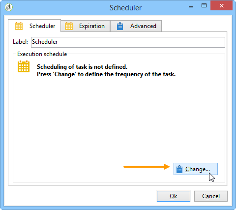

# 调度程序 {#scheduler}

调度程序 **是** 持续性任务，在计划指定的时间激活其过渡。

该 **[!UICONTROL Scheduler]** 活动应被视为计划开始。 图表中的活动定位规则与活动相同。 **[!UICONTROL Start]** 此活动不得具有入站过渡。

## 最佳做法 {#best-practices}

* 不要计划工作流超过每15分钟运行一次，因为它可能会影响总体系统性能并在数据库中创建块。

* 在工作流中，每个 **[!UICONTROL Scheduler]** 分支不能使用多于一个活动。 请参 [阅使用活动](../../workflow/using/workflow-best-practices.md#using-activities)。

* 使用调度程序活动可能导致同时运行多个工作流执行。 例如，您可以让调度程序每小时触发工作流执行，但有时整个工作流的执行需要超过一小时。

   如果工作流已在运行，您可能希望跳过执行。 有关如何防止同时执行工作流的详细信息，请参 [阅本页](../../workflow/using/monitoring-workflow-execution.md#preventing-simultaneous-multiple-executions)。

* 请注意，如果工作流正在执行长期过渡（如导入），或wfserver模块停止一段时间，则可以在数小时后激活该任务。 在这种情况下，可能需要将由任务激活的调度程序的执行限制到一定的时间范围。

## 配置调度程序活动 {#configuring-scheduler-activity}

调度程序定义过渡的激活计划。 要进行配置，请多次单击图形对象，然后单击 **[!UICONTROL Change...]**

向导允许您定义活动的频率和有效期。 配置步骤如下：

1. 选择激活频率并单击 **[!UICONTROL Next]**。

   

1. 给激活时间和天数。 此步骤的参数取决于上一步中选择的频率。 如果您选择每天启动活动多次，配置选项将如下：

   

1. 定义计划的有效期，或指定执行该数据的次数。

   

1. 检查配置并单击 **[!UICONTROL Finish]** 以保存。

   
