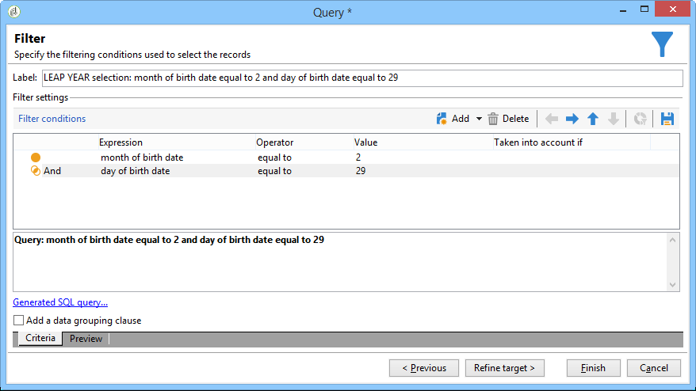

# 发送生日电子邮件{#sending-a-birthday-email}


## 简介 {#introduction}

此用例介绍如何计划在收件人生日当天向收件人列表发送定期电子邮件。

要设置此用例，我们创建了以下定位工作流：


此（每日运行）工作流会选择当前日期生日的所有收件人。

 此用例也可以以视频的形式找到。有关更多信息，请参阅[创建工作流](https://experienceleague.adobe.com/docs/campaign-classic-learn/tutorials/automating-with-workflows/creating-a-workflow.html)视频。

要实现此目的，请创建营销活动并单击&#x200B;**[!UICONTROL Targeting and workflows]**&#x200B;选项卡。 有关更多信息，请参阅[在工作流中构建主目标](../../campaign/using/marketing-campaign-deliveries.md#building-the-main-target-in-a-workflow)一节。

然后，执行以下步骤：

## 计划发送 {#configuring-the-scheduler}

1. 首先，添加&#x200B;**调度程序**&#x200B;以触发每天发送的投放。 在以下示例中，每天早上6点创建投放。

   


## 确定生日为的收件人 {#identifying-recipients-whose-birthday-it-is}

配置&#x200B;**[!UICONTROL Scheduler]**&#x200B;活动以便工作流每天启动后，识别出生日期等于当前日期的所有收件人。

要执行此操作，请应用以下步骤：

1. 将&#x200B;**[!UICONTROL Query]**&#x200B;活动拖放到工作流中，并双击该活动。
1. 单击&#x200B;**编辑查询**&#x200B;链接，然后选择&#x200B;**[!UICONTROL Filtering conditions]**。

   

1. 单击&#x200B;**[!UICONTROL Expression]**&#x200B;列的第一个单元格，然后单击&#x200B;**[!UICONTROL Edit expression]**&#x200B;以打开表达式编辑器。

   

1. 单击&#x200B;**[!UICONTROL Advanced selection]**&#x200B;以选择筛选模式。

   

1. 选择&#x200B;**[!UICONTROL Edit the formula using an expression]**&#x200B;并单击&#x200B;**[!UICONTROL Next]**&#x200B;以显示表达式编辑器。
1. 在函数列表中，双击&#x200B;**[!UICONTROL Day]**，可通过&#x200B;**[!UICONTROL Date]**&#x200B;节点访问该节点。 此函数返回表示与作为参数传递的日期对应的日期的数字。

   

1. 在可用字段列表中，双击&#x200B;**[!UICONTROL Birth date]**。 然后，编辑器的上部显示以下公式：

   ```
   Day(@birthDate)
   ```

   单击&#x200B;**[!UICONTROL Finish]**&#x200B;确认。

1. 在查询编辑器中，在&#x200B;**[!UICONTROL Operator]**&#x200B;列的第一个单元格中，选择&#x200B;**[!UICONTROL equal to]**。

   

1. 接下来，单击第二列的第一个单元格(**[!UICONTROL Value]**)，然后单击&#x200B;**[!UICONTROL Edit expression]**&#x200B;以打开表达式编辑器。
1. 在函数列表中，双击&#x200B;**[!UICONTROL Day]**，可通过&#x200B;**[!UICONTROL Date]**&#x200B;节点访问该节点。
1. 双击&#x200B;**[!UICONTROL GetDate]**&#x200B;函数以检索当前日期。

   

   编辑器的上部显示以下公式：

   ```
   Day(GetDate())
   ```

   单击&#x200B;**[!UICONTROL Finish]**&#x200B;确认。

1. 重复此步骤以检索对应于当月的出生月份。 为此，请单击&#x200B;**[!UICONTROL Add]**&#x200B;按钮并重复步骤3至10，将&#x200B;**[!UICONTROL Day]**&#x200B;替换为&#x200B;**[!UICONTROL Month]**。

   完整查询如下所示：

   

将&#x200B;**[!UICONTROL Query]**&#x200B;活动的结果链接到&#x200B;**[!UICONTROL Email delivery]**&#x200B;活动，以向生日时所有收件人的列表发送电子邮件。

## 包括2月29日出生的收件人（可选） {#including-recipients-born-on-february-29th--optional-}

如果要包含2月29日出生的所有收件人，此用例将介绍如何计划向生日的收件人列表发送定期电子邮件 — 无论这是否是闰年。

此用例的主要实施步骤是：

* 选择收件人
* 选择是否是闰年
* 选择2月29日出生的任何收件人

要设置此用例，我们创建了以下定位工作流：


如果当前年份&#x200B;**不是闰年**，并且工作流在3月1日运行，则我们需要选择昨天（2月29日）生日的所有收件人，并将它们添加到收件人列表。 在任何其他情况下，都不需要任何其他操作。

### 步骤1:选择收件人 {#step-1--selecting-the-recipients}

配置&#x200B;**[!UICONTROL Scheduler]**&#x200B;活动以便工作流每天启动后，识别周年为当天的所有收件人。

>[!NOTE]
>
>如果当前年份是闰年，则所有在2月29日出生的收件人都将自动包含在内。


[识别生日为](#identifying-recipients-whose-birthday-it-is)的收件人部分中介绍了如何选择生日对应于当前日期的收件人。

### 步骤2:选择是否是闰年 {#step-2--select-whether-or-not-it-is-a-leap-year}

利用&#x200B;**[!UICONTROL Test]**&#x200B;活动，可检查它是否为闰年以及当前日期是否为3月1日。

如果测试得到验证（年份不是闰年 — 没有2月29日 — 而当前日期实际上是3月1日），则&#x200B;**[!UICONTROL True]**&#x200B;过渡将启用，2月29日出生的收件人将添加到3月1日的投放中。 否则，将启用&#x200B;**[!UICONTROL False]**&#x200B;过渡，并且只有在当前日期出生的收件人将收到投放。

将下面的代码复制并粘贴到&#x200B;**[!UICONTROL Advanced]**&#x200B;选项卡的&#x200B;**[!UICONTROL Initialization script]**&#x200B;部分。

```
function isLeapYear(iYear)
{
    if(iYear/4 == Math.floor(iYear/4))
    {
        if(iYear/100 != Math.floor(iYear/100))
        {
            // Divisible by 4 only -> Leap Year
            return 1;
        }
        else
        {
            if(iYear/400 == Math.floor(iYear/400))
            {
                // Divisible by 4, 100 and 400 -> Leap year
                return 1;
            }
        }
    }
    // all others: no leap year
    return 0;
}

// Return today's date and time
var currentTime = new Date()
// returns the month (from 0 to 11)
var month = currentTime.getMonth() + 1
// returns the day of the month (from 1 to 31)
var day = currentTime.getDate()
// returns the year (four digits)
var year = currentTime.getFullYear()

// is current year a leap year?
vars.currentIsALeapYear = isLeapYear(year);

// is current date the first of march?
if(month == 3 && day == 1) {
  // today is 1st of march
vars.firstOfMarch = 1;
}
```


在&#x200B;**[!UICONTROL Conditional forks]**&#x200B;部分中添加以下条件：

```
vars.currentIsALeapYear == 0 && vars.firstOfMarch == 1
```


### 步骤3:选择2月29日出生的任何收件人 {#step-3--select-any-recipients-born-on-february-29th}

创建&#x200B;**[!UICONTROL Fork]**&#x200B;活动，并将其中一个叫客过渡链接到&#x200B;**[!UICONTROL Query]**&#x200B;活动。

在此查询中，选择出生日期为2月29日的所有收件人。



将结果与&#x200B;**[!UICONTROL Union]**&#x200B;活动组合。

将两个&#x200B;**[!UICONTROL Test]**&#x200B;活动分支的结果链接到&#x200B;**[!UICONTROL Email delivery]**&#x200B;活动，以向生日的所有收件人列表发送电子邮件，即使是2月29日出生的非闰年的收件人。

## 创建循环投放 {#creating-a-recurring-delivery-in-a-targeting-workflow}

根据要发送的生日电子邮件模板添加&#x200B;**定期投放**&#x200B;活动。

>[!CAUTION]
>
>要执行工作流，必须启动与Campaign包相关的技术工作流。 有关更多信息，请参阅[技术工作流列表](about-technical-workflows.md)一节。
>
>如果为营销活动启用了批准步骤，则只有在确认这些步骤后才会发送投放。 有关更多信息，请参阅[选择要批准的流程](../../campaign/using/marketing-campaign-approval.md#choosing-the-processes-to-be-approved)一节。


