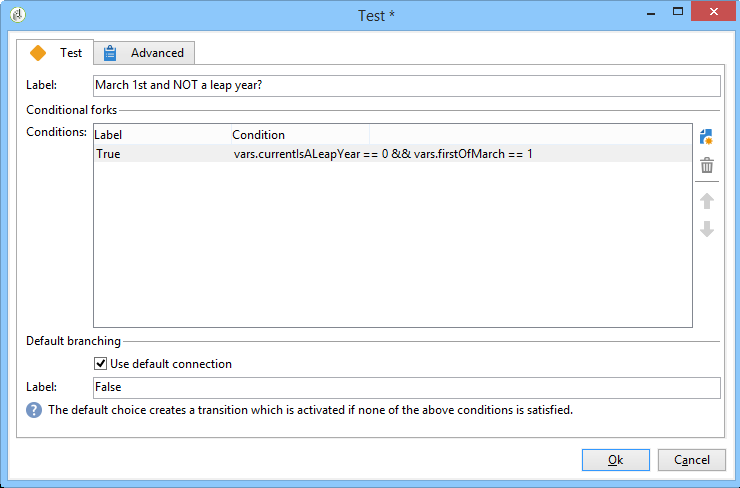

# 发送生日电子邮件{#sending-a-birthday-email}

## 简介 {#introduction}

此用例介绍如何计划在收件人生日当天向他们发送重复的电子邮件。

要设置此用例，我们创建了以下定位工作流：


此（每日运行）工作流将选择当前日期具有其生日的所有收件人。

此用例也可以以视频的形式找到。 For more on this, refer to the [Creating a workflow](https://docs.adobe.com/content/help/en/campaign-classic-learn/tutorials/automating-with-workflows/creating-a-workflow.html) video.

为此，请创建活动并单击选 **[!UICONTROL Targeting and workflows]** 项卡。 有关此内容的详细信息，请参 [阅在工作流中构建主目标](../../campaign/using/marketing-campaign-deliveries.md#building-the-main-target-in-a-workflow) 。

然后，按照以下步骤操作：

## 安排发送 {#configuring-the-scheduler}

1. 首先，添加 **调度程序** ，触发每天发送投放。 在以下示例中，每天早上6点创建投放。

   


## 识别生日是谁的收件人 {#identifying-recipients-whose-birthday-it-is}

配置活动 **[!UICONTROL Scheduler]** 之后，工作流每天开始，确定其出生日期等于当前日期的所有收件人。

为此，请应用以下步骤：

1. 将活动拖放 **[!UICONTROL Query]** 到工作流中，然后多次单击它。
1. 单击“编 **辑查询** ”链接并选择 **[!UICONTROL Filtering conditions]**。

   

1. 单击列的第一个单 **[!UICONTROL Expression]** 元格，然 **[!UICONTROL Edit expression]** 后单击打开表达式编辑器。

   

1. 单击 **[!UICONTROL Advanced selection]** 以选择筛选模式。

   

1. 选择 **[!UICONTROL Edit the formula using an expression]** 并单击 **[!UICONTROL Next]** 以显示表达式编辑器。
1. 在函数的列表中，按住多次 **[!UICONTROL Day]**&#x200B;单击，可通过节点 **[!UICONTROL Date]** 访问。 此函数返回表示与作为参数传递的日期相对应的日期的数字。

   

1. 在可用字段的列表中，多次单击 **[!UICONTROL Birth date]**。 编辑器的上半部分显示以下公式：

   ```
   Day(@birthDate)
   ```

   Click **[!UICONTROL Finish]** to confirm.

1. 在查询编辑器中，在列的第一个单元格 **[!UICONTROL Operator]** 中，选择 **[!UICONTROL equal to]**。

   

1. 接下来，单击第二列()的第一个单&#x200B;**[!UICONTROL Value]**&#x200B;元格，然 **[!UICONTROL Edit expression]** 后单击以打开表达式编辑器。
1. 在函数的列表中，按住多次 **[!UICONTROL Day]**&#x200B;单击，可通过节点 **[!UICONTROL Date]** 访问。
1. 多次-单击 **[!UICONTROL GetDate]** 函数以检索当前日期。

   

   编辑器的上半部分显示以下公式：

   ```
   Day(GetDate())
   ```

   Click **[!UICONTROL Finish]** to confirm.

1. 重复此过程以检索与当月对应的出生月份。 为此，请单击按 **[!UICONTROL Add]** 钮并重复步骤3到10，替换 **[!UICONTROL Day]** 为 **[!UICONTROL Month]**。

   完整查询如下：

   

将活动的结果链 **[!UICONTROL Query]** 接到活动 **[!UICONTROL Email delivery]** ，以在列表生日时向所有收件人的发送电子邮件。

## 包括2月29日出生的收件人（可选） {#including-recipients-born-on-february-29th--optional-}

如果您希望包括2月29日出生的所有收件人，此用例将介绍如何计划向一列表收件人发送一封循环发送的电子邮件，供他们生日之用——无论这是否是闰年。

此用例的主要实施步骤是：

* 选择收件人
* 选择它是否是闰年
* 选择2月29日出生的收件人

要设置此用例，我们创建了以下定位工作流：


如果当前年 **不是闰年** ，而工作流在3月1日运行，则我们需要选择昨天（2月29日）生日的所有收件人，并将其添加到收件人列表。 在任何其他情况下，都不需要执行任何其他操作。

### 第1步：选择收件人 {#step-1--selecting-the-recipients}

配置活动 **[!UICONTROL Scheduler]** 之后，工作流每天都会开始，识别周年日为当天的所有收件人。

>[!NOTE]
>
>如果今年是闰年，那么所有2月29日出生的收件人都自动包括在内。


选择与当前日期对应的收件人会显示在“识别其生 [日收件人”部分](#identifying-recipients-whose-birthday-it-is) 。

### 第2步：选择它是否是闰年 {#step-2--select-whether-or-not-it-is-a-leap-year}

该 **[!UICONTROL Test]** 活动允许您检查它是否是闰年以及当前日期是否为3月1日。

如果测试得到验证（年不是闰年——没有2月29日——而当前日期确实是3月1日），则过渡将启用，2月29日出生的收件人将被添加到3月1日投放。 **[!UICONTROL True]** 否则， **[!UICONTROL False]** 过渡将处于启用状态，只有在当前日期出生的收件人将收到投放。

将下面的代码复制并粘贴 **[!UICONTROL Initialization script]** 到选项卡的 **[!UICONTROL Advanced]** 部分。

```
function isLeapYear(iYear)
{
    if(iYear/4 == Math.floor(iYear/4))
    {
        if(iYear/100 != Math.floor(iYear/100))
        {
            // Divisible by 4 only -> Leap Year
            return 1;
        }
        else
        {
            if(iYear/400 == Math.floor(iYear/400))
            {
                // Divisible by 4, 100 and 400 -> Leap year
                return 1;
            }
        }
    }
    // all others: no leap year
    return 0;
}

// Return today's date and time
var currentTime = new Date()
// returns the month (from 0 to 11)
var month = currentTime.getMonth() + 1
// returns the day of the month (from 1 to 31)
var day = currentTime.getDate()
// returns the year (four digits)
var year = currentTime.getFullYear()

// is current year a leap year?
vars.currentIsALeapYear = isLeapYear(year);

// is current date the first of march?
if(month == 3 && day == 1) {
  // today is 1st of march
vars.firstOfMarch = 1;
}
```


在节中添加以下 **[!UICONTROL Conditional forks]** 条件：

```
vars.currentIsALeapYear == 0 && vars.firstOfMarch == 1
```



### 第3步：选择2月29日出生的收件人 {#step-3--select-any-recipients-born-on-february-29th}

创建 **[!UICONTROL Fork]** 活动，并将其中一个出站过渡链接到 **[!UICONTROL Query]** 活动。

在此查询中，选择出生日期为2月29日的所有收件人。


将结果与活动结 **[!UICONTROL Union]** 合。

将两个活动分支的 **[!UICONTROL Test]** 结果链接到一个活动 **[!UICONTROL Email delivery]** ，向所有收件人的列表发送电子邮件，在他们的生日，甚至是2月29日出生的非闰年。

## 创建循环投放 {#creating-a-recurring-delivery-in-a-targeting-workflow}

根据 **要发送的生日** 电子邮件模板添加重复投放活动。

>[!CAUTION]
>
>要执行工作流，必须启动与活动进程相关的技术工作流。 For more on this, refer to the [List of campaign process workflows](../../workflow/using/campaign.md) section.
>
>如果为活动启用了批准步骤，则只有确认这些步骤后，才会发送投放。 有关此内容的详细信息，请参 [阅选择要批准的流程](../../campaign/using/marketing-campaign-approval.md#choosing-the-processes-to-be-approved) 。


