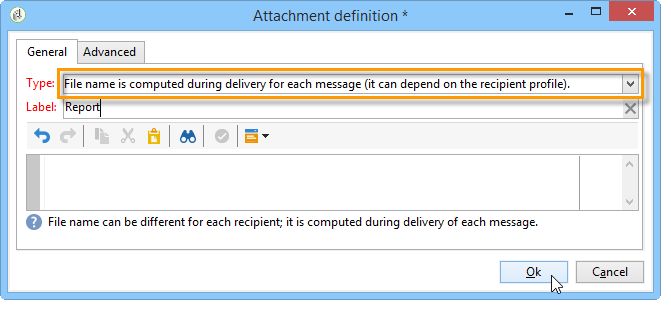

# 向列表发送报告{#sending-a-report-to-a-list}


此用例详细说明了如何以PDF格式生成每月现成的&#x200B;**[!UICONTROL Tracking indicators]**&#x200B;报告，以及如何将其发送给收件人列表。


此用例的主要实施步骤包括：

* 创建将接收投放的收件人列表（请参阅：[步骤1：创建收件人列表](#step-1--creating-the-recipient-list)）。
* 创建投放模板，以便您每次执行工作流时都生成一个新投放（请参阅： [步骤2：创建投放模板](#step-2--creating-the-delivery-template)）。
* 创建工作流以允许您以PDF格式生成报告并将其发送给收件人列表（请参阅：[步骤3：创建工作流](#step-3--creating-the-workflow)）。

## 步骤1：创建收件人列表 {#step-1--creating-the-recipient-list}

转到&#x200B;**[!UICONTROL Profiles and targets]**&#x200B;选项卡，单击&#x200B;**[!UICONTROL Lists]**&#x200B;链接，然后单击&#x200B;**[!UICONTROL Create]**&#x200B;按钮。 选择&#x200B;**[!UICONTROL New list]**&#x200B;并为要发送的报告创建新的收件人列表。


有关创建列表的详细信息，请参阅此[部分](../../platform/using/creating-and-managing-lists.md)。

## 步骤2：创建投放模板 {#step-2--creating-the-delivery-template}

1. 转到Adobe Campaign资源管理器的&#x200B;**[!UICONTROL Resources > Templates > Delivery templates]**&#x200B;节点并复制&#x200B;**[!UICONTROL Email delivery]**&#x200B;现成模板。

   

   有关创建投放模板的更多信息，请参阅此[部分](../../delivery/using/about-templates.md)。

1. 输入各种模板参数：标签、目标（以前创建的收件人列表）、主题和内容。

   

1. 每次执行工作流时，都会更新&#x200B;**[!UICONTROL Tracking indicators]**&#x200B;报告（请参阅[步骤3：创建工作流](#step-3--creating-the-workflow)）。 要在投放中包含最新版本的报告，您需要添加&#x200B;**[!UICONTROL Calculated attachment]**：

   有关创建计算附件的详细信息，请参阅此[部分](../../delivery/using/attaching-files.md#creating-a-calculated-attachment)。

   * 单击&#x200B;**[!UICONTROL Attachments]**&#x200B;链接并单击&#x200B;**[!UICONTROL Add]**，然后选择&#x200B;**[!UICONTROL Calculated attachment]**。

     

   * 转到&#x200B;**[!UICONTROL Type]**&#x200B;字段并选择第四个选项： **[!UICONTROL File name is computed during delivery of each message (it may then depend on the recipient profile)]**。

     

     在&#x200B;**[!UICONTROL Label]**&#x200B;字段中输入的值将不会显示在最终投放中。

   * 转到编辑区域并输入文件的访问路径和名称。

     

     >[!CAUTION]
     >
     >文件必须存在于服务器上。 其路径和名称必须与在工作流的&#x200B;**[!UICONTROL JavaScript code]**&#x200B;类型活动中输入的路径和名称相同（请参阅：[步骤3：创建工作流](#step-3--creating-the-workflow)）。

   * 选择&#x200B;**[!UICONTROL Advanced]**&#x200B;选项卡并选中&#x200B;**[!UICONTROL Script the name of the file name displayed in the mails sent]**。 转到编辑区域，然后输入要为最终投放中的附件指定的名称。

     

## 步骤3：创建工作流 {#step-3--creating-the-workflow}

已为此用例创建以下工作流。 它包含三个活动：

* 一个&#x200B;**[!UICONTROL Scheduler]**&#x200B;类型活动，可让您每月执行一次工作流，
* 一个&#x200B;**[!UICONTROL JavaScript code]**&#x200B;类型活动，允许您生成PDF格式的报告，
* 一个&#x200B;**[!UICONTROL Delivery]**&#x200B;类型活动，该活动使用之前创建的投放模板。


1. 现在转到&#x200B;**[!UICONTROL Administration > Production > Technical workflows]**&#x200B;节点并创建新工作流。

   

1. 首先添加&#x200B;**[!UICONTROL Scheduler]**&#x200B;类型活动并对其进行配置，以便工作流在每月第一个星期一执行。

   

   有关配置调度程序的详细信息，请参阅[调度程序](scheduler.md)。

1. 然后添加&#x200B;**[!UICONTROL JavaScript code]**&#x200B;类型活动。

   

   在编辑区域中输入以下代码：

   ```
   var reportName = "deliveryFeedback";
   var path = "/tmp/deliveryFeedback.pdf";
   var exportFormat = "PDF";
   var reportURL = "<PUT THE URL OF THE REPORT HERE>";
   var _ctx = <ctx _context="global" _reportContext="deliveryFeedback" />
   var isAdhoc = 0;
   
   xtk.report.export(reportName, _ctx, exportFormat, path, isAdhoc);
   ```

   使用以下变量：

   * **var reportName**：用双引号输入报告的内部名称。 在这种情况下，**跟踪指示器**&#x200B;报告的内部名称为“deliveryFeedback”。
   * **var路径**：输入文件的保存路径(“tmp/files/”)、要为文件指定的名称(“deliveryFeedback”)以及文件扩展名(“.pdf”)。 在本例中，我们使用内部名称作为文件名。 值需要位于双引号之间并以“+”字符分隔。

     >[!CAUTION]
     >
     >文件必须保存在服务器上。 您必须在已计算附件的编辑窗口的&#x200B;**[!UICONTROL General]**&#x200B;选项卡中输入相同的路径和名称（请参阅： [步骤2：创建投放模板](#step-2--creating-the-delivery-template)）。

   * **var exportFormat**：输入文件的导出格式(“PDF”)。
   * **var _ctx**（上下文）：在这种情况下，我们在其全局上下文中使用&#x200B;**[!UICONTROL Tracking indicators]**&#x200B;报告。

1. 通过使用以下选项添加&#x200B;**[!UICONTROL Delivery]**&#x200B;类型活动来完成：

   * **[!UICONTROL Delivery]**：选择&#x200B;**[!UICONTROL New, created from a template]**，然后选择之前创建的投放模板。
   * 对于&#x200B;**[!UICONTROL Recipients]**&#x200B;和&#x200B;**[!UICONTROL Content]**&#x200B;字段，请选择&#x200B;**[!UICONTROL Specified in the delivery]**。
   * **[!UICONTROL Action to execute]**：选择&#x200B;**[!UICONTROL Prepare and start]**。
   * 取消选中&#x200B;**[!UICONTROL Generate an outbound transition]**&#x200B;和&#x200B;**[!UICONTROL Process errors]**。

   
