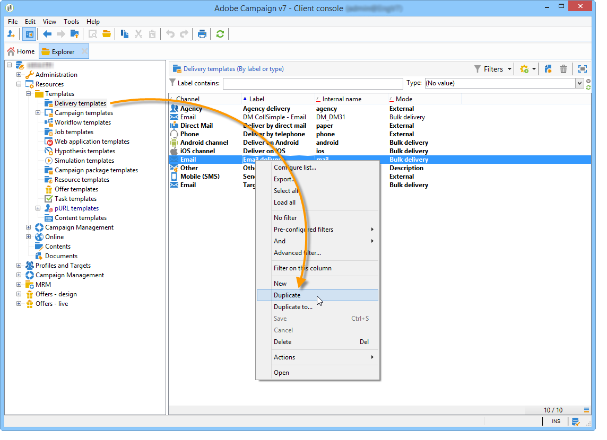

# 向列表发送报告{#sending-a-report-to-a-list}

此用例详细说明了如何以PDF格式生成每月现成 **[!UICONTROL Tracking indicators]** 报告以及如何将其发送给列表收件人。


此用例的主要实施步骤是：

* 创建将接收列表的收件人的投放(请参阅： [第1步：创建收件人列表](#step-1--creating-the-recipient-list))。
* 创建投放模板，使您每次执行工作流时都能生成新投放(请参阅： [第2步：创建投放模板](#step-2--creating-the-delivery-template))。
* 创建一个工作流，它允许您以PDF格式生成报表并将其发送给列表(请参阅： [第3步：创建工作流](#step-3--creating-the-workflow))。

## 第1步：创建收件人列表 {#step-1--creating-the-recipient-list}

转到宇宙 **[!UICONTROL Profiles and targets]** ，单击链 **[!UICONTROL Lists]** 接，然后单击 **[!UICONTROL Create]** 按钮。 为 **[!UICONTROL New list]** 要发送到的报表选择并创建新的收件人列表。


For more on creating lists, refer to this [section](../../platform/using/creating-and-managing-lists.md).

## 第2步：创建投放模板 {#step-2--creating-the-delivery-template}

1. 转到Adobe Campaign **[!UICONTROL Resources > Templates > Delivery templates]** 浏览器的节点，并重复 **[!UICONTROL Email delivery]** 现成的模板。

   

   有关创建投放模板的详细信息，请参阅此 [部分](../../delivery/using/about-templates.md)。

1. 输入各种模板参数：标签、目标(先前创建的收件人的列表)、主题和内容。

   

1. 每次执行工作流时，都会 **[!UICONTROL Tracking indicators]** 更新报告(请参 [阅步骤3:创建工作流](#step-3--creating-the-workflow))。 要在投放中包含报告的最新版本，您需要添加以下项 **[!UICONTROL Calculated attachment]**:

   有关创建计算附件的详细信息，请参阅此 [部分](../../delivery/using/attaching-files.md#creating-a-calculated-attachment)。

   * 单击链 **[!UICONTROL Attachments]** 接，单 **[!UICONTROL Add]**&#x200B;击，然后选择 **[!UICONTROL Calculated attachment]**。

      

   * 转到字段 **[!UICONTROL Type]** 并选择第四个选项： **[!UICONTROL File name is computed during delivery of each message (it may then depend on the recipient profile)]**.

      

      在字段中输入 **[!UICONTROL Label]** 的值不会显示在最终投放中。

   * 转到编辑区域并输入文件的访问路径和名称。

      

      >[!CAUTION]
      >
      >服务器上必须存在该文件。 其路径和名称必须与在工作流的类型活动 **[!UICONTROL JavaScript code]** 中输入的路径和名称相同(请参阅： [第3步：创建工作流](#step-3--creating-the-workflow))。

   * 选择选 **[!UICONTROL Advanced]** 项卡并选中 **[!UICONTROL Script the name of the file name displayed in the mails sent]**。 转到编辑区域，并在最终投放中输入要为附件指定的名称。

      

## 第3步：创建工作流 {#step-3--creating-the-workflow}

为此用例创建了以下工作流。 它有三个活动:

* 一种 **[!UICONTROL Scheduler]** 类型活动，允许您每月执行一次工作流，
* 一种 **[!UICONTROL JavaScript code]** 类型活动，可让您生成PDF格式的报表，
* 一个 **[!UICONTROL Delivery]** 类型活动，它使用先前创建的投放模板。


1. 现在，转到该 **[!UICONTROL Administration > Production > Technical workflows]** 节点并创建新工作流。

   

1. 开始，方 **[!UICONTROL Scheduler]** 法是添加类型活动，并对其进行配置，使工作流在当月的第一个星期一执行。

   

   有关配置调度程序的详细信息，请参阅 [调度程序](../../workflow/using/scheduler.md)。

1. 然后添加 **[!UICONTROL JavaScript code]** 类型活动。

   

   在编辑区域中输入以下代码：

   ```
   var reportName = "deliveryFeedback";
   var path = "/tmp/deliveryFeedback.pdf";
   var exportFormat = "PDF";
   var reportURL = "<PUT THE URL OF THE REPORT HERE>";
   var _ctx = <ctx _context="global" _reportContext="deliveryFeedback" />
   var isAdhoc = 0;
   
   xtk.report.export(reportName, _ctx, exportFormat, path, isAdhoc);
   ```

   使用以下变量：

   * **var reportName**:在多次引号中输入报表的内部名称。 在这种情况下，跟踪指示器报 **告的内部名** 称为“deliveryFeedback”。
   * **var path**:输入文件的保存路径(“tmp/files/”)、要提供文件的名称(“deliveryFeedback”)和文件扩展名(“.pdf”)。 在这种情况下，我们使用内部名称作为文件名。 值必须在多次引号之间，并用“+”字符分隔。

      >[!CAUTION]
      >
      >文件必须保存在服务器上。 您必须在编辑窗口的选项卡中为计算的附 **[!UICONTROL General]** 件输入相同的路径和相同的名称(请参阅： [第2步：创建投放模板](#step-2--creating-the-delivery-template))。

   * **var exportFormat**:输入文件的导出格式(“PDF”)。
   * **var _ctx** (context):在这种情况下，我们将在其全 **[!UICONTROL Tracking indicators]** 局环境中使用报告。

1. 通过添加具有以 **[!UICONTROL Delivery]** 下选项的类型活动来完成：

   * **[!UICONTROL Delivery]**:选 **[!UICONTROL New, created from a template]**&#x200B;择，然后选择之前创建的投放模板。
   * 对于和 **[!UICONTROL Recipients]** 字 **[!UICONTROL Content]** 段，选择 **[!UICONTROL Specified in the delivery]**。
   * **[!UICONTROL Action to execute]**:选择 **[!UICONTROL Prepare and start]**。
   * 取消检查 **[!UICONTROL Generate an outbound transition]** 和 **[!UICONTROL Process errors]**。

   

