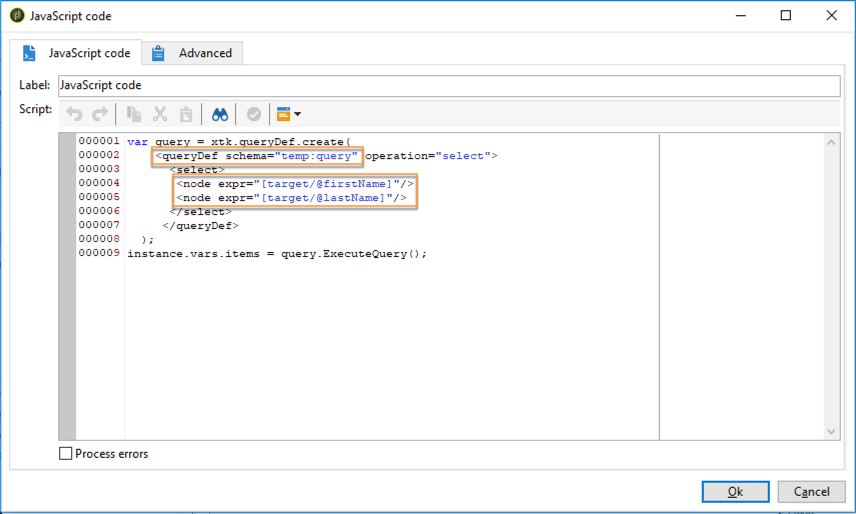

# 向运营商发送个性化提醒{#sending-personalized-alerts-to-operators}

在此示例中，我们希望向操作员发送警报，该操作员将包含打开新闻稿但未单击新闻稿所包含链接的配置文件的名称。

配置文件的名字和姓氏字段链接到定 **[!UICONTROL Recipients]** 位维，而活动 **[!UICONTROL Alert]** 链接到定位维 **[!UICONTROL Operator]** 。 因此，两个定位维之间没有可用的字段来执行对帐，检索名字和姓字段，并在警报活动中显示它们。

该过程是按如下方式构建工作流：

1. 使用活 **[!UICONTROL Query]** 动定位数据。
1. 将活动 **[!UICONTROL JavaScript code]** 添加到工作流中，以将查询中的填充保存到实例变量。
1. 使用活 **[!UICONTROL Test]** 动检查人口计数。
1. 根据 **[!UICONTROL Alert]** 活动结果，使用活动向操作员发送 **[!UICONTROL Test]** 警报。


## 将人口保存到实例变量 {#saving-the-population-to-the-instance-variable}

将以下代码添加到活 **[!UICONTROL JavaScript code]** 动中。

```
var query = xtk.queryDef.create(  
    <queryDef schema="temp:query" operation="select">  
      <select>  
       <node expr="[target/recipient.@firstName]"/>  
       <node expr="[target/recipient.@lastName]"/>  
      </select>  
     </queryDef>  
  );  
  var items = query.ExecuteQuery();
```

确保Javascript代码与您的工作流信息相对应：

* 标 **[!UICONTROL queryDef schema]** 记应与查询活动中使用的定位维的名称相对应。
* 标 **[!UICONTROL node expr]** 记应与要检索的字段的名称相对应。



要检索这些信息，请按照以下步骤操作：

1. 从活动中右键单击出站过渡， **[!UICONTROL Query]** 然后选择 **[!UICONTROL Display the target]**。

   

1. 右键单击列表，然后选择 **[!UICONTROL Configure list]**。

   

1. 查询定位维和字段名称显示在列表中。

   

## 测试人口数 {#testing-the-population-count}

将下面的代码添加到活 **[!UICONTROL Test]** 动中，以检查目标人群是否至少包含1个配置文件。

```
var.recCount>0
```


## 设置警报 {#setting-up-the-alert}

现在，已将人群添加到包含所需字段的实例变量中，您可以将这些信息添加到活 **[!UICONTROL Alert]** 动中。

为此，请在选项卡中添 **[!UICONTROL Source]** 加以下代码：

```
<ul>
<%
var items = new XML(instance.vars.items)
for each (var item in items){
%>
<li><%= item.target.@firstName %> <%= item.target.@lastName %></li>
<%
} %></ul>
```

>[!NOTE]
>
>通过 **[!UICONTROL <%= item.target.recipient.@fieldName %>]** 该命令，您可以添加已通过活动保存到实例变量中的一个字 **[!UICONTROL JavaScript code]** 段。\
>只要字段已插入到JavaScript代码中，就可以添加所需数量的字段。


