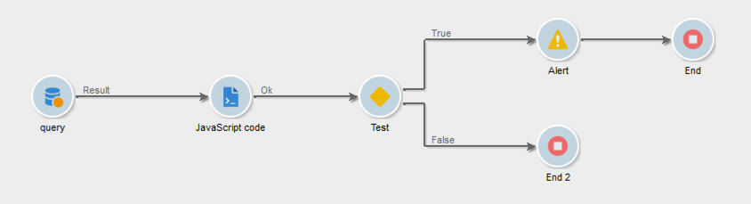
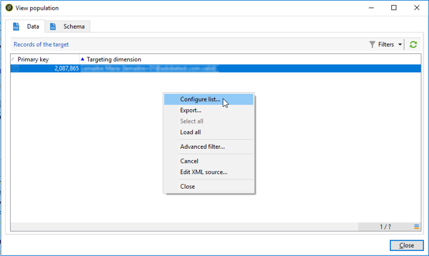

# 向运营商发送个性化提醒{#sending-personalized-alerts-to-operators}

在此示例中，我们希望向操作员发送警报，该操作员将包含打开新闻稿但未单击新闻稿所包含链接的用户档案的名称。

用户档案的名字和姓字段链接到&#x200B;**[!UICONTROL Recipients]**&#x200B;定位维度，而&#x200B;**[!UICONTROL Alert]**&#x200B;活动链接到&#x200B;**[!UICONTROL Operator]**&#x200B;定位维度。 因此，两个定位维度之间没有可用的字段来执行对帐和检索名字和姓氏字段，并在警报活动中显示它们。

该过程是按如下方式构建工作流：

1. 使用&#x200B;**[!UICONTROL Query]**&#x200B;活动目标数据。
1. 将&#x200B;**[!UICONTROL JavaScript code]**&#x200B;活动添加到工作流中，以将查询中的填充保存到实例变量。
1. 使用&#x200B;**[!UICONTROL Test]**&#x200B;活动检查人口计数。
1. 根据&#x200B;**[!UICONTROL Test]**&#x200B;活动结果，使用&#x200B;**[!UICONTROL Alert]**&#x200B;活动向运算符发送警报。



## 将填充保存到实例变量{#saving-the-population-to-the-instance-variable}

将下面的代码添加到&#x200B;**[!UICONTROL JavaScript code]**&#x200B;活动。

```
var query = xtk.queryDef.create(  
    <queryDef schema="temp:query" operation="select">  
      <select>  
       <node expr="[target/recipient.@firstName]"/>  
       <node expr="[target/recipient.@lastName]"/>  
      </select>  
     </queryDef>  
  );  
  var items = query.ExecuteQuery();
```

确保Javascript代码与您的工作流信息相对应：

* **[!UICONTROL queryDef schema]**&#x200B;标记应与在定位维度活动中使用的查询的名称相对应。
* **[!UICONTROL node expr]**&#x200B;标记应与要检索的字段的名称相对应。


要检索这些信息，请按照以下步骤操作：

1. 从&#x200B;**[!UICONTROL Query]**&#x200B;活动中右键单击出站过渡，然后选择&#x200B;**[!UICONTROL Display the target]**。

   

1. 右键单击列表，然后选择&#x200B;**[!UICONTROL Configure list]**。

   

1. 查询定位维度和字段名称显示在列表中。

   

## 测试人口数{#testing-the-population-count}

将下面的代码添加到&#x200B;**[!UICONTROL Test]**&#x200B;活动，以检查目标人群是否至少包含1个用户档案。

```
var.recCount>0
```


## 设置警报{#setting-up-the-alert}

现在，已将填充添加到具有所需字段的实例变量中，您可以将这些信息添加到&#x200B;**[!UICONTROL Alert]**&#x200B;活动。

为此，请在&#x200B;**[!UICONTROL Source]**&#x200B;选项卡中添加以下代码：

```
<ul>
<%
var items = new XML(instance.vars.items)
for each (var item in items){
%>
<li><%= item.target.@firstName %> <%= item.target.@lastName %></li>
<%
} %></ul>
```

>[!NOTE]
>
>使用&#x200B;**[!UICONTROL <%= item.target.recipient.@fieldName %>]**&#x200B;命令，可以通过&#x200B;**[!UICONTROL JavaScript code]**&#x200B;活动将已保存到实例变量的字段之一添加。\
>只要字段已插入到JavaScript代码中，就可以添加所需数量的字段。


