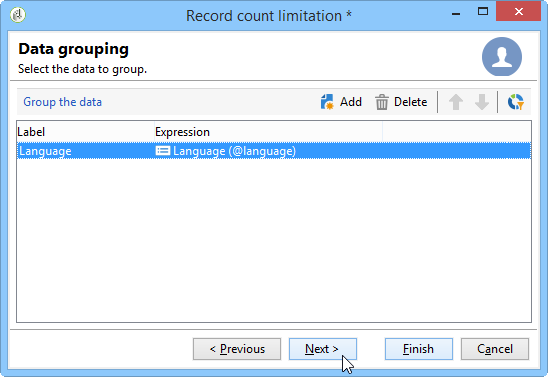
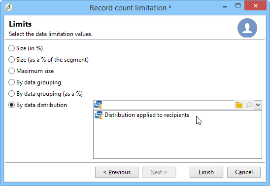

# 拆分{#split}

分 **割类**&#x200B;型活动允许您将目标分割为多个子集。 该目标是利用所有接收结果构建的：因此，必须完成所有以前的活动才能执行此活动。

此活动不会触发入站人口合并。 如果多个过渡以一个拆分活动登录，我们建议在 **[!UICONTROL Union]** 前面插入一个活动。

有关正在使用的拆分活动的示例，请参 [阅使用拆分活动创建子集](../../workflow/using/targeting-data.md#creating-subsets-using-the-split-activity)。

本节介绍了一个示例，其中说明了如何使用“拆分”活动使用过滤条件将目标分割为不 [同种群](../../workflow/using/cross-channel-delivery-workflow.md)。

本节提供了一个示例，其中显示如何在“拆分”活动中使用 [实例变量](../../workflow/using/javascript-scripts-and-templates.md)。

要配置此活动，请在选项卡中定义子集内 **[!UICONTROL Subsets]** 容和标签，然后在选项卡中选择目标 **[!UICONTROL General]** 维。

## 创建子集 {#creating-subsets}

要创建子集，请执行以下操作：

1. 单击匹配字段中的标签，然后选择要应用的筛选器。
1. 要过滤入站人口，请选择 **[!UICONTROL Add a filtering condition]** 选项，然后单击 **[!UICONTROL Edit...]** 链接。

   选择要应用于数据的筛选器类型，以将其包含在此集中。

   该过程与查询类 **型**&#x200B;活动相同。

   >[!NOTE]
   >
   >最多可以过滤两个外部数据库(联合数据访问)中的数据。

1. 您可以指定要从目标中提取的创建子集的最大记录数。 为此，请选中选 **[!UICONTROL Limit the selected records]** 项并单击链 **[!UICONTROL Edit...]** 接。

   通过向导，您可以选择此子集的记录选择模式。 这些步骤可在限制 [子集记录数中找到](#limiting-the-number-of-subset-records)。

   

1. 如果需要，可以使 **用按钮添加** 其他子 **[!UICONTROL Add]** 集。

   

   >[!NOTE]
   >
   >如果未 **[!UICONTROL Enable overlapping of output populations]** 选中该选项，则按选项卡的顺序创建子集。 使用此窗口右上角的箭头移动它们。 例如，如果第一个子集恢复了初始种群的70%，那么下一个子集将仅将其选择标准应用于其余的30%，依此类推。

   对于创建的每个子集，将向拆分过渡添加出站活动。

   

   您可以选择生成单个出站过渡(例如，使用段代码标识集):为此，请选择选 **[!UICONTROL Generate subsets in the same table]** 项卡中的 **[!UICONTROL General]** 选项。

   如果完成，则每个子集的段代码自动存储在附加列中。 此列可在投放级别的个性化字段中访问。

## 限制子集记录数 {#limiting-the-number-of-subset-records}

如果您不想使用子集中包含的整个人口，可以限制将包含的记录数。

1. 在“子集编辑”窗口中，选 **[!UICONTROL Limit the selected records]** 中该选项并单击 **[!UICONTROL Edit...]** 链接。
1. 选择所选的限制类型：

   * **[!UICONTROL Activate random sampling]**:此选项将随机抽取记录。 应用的随机采样类型取决于数据库引擎。
   * **[!UICONTROL Keep only the first records after sorting]**:此选项允许您根据一个或多个排序顺序定义限制。 如果选择字 **[!UICONTROL Age]** 段作为排序标准，选择100作为限制，则只保留最小的100个收件人。
   * **[!UICONTROL Keep the first ones after sorting (criteria, random)]**:此选项组合了前两个选项。 它允许您根据一个或多个排序顺序定义限制，如果某些记录的值与定义的标准值相同，则对第一个记录应用随机选择。

      例如，如果选择字段作 **[!UICONTROL Age]** 为排序标准，然后定义限制为100，但数据库中2000个最年轻的收件人都是18个，则将从2000个收件人中随机选择100个。
   

1. 如果要定义排序标准，还可以通过一个附加步骤定义列和排序顺序。

   

1. 然后选择数据限制方法。

   

   有几种方法可以执行此操作：

   * **[!UICONTROL Size (in %)]**:记录的百分比。 例如，以下配置提取总人口的10%。

      百分比适用于初始人口，而不是活动的结果。

   * **[!UICONTROL Size (as a % of the segment)]**:仅与子集相关而与初始种群无关的记录的百分比。
   * **[!UICONTROL Maximum size]**:最大记录数。
   * **[!UICONTROL By data grouping]**:可以根据入站人口的指定字段中的值设置记录数限制。 有关此主题的详细信息，请 [参阅按数据分组限制子集记录数](#limiting-the-number-of-subset-records-by-data-grouping)。
   * **[!UICONTROL By data grouping (in %)]**:您可以根据入站人口的指定字段中的值使用百分比设置记录数量限制。 有关此主题的详细信息，请 [参阅按数据分组限制子集记录数](#limiting-the-number-of-subset-records-by-data-grouping)。
   * **[!UICONTROL By data distribution]**:如果分组字段的值太多，或者如果您希望避免为每个新的拆分活动再次输入值，Adobe Campaign允许您配置 **[!UICONTROL By data distribution]** 限制(可选分布式营销模块)。 有关此信息的详细信息，请 [参阅限制每个数据分发的子集记录数](#limiting-the-number-of-subset-records-per-data-distribution)。

1. 单击 **[!UICONTROL Finish]** 以批准记录选择条件。 定义的配置随后将显示在编辑器的中间窗口中。

## 按数据分组限制子集记录数 {#limiting-the-number-of-subset-records-by-data-grouping}

您可以按数据分组限制记录数。 此限制可使用固定值或百分比执行。

例如，如果选择字段 **[!UICONTROL Language]** 作为组字段，则可以为每种语言定义记录列表。

1. 选择数据限制值后，选择或 **[!UICONTROL By data grouping]** 单 **[!UICONTROL By data grouping (as a %)]** 击鼠标 **[!UICONTROL Next]**。

   

1. 然后选择分组字段(例 **[!UICONTROL Language]** 如字段)并单击 **[!UICONTROL Next]**。

   

1. 最后，指定数据分组阈值（使用固定值或百分比，具体取决于之前选择的分组方法）。 要为每个值设置相同的阈值，例如，如果希望将每种语言的记录数设置为10，请选择该 **[!UICONTROL All data groupings are the same size]** 选项。 要为每个值设置不同的限制，请选择 **[!UICONTROL Limitations by grouping value]** 选项。 这将允许您为英语、法语等选择其他限制。

   

1. 单 **[!UICONTROL Finish]** 击以批准限制并返回编辑拆分活动。

## 限制每个数据分发的子集记录数 {#limiting-the-number-of-subset-records-per-data-distribution}

如果您的分组字段包含的值过多，或者您希望避免重置每个新拆分活动的值，Adobe Campaign允许您为每个数据分发创建限制。 选择数据限制值时(有关此主题的详细信息，请参 [阅创建子集](#creating-subsets) )，选择 **[!UICONTROL By data distribution]** 选项并从下拉菜单中选择一个模板。 创建数据分发模板的过程如下所示。

有关具有分发模 **[!UICONTROL Local approval]** 板的活动的示例，请参 [阅使用本地批准活动](../../workflow/using/using-the-local-approval-activity.md)。

>[!IMPORTANT]
>
>要使用此功能，您需要购买分布式营销模块，这是一个活动选项。 请核实您的许可协议。

通过数据分发模板，您可以使用分组值列表限制记录数。 要创建数据分发模板，请应用以下步骤：

1. 要创建数据分发模板，请转到节 **[!UICONTROL Resources > Campaign management > Data distribution]** 点并单击 **[!UICONTROL New]**。

   

1. 在选 **[!UICONTROL General]** 项卡中，您可以输入分发的标签和执行上下文(定位维度、分发字段)。

   

   需要输入以下字段：

   * **[!UICONTROL Label]**:“分发”模板的标签。
   * **[!UICONTROL Targeting dimension]**:例如，输入将应用定位维度分发的 **[!UICONTROL Recipient]** 。 此模式必须始终与定位工作流中使用的数据兼容。
   * **[!UICONTROL Distribution field]**:通过定位维度选择字段。 例如，如果您选择字 **[!UICONTROL Email domain]** 段，则收件人的列表将按域划分。
   * **[!UICONTROL Distribution type]**:选择目标限制值在选项卡中的划分方 **[!UICONTROL Distribution]** 式： **[!UICONTROL Percentage]** 或 **[!UICONTROL Set]**&#x200B;者
   * **[!UICONTROL Assignment type]**:选择数据分发分配类型。 您可以按组或运算符选择分配，或按本地实体选择分配。 按本地实体分配用于 **分布式营销**。 For more information, refer to this [section](../../campaign/using/about-distributed-marketing.md).
   * **[!UICONTROL Approval storage]**:如果您在定 **[!UICONTROL Local approval]** 位工作流中使用活动( [请参阅本地审](../../workflow/using/local-approval.md)批)，请输入模式，以存储审批结果。 必须为每个定位存储指定一个模式模式。 如果您使用定 **[!UICONTROL Recipients]** 位模式，请输入默认 **[!UICONTROL Local approval of recipients]** 存储模式。

      如果数据分组存在不经本地批准的简单限制，则无需输入字 **[!UICONTROL Approvals storage]** 段。

1. 如果您使用的是 **[!UICONTROL Local approval]** 活动(请参 [阅本地批准](../../workflow/using/local-approval.md))，请输 **[!UICONTROL Advanced settings]** 入分发模板：

   

   需要输入以下字段：

   * **[!UICONTROL Approve targeted messages]**:如果希望从要批准的收件人的列表中预先选择所有收件人，请选中此选项。 如果未选中此选项，则不会预先选择任何收件人。

      >[!NOTE]
      >
      >此选项默认处于选中状态。

      

   * **[!UICONTROL Delivery label]**:允许您定义表达式以在返回通知中显示投放标签。 默认表达式提供有关投放（计算字符串）的标准标签的信息。 您可以修改此表达式。

      

   * **[!UICONTROL Grouping field]**:此字段允许您定义用于在审批和返回通知中显示收件人的分组。

      

   * **[!UICONTROL Web Interface]**:允许您将Web应用程序链接到收件人列表。 在批准和返回通知中，每个收件人都可单击，并链接到所选Web应用程序。 字 **[!UICONTROL Parameters]** 段(例如 **[!UICONTROL recipientId]**)允许您配置要在URL和Web应用程序中使用的其他参数。

      

1. 使用 **[!UICONTROL Breakdown]** 选项卡可以定义分配值的列表。

   

   * **[!UICONTROL Value]**:输入分配值。
   * **[!UICONTROL Percentage / Set]**:输入链接到每个值的记录限制（固定或百分比）。

      此列由选项卡 **[!UICONTROL Distribution type]** 中的字段定 **[!UICONTROL General]** 义。

   * **[!UICONTROL Label]**:输入链接到每个值的标签。
   * **[!UICONTROL Group or operator]**:如果您使用的是 **[!UICONTROL Local approval]** 活动(请参 [阅本地批准](../../workflow/using/local-approval.md))，请选择分配给每个分配值的运算符或操作员组。

      如果数据分组存在不经本地批准的简单限制，则无需输入字 **[!UICONTROL Group or operator]** 段。

      >[!IMPORTANT]
      >
      >确保已为操作员分配了适当的权限。

   * **[!UICONTROL Local entity]**:选择分配给每个分配值的本地实体。 本地实体用于 **分布式营销**。 For more information, refer to this [section](../../campaign/using/about-distributed-marketing.md).

## 筛选参数 {#filtering-parameters}

单击选 **[!UICONTROL General]** 项卡以输入活动标签。 为此拆分选择目标和筛选维。 如有必要，您可以更改给定子集的这些维。

Check the **[!UICONTROL Generate complement]** option if you wish to exploit the remaining population. 补码是入站目标减去子集的合并。 随后将向该过渡添加一个额外的出站活动，如下所示：

要使此选项正常工作，入站数据必须具有主键。

例如，如果通过活动直接从外部数据库(如Netezza（它不支持索引的概念）)读取数 **[!UICONTROL Data loading (RDBMS)]** 据，则活动生成的补码将 **[!UICONTROL Split]** 不正确。

要避免这种情况，您可以在活动 **[!UICONTROL Enrichment]** 前拖放一个 **[!UICONTROL Split]** 活动。 在活动 **[!UICONTROL Enrichment]** 中，检 **[!UICONTROL Keep all additional data from the main set]** 查要用于配置活动过滤器的列，并在其他数据中指定这些 **[!UICONTROL Split]** 列。 然后，来自过渡的入站活动的 **[!UICONTROL Split]** 被本地存储在Adobe Campaign服务器上的临时表中，并且可以正确地生成补码。

通过 **[!UICONTROL Enable overlapping of output populations]** 此选项，可以管理属于多个子集的人群：

* 如果未选中该框，拆分活动将确保一个收件人不能存在于多个输出过渡中，即使它满足多个子集的条件也是如此。 它们将位于具有匹配条件的第一个选项卡的目标中。
* 选中该框后，如果收件人符合筛选条件，则可以在多个子集中找到这些数据。 Adobe Campaign建议使用独占标准。

## 输入参数 {#input-parameters}

* tableName
* 模式

每个入站事件必须指定由这些参数定义的目标。

## 输出参数 {#output-parameters}

* tableName
* 模式
* recCount

这三个值集标识排除所产生的目标。 **[!UICONTROL tableName]** 是记录目标标识符的表的名称， **[!UICONTROL schema]** 是人口的模式(通常是nms:收件人 **[!UICONTROL recCount]** )，是表中元素的数量。

与补码关联的过渡具有相同的参数。
