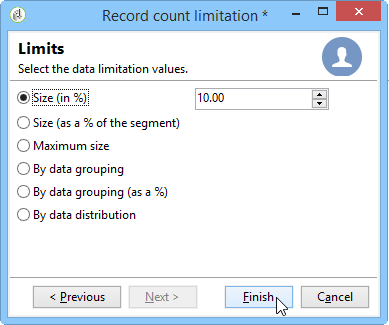
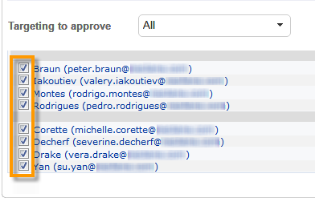

# 拆分{#split}

通过&#x200B;**Split**&#x200B;类型的活动，您可以将目标分割成多个子集。 该目标由所有接收结果构建：因此，之前的所有活动都必须已完成，才能执行此活动。

此活动不会触发集客群体的并集。 如果多个过渡在一个拆分活动中落地，我们建议在该活动前面插入&#x200B;**[!UICONTROL Union]**&#x200B;活动。

有关所使用的拆分活动的示例，请参阅[使用拆分活动创建子集](../../workflow/using/targeting-data.md#creating-subsets-using-the-split-activity)。

[此部分](../../workflow/using/cross-channel-delivery-workflow.md)中介绍了如何使用拆分活动将目标使用筛选条件细分为不同群体的示例。

[此部分](../../workflow/using/javascript-scripts-and-templates.md)中提供了显示如何在拆分活动中使用实例变量的示例。

要配置此活动，请在&#x200B;**[!UICONTROL Subsets]**&#x200B;选项卡中定义子集内容和标签，然后在&#x200B;**[!UICONTROL General]**&#x200B;选项卡中选择目标维度。

## 创建子集{#creating-subsets}

要创建子集，请执行以下操作：

1. 单击匹配字段中的标签，然后选择要应用的过滤器。
1. 要筛选集客群体，请选择&#x200B;**[!UICONTROL Add a filtering condition]**&#x200B;选项，然后单击&#x200B;**[!UICONTROL Edit...]**&#x200B;链接。

   选择要应用于数据的过滤器类型，以将其包含在此集中。

   该过程与&#x200B;**Query**&#x200B;类型活动的过程相同。

   >[!NOTE]
   >
   >最多可以在两个外部数据库(FDA)中过滤数据。

1. 您可以指定要从目标中提取以创建子集的最大记录数。 要执行此操作，请勾选&#x200B;**[!UICONTROL Limit the selected records]**&#x200B;选项并单击&#x200B;**[!UICONTROL Edit...]**&#x200B;链接。

   向导允许您选择此子集记录的选择模式。 可在[限制子集记录数](#limiting-the-number-of-subset-records)中找到这些步骤。

   

1. 如果需要，可以使用&#x200B;**[!UICONTROL Add]**&#x200B;按钮添加其他子集&#x200B;**。**

   

   >[!NOTE]
   >
   >如果未勾选&#x200B;**[!UICONTROL Enable overlapping of output populations]**&#x200B;选项，则会按选项卡的顺序创建子集。 使用此窗口右上方的箭头移动它们。 例如，如果第一个子集取回了初始群体的70%，则下一个子集将仅将其选择标准应用于其余的30%，依此类推。

   对于创建的每个子集，都会向拆分活动中添加叫客过渡。

   

   您可以选择生成单个叫客过渡（例如，使用段码标识集）：要执行此操作，请在&#x200B;**[!UICONTROL General]**&#x200B;选项卡中选择&#x200B;**[!UICONTROL Generate subsets in the same table]**&#x200B;选项。

   如果完成，则每个子集的段码会自动存储在附加列中。 此列可在投放级别的个性化字段中访问。

## 限制子集记录数{#limiting-the-number-of-subset-records}

如果您不希望使用子集中包含的整个群体，则可以限制将包含的记录数。

1. 在子集编辑窗口中，选中&#x200B;**[!UICONTROL Limit the selected records]**&#x200B;选项，然后单击&#x200B;**[!UICONTROL Edit...]**&#x200B;链接。
1. 选择选择的限制类型：

   * **[!UICONTROL Activate random sampling]**:此选项会随机抽取记录样本。应用的随机取样类型取决于数据库引擎。
   * **[!UICONTROL Keep only the first records after sorting]**:利用此选项，可根据一个或多个排序顺序定义限制。如果选择&#x200B;**[!UICONTROL Age]**&#x200B;字段作为排序标准，选择100作为限制，则仅保留最年轻的100个收件人。
   * **[!UICONTROL Keep the first ones after sorting (criteria, random)]**:此选项是前两个选项的组合。它允许您根据一个或多个排序顺序定义限制，如果某些记录的值与定义的标准值相同，则对第一个记录应用随机选择。

      例如，如果选择&#x200B;**[!UICONTROL Age]**&#x200B;字段作为排序标准，然后定义限制为100，但数据库中2000个最年轻的收件人均为18，则将从这2000个收件人中随机选择100个收件人。
   

1. 如果要定义排序标准，您可以通过额外的步骤定义列和排序顺序。

   

1. 然后选择数据限制方法。

   

   可通过以下几种方式执行此操作：

   * **[!UICONTROL Size (in %)]**:记录的百分比。例如，以下配置会提取总人口的10%。

      百分比适用于初始群体，而不是活动结果。

   * **[!UICONTROL Size (as a % of the segment)]**:仅与子集有关而与初始群体无关的记录的百分比。
   * **[!UICONTROL Maximum size]**:最大记录数。
   * **[!UICONTROL By data grouping]**:您可以根据集客群体指定字段中的值设置记录数量限制。有关此主题的更多信息，请参阅[通过数据分组限制子集记录的数量](#limiting-the-number-of-subset-records-by-data-grouping)。
   * **[!UICONTROL By data grouping (in %)]**:您可以根据集客群体指定字段中的值，使用百分比设置记录数限制。有关此主题的更多信息，请参阅[通过数据分组限制子集记录的数量](#limiting-the-number-of-subset-records-by-data-grouping)。
   * **[!UICONTROL By data distribution]**:如果您的分组字段的值过多，或者您希望避免为每个新拆分活动再次输入值，则可以通过Adobe Campaign配置限 **[!UICONTROL By data distribution]** 制（可选的分布式营销模块）。有关更多信息，请参阅[限制每个数据分发的子集记录数](#limiting-the-number-of-subset-records-per-data-distribution)。

1. 单击&#x200B;**[!UICONTROL Finish]**&#x200B;以批准记录选择条件。 然后，定义的配置将显示在编辑器的中间窗口中。

## 通过数据分组{#limiting-the-number-of-subset-records-by-data-grouping}限制子集记录数

您可以按数据分组限制记录数。 此限制可以使用固定值或百分比执行。

例如，如果选择&#x200B;**[!UICONTROL Language]**&#x200B;字段作为组字段，则可以为每种语言定义记录列表。

1. 选择数据限制值后，选择&#x200B;**[!UICONTROL By data grouping]**&#x200B;或&#x200B;**[!UICONTROL By data grouping (as a %)]**&#x200B;并单击&#x200B;**[!UICONTROL Next]**。

   

1. 然后，选择分组字段（例如&#x200B;**[!UICONTROL Language]**&#x200B;字段）并单击&#x200B;**[!UICONTROL Next]**。

   

1. 最后，指定数据分组阈值（使用固定值或百分比，具体取决于先前选择的分组方法）。 要为每个值设置相同的阈值，例如，如果希望将每种语言的记录数设置为10，请选择&#x200B;**[!UICONTROL All data groupings are the same size]**&#x200B;选项。 要为每个值设置不同的限制，请选择&#x200B;**[!UICONTROL Limitations by grouping value]**&#x200B;选项。 这将允许您选择英语、法语等的其他限制。

   

1. 单击&#x200B;**[!UICONTROL Finish]**&#x200B;以批准限制并返回编辑拆分活动。

## 限制每个数据分发的子集记录数{#limiting-the-number-of-subset-records-per-data-distribution}

如果分组字段包含的值过多，或者您希望避免重置每个新拆分活动的值，则Adobe Campaign允许您为每个数据分发创建限制。 选择数据限制值（有关此主题的更多信息，请参见[创建子集](#creating-subsets)部分）时，选择&#x200B;**[!UICONTROL By data distribution]**&#x200B;选项，然后从下拉菜单中选择模板。 创建数据分发模板的演示如下所示。

有关具有分发模板的&#x200B;**[!UICONTROL Local approval]**&#x200B;活动的示例，请参阅[使用本地批准活动](../../workflow/using/using-the-local-approval-activity.md)。

>[!IMPORTANT]
>
>要使用此功能，您需要购买分布式营销模块，该模块是一个Campaign选项。 请核实您的许可协议。

利用数据分发模板，可使用分组值列表限制记录数。 要创建数据分发模板，请应用以下步骤：

1. 要创建数据分发模板，请转到&#x200B;**[!UICONTROL Resources > Campaign management > Data distribution]**&#x200B;节点，然后单击&#x200B;**[!UICONTROL New]**。

   

1. 通过&#x200B;**[!UICONTROL General]**&#x200B;选项卡，可输入分发的标签和执行上下文（定向维度、分发字段）。

   

   需要输入以下字段：

   * **[!UICONTROL Label]**:分发模板的标签。
   * **[!UICONTROL Targeting dimension]**:例如，输入要应用数据分发的定向 **[!UICONTROL Recipient]** 维度。此模式必须始终与定位工作流中使用的数据兼容。
   * **[!UICONTROL Distribution field]**:通过定向维度选择字段。例如，如果选择&#x200B;**[!UICONTROL Email domain]**&#x200B;字段，则收件人列表将按域划分。
   * **[!UICONTROL Distribution type]**:在选项卡中选择目标限制值的划分方 **[!UICONTROL Distribution]** 式： **[!UICONTROL Percentage]** 或 **[!UICONTROL Set]**。
   * **[!UICONTROL Assignment type]**:选择数据分发分配类型。您可以选择按组或运算符进行分配或按本地实体进行分配。 **分布式营销**&#x200B;中使用由本地实体分配的内容。 有关更多信息，请参阅此[部分](../../campaign/using/about-distributed-marketing.md)。
   * **[!UICONTROL Approval storage]**:如果您在定 **[!UICONTROL Local approval]** 位工作流中使用活动(请参 [阅本地批准](../../workflow/using/local-approval.md))，请输入将存储批准结果的架构。必须为每个定位模式指定一个存储模式。 如果使用&#x200B;**[!UICONTROL Recipients]**&#x200B;定位架构，请输入默认的&#x200B;**[!UICONTROL Local approval of recipients]**&#x200B;存储架构。

      如果通过数据分组进行简单限制而未获得本地批准，则无需输入&#x200B;**[!UICONTROL Approvals storage]**&#x200B;字段。

1. 如果您使用&#x200B;**[!UICONTROL Local approval]**&#x200B;活动（请参阅[本地批准](../../workflow/using/local-approval.md)），请为分发模板输入&#x200B;**[!UICONTROL Advanced settings]**:

   

   需要输入以下字段：

   * **[!UICONTROL Approve targeted messages]**:如果希望从要批准的收件人列表中预先选择所有收件人，请勾选此选项。如果未选中此选项，则不会预选任何收件人。

      >[!NOTE]
      >
      >默认勾选此选项。

      

   * **[!UICONTROL Delivery label]**:允许您定义表达式以在回访通知中显示投放标签。默认表达式提供有关投放标准标签（计算字符串）的信息。 您可以修改此表达式。

      

   * **[!UICONTROL Grouping field]**:利用此字段，可定义用于在批准和回访通知中显示收件人的分组。

      

   * **[!UICONTROL Web Interface]**:允许您将web应用程序链接到收件人列表。在批准和返回通知中，每个收件人都可以单击，并将链接到选定的Web应用程序。 **[!UICONTROL Parameters]**&#x200B;字段（例如&#x200B;**[!UICONTROL recipientId]**）允许您配置要在URL和Web应用程序中使用的其他参数。

      

1. 使用&#x200B;**[!UICONTROL Breakdown]**&#x200B;选项卡可定义分配值列表。

   

   * **[!UICONTROL Value]**:输入分配值。
   * **[!UICONTROL Percentage / Set]**:输入链接到每个值的记录限制（固定或百分比）。

      此列由&#x200B;**[!UICONTROL General]**&#x200B;选项卡中的&#x200B;**[!UICONTROL Distribution type]**&#x200B;字段定义。

   * **[!UICONTROL Label]**:输入链接到每个值的标签。
   * **[!UICONTROL Group or operator]**:如果您使用的是 **[!UICONTROL Local approval]** 活动(请参阅 [本地批准](../../workflow/using/local-approval.md))，请选择分配给每个分配值的运算符或运算符组。

      如果通过数据分组进行简单限制而未获得本地批准，则无需输入&#x200B;**[!UICONTROL Group or operator]**&#x200B;字段。

      >[!IMPORTANT]
      >
      >确保为运算符分配了相应的权限。

   * **[!UICONTROL Local entity]**:选择分配给每个分配值的本地实体。本地实体用在&#x200B;**分布式营销**&#x200B;中。 有关更多信息，请参阅此[部分](../../campaign/using/about-distributed-marketing.md)。

## 筛选参数{#filtering-parameters}

单击&#x200B;**[!UICONTROL General]**&#x200B;选项卡以输入活动标签。 为此拆分选择目标和筛选维度。 如有必要，您可以更改给定子集的这些维度。

如果要利用剩余群体，请勾选&#x200B;**[!UICONTROL Generate complement]**&#x200B;选项。 补码是集客目标减去子集的并集。 随后，将向活动添加其他叫客过渡，如下所示：

要使此选项正常工作，集客数据必须具有主键。

例如，如果通过&#x200B;**[!UICONTROL Data loading (RDBMS)]**&#x200B;活动直接从外部数据库(如Netezza（不支持索引概念）)读取数据，则&#x200B;**[!UICONTROL Split]**&#x200B;活动生成的补码将不正确。

要避免这种情况，您可以将&#x200B;**[!UICONTROL Enrichment]**&#x200B;活动拖放到&#x200B;**[!UICONTROL Split]**&#x200B;活动之前。 在&#x200B;**[!UICONTROL Enrichment]**&#x200B;活动中，检查&#x200B;**[!UICONTROL Keep all additional data from the main set]** ，并在附加数据中指定要用于配置&#x200B;**[!UICONTROL Split]**&#x200B;活动过滤器的列。 然后，**[!UICONTROL Split]**&#x200B;活动集客过渡中的数据将存储在Adobe Campaign服务器上的临时表中，并且可以正确生成补码。

使用&#x200B;**[!UICONTROL Enable overlapping of output populations]**&#x200B;选项可以管理属于多个子集的群体：

* 未勾选框时，拆分活动可确保收件人不能出现在多个输出过渡中，即使它符合多个子集的条件也是如此。 它们将位于第一个选项卡的目标中，且标准匹配。
* 选中该框后，如果收件人符合其筛选条件，则可以在多个子集中找到该收件人。 Adobe Campaign建议使用排他性标准。

## 输入参数{#input-parameters}

* tableName
* 模式

每个集客事件必须指定由这些参数定义的目标。

## 输出参数{#output-parameters}

* tableName
* 模式
* recCount

这组值由三个值组成，用于标识由排除项生成的目标。 **[!UICONTROL tableName]** 是记录目标标识符的表的名称， **[!UICONTROL schema]** 是群体的模式（通常为nms:recipient）， **[!UICONTROL recCount]** 是表中元素的数量。

与补码关联的过渡具有相同的参数。
