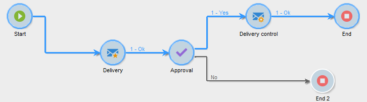

# 开始和结束{#start-and-end}

通过 **[!UICONTROL Start]** 和 **[!UICONTROL End]** 活动，您可以以图形方式标记工作流的开始和结束。 这些活动没有功能影响，因此是可选的。

* **[!UICONTROL Start]**

   使用活动执行工作流开始，而不使用入站过渡和开始类型活动。

   

* **[!UICONTROL End]**

   您可以配置 **[!UICONTROL End]** 活动以中断所有正在进行的任务。 为此，请多次单击活动以显示其属性，并选中相应的选项。

   

   启用结束活动时，工作台中的数据将自动删除。 如果这不是必需的，并且为了避免不必要的载入，您可以选择在最后一个过渡输出时禁用活动。 例如，在投放输出中，如果没有计划进程，请取消选中相关选项，如下所示：

   

