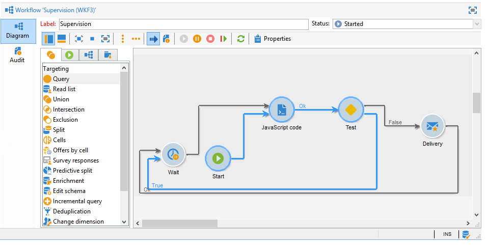
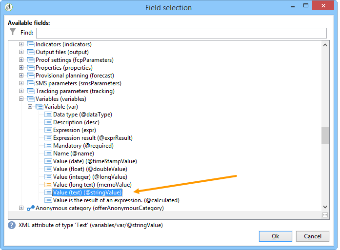

# 用例：监督工作流{#supervising-workflows}

此用例详细介绍了如何创建工作流，它允许您监视“已暂停”、“已停止”或“有错误”的一组工作流的状态。

其目的是：

* 使用工作流来监视一组业务工作流。
* 通过“投放”活动向主管发送消息。

要监视一组工作流的状态，您需要执行以下步骤：

1. 创建监视工作流。
1. 编写JavaScript以确定工作流是暂停、停止还是出错。
1. 创建&#x200B;**[!UICONTROL Test]**&#x200B;活动。
1. 准备投放模板。

>[!NOTE]
>
>除了工作流之外，活动&#x200B;**工作流热图**&#x200B;还允许您详细分析当前运行的工作流。 有关详细信息，请参阅[专用部分](../../workflow/using/heatmap.md)。
>
>有关如何&#x200B;**监视工作流执行**&#x200B;的详细信息，请参阅[本节](../../workflow/using/monitoring-workflow-execution.md)。

## 第1步：创建监视工作流{#step-1--creating-the-monitoring-workflow}

我们要监视的工作流文件夹是存储在&#x200B;**管理>生产>技术工作流**&#x200B;节点中的&#x200B;**&quot;CustomWorkflows&quot;**&#x200B;文件夹。 此文件夹包含一组业务工作流。

**监视工作流**&#x200B;存储在技术工作流文件夹的根目录下。 使用的标签为&#x200B;**&quot;Monitoring&quot;**。

以下模式显示了活动的顺序：



此工作流由以下部分组成：

* a **&quot;开始&quot;**&#x200B;活动。
* a **&quot;JavaScript code&quot;**&#x200B;负责分析业务工作流文件夹的活动。
* a **&quot;Test&quot;**&#x200B;活动向主管发送投放或重新开始工作流。
* a **&quot;投放&quot;**&#x200B;负责消息布局的活动。
* a **&quot;wait&quot;**&#x200B;活动，用于控制工作流迭代之间的提前期。

## 第2步：编写JavaScript {#step-2--writing-the-javascript}

JavaScript代码的第一部分与&#x200B;**查询(queryDef)**&#x200B;一致，它允许您用“pause”(@state == 13)、“error”(@failed == 1)或“stopped”(@state == 20)状态标识工作流。

在以下条件下，将提供要监视的工作流文件夹的&#x200B;**内部名称**:

```
<condition boolOperator="AND" expr="[folder/@name] = 'Folder20'" internalId="1"/>
```

```
var strError = "";
var strPaused = "";
var strStop = "";

var queryWkfError = xtk.queryDef.create(
  <queryDef schema="xtk:workflow" operation="select">
    <select>
      <node expr="@internalName"/>
      <node expr="@state"/>
      <node expr="@label"/>
      <node expr="@failed"/>
      <node expr="@state"/>   
    </select>
    <where id="12837805386">
      <condition boolOperator="AND" expr="[folder/@name] = 'Folder20'" internalId="1"/>
        <condition boolOperator="AND" internalId="2">
          <condition boolOperator="OR" expr="@state = 20" internalId="3"/>
          <condition expr="@state = 13" internalId="4"/>
        </condition>  
    </where>
  </queryDef>
);
var ndWkfError = queryWkfError.ExecuteQuery(); 
```

JavaScript代码的第二部分允许您根据在查询期间恢复的状态，为每个工作流&#x200B;**显示一条消息。**

>[!NOTE]
>
>创建的字符串必须加载到工作流的事件变量中。

```
for each ( var wkf in ndWkfError.workflow ) 
{
  if ( wkf.@state == 13 )  // Status 13 = paused
  {
    if ( wkf.@failed == 1 )
      strError += "<li>Workflow '" + wkf.@internalName + "' with the label '" + wkf.@label + "'</li>";
    else
      strPaused += "<li>Workflow '" + wkf.@internalName + "' with the label '" + wkf.@label + "'</li>";
  }
  
  if ( wkf.@state == 20 )  // Status 20 = stop
    strStop += "<li>Workflow '" + wkf.@internalName + "' with the label '" + wkf.@label + "'</li>";
}

vars.strWorkflowError = strError;
vars.strWorkflowPaused = strPaused;
vars.strWorkflowStop = strStop;
```

## 第3步：创建“Test”活动{#step-3--creating-the--test--activity}

“测试”活动允许您根据“等待”活动确定是需要发送投放还是需要运行另一个周期。

如果三个投放变量“vars.strWorkflowError”、“vars.strWorkflowPaused”或“vars.strWorkflowStop”中的至少一个为非void，则会向主管&#x200B;**发送事件。**


可以配置“等待”活动，以定期间隔重新开始监视工作流。 对于此用例， **等待时间设置为1小时**。


## 第4步：准备投放{#step-4--preparing-the-delivery}

“投放”活动基于存储在&#x200B;**资源>模板>投放模板**&#x200B;节点中的&#x200B;**投放模板**。

此模板必须包括：

* **主管的电子邮件地址**。
* **用于** 插入个性化文本的HTML内容。

   

   声明的三个变量(WF_Stop、WF_Paused、WF_Error)与三个工作流事件变量匹配。

   这些变量必须在投放模板属性的&#x200B;**变量**&#x200B;选项卡中声明。

   要恢复&#x200B;**工作流事件变量**&#x200B;的内容，您需要声明特定于将使用JavaScript代码返回的值初始化的投放的变量。

   该投放模板具有以下内容：

   

创建并批准模板后，您需要将&#x200B;**投放**&#x200B;活动配置为：

* 将“投放”活动链接到之前创建的投放模板。
* 将工作流的事件变量链接到特定于投放模板的变量。

多次 — 单击&#x200B;**投放**&#x200B;活动并选择以下选项：

* 投放:选择“新建”（从模板&#x200B;**创建），然后选择之前创建的投放模板。**
* 对于&#x200B;**收件人和Content**&#x200B;字段，选择&#x200B;**在投放**&#x200B;中指定。
* 要执行的操作：选择&#x200B;**准备并开始**。
* 取消选中&#x200B;**处理错误**&#x200B;选项。

   

* 转到&#x200B;**投放**&#x200B;活动的&#x200B;**脚本**&#x200B;选项卡，通过个性化字段菜单添加三个&#x200B;**字符串**&#x200B;类型变量。

   

   

   声明的三个变量是：

   ```
   delivery.variables._var[0].stringValue = vars.strWorkflowError;
   delivery.variables._var[1].stringValue = vars.strWorkflowPaused;
   delivery.variables._var[2].stringValue = vars.strWorkflowStop; 
   ```

启动此监视工作流后，它会向收件人发送以下摘要：


