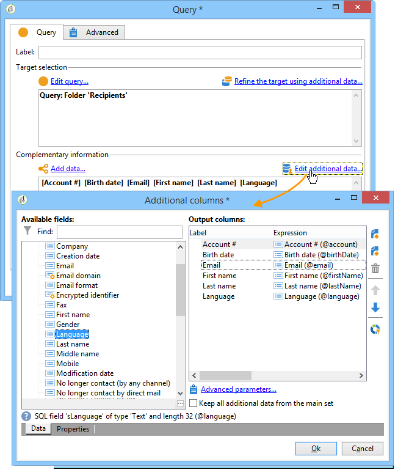

# 定位数据{#targeting-data}

## 创建查询 {#creating-queries}

### 选择数据 {#selecting-data}

活动 **[!UICONTROL Query]** 允许您选择基本数据来构建目标群。 有关此内容的详细信息，请参 [阅创建查询](../../workflow/using/query.md#creating-a-query)。

您还可以使用以下活动查询和细化数据库中的数据： [增量查询](../../workflow/using/incremental-query.md), [读取列表](../../workflow/using/read-list.md)。

可以在整个工作流的生命周期中收集要转发和处理的其他数据。 有关此内容的详细信息，请参 [阅添加数](../../workflow/using/query.md#adding-data) 据 [和编辑其他数据](#editing-additional-data)。

### 编辑其他数据 {#editing-additional-data}

添加其他数据后，您可以编辑它或使用它来优化在查询活动中定义的目标。

通过 **[!UICONTROL Edit additional data...]** 该链接，您可以视图添加的数据并修改它或将其添加到它。

要向先前定义的输出列添加数据，请在可用字段列表中选择它。 要创建新的输出列，请单击 **[!UICONTROL Add]** 图标，然后选择字段并单击 **[!UICONTROL Edit expression]**。

为要添加的字段定义计算模式，例如聚合。

通过 **[!UICONTROL Add a sub-item]** 此选项，可将计算数据附加到集合。 这允许您从集合中选择其他数据或定义收集要素的聚合计算。

子元素将在其映射到的集合的子树中表示。

集合显示在 **[!UICONTROL Collections]** 子选项卡中。 您可以通过单击所选集合的图标 **[!UICONTROL Detail]** 来筛选收集的元素。 过滤器向导允许您选择收集的数据并指定要应用于集合中数据的过滤条件。

### 使用其他数据优化目标 {#refining-the-target-using-additional-data}

收集的其他数据使您能够细化数据库中的数据过滤。 为此，请单击链 **[!UICONTROL Refine the target using additional data...]** 接：这样，您就可以对添加的数据进行过滤。

### 均化数据 {#homogenizing-data}

在或 **[!UICONTROL Union]** 键入 **[!UICONTROL Intersection]** 活动中，您可以选择仅保留共享的其他数据以保持数据的一致性。 在这种情况下，此活动的临时输出工作台将仅包含所有入站集中找到的其他数据。

### 与其他数据协调 {#reconciliation-with-additional-data}

在数据协调阶段&#x200B;**[!UICONTROL Union]**( **[!UICONTROL Intersection]**、等) 活动)，您可以从其他列中选择要用于数据协调的列。 为此，请配置所选列的对帐并指定主集。 然后，选择窗口下方列中的列，如下例所示：

### 创建子集 {#creating-subsets}

活动 **[!UICONTROL Split]** 允许您根据通过提取查询定义的条件创建子集。 对于每个子集，在编辑填充上的筛选条件时，您随后将访问标准查询活动，该目标细分条件允许您定义分段条件。

您可以将目标拆分为多个子集，只使用附加数据作为筛选条件，或除目标数据之外。 如果您已购买联合数据访问选项，则还可以使用 **外部** 数据。

有关详细信息，请参阅使 [用拆分活动创建子集](#creating-subsets-using-the-split-activity)。

## 细分数据 {#segmenting-data}

### 组合多个目标(合并) {#combining-several-targets--union-}

合并活动允许您在一个过渡中组合多个活动的结果。 集合不一定必须是同质的。

以下数据对帐选项可用：

* **[!UICONTROL Keys only]**

   如果输入总体是同质的，则可以使用此选项。

* **[!UICONTROL All columns in common]**

   通过此选项，您可以根据目标各种人群通用的所有列来调节数据。

   Adobe Campaign根据列的名称标识列。 接受容差阈值：例如，“Email”列可以识别为与“@email”列相同。

* **[!UICONTROL A selection of columns]**

   选择此选项可定义要应用列表协调的列的。

   开始，方法是选择主集（包含源数据的集），然后选择要用于连接的列。

   

   >[!CAUTION]
   >
   >在数据协调过程中，不会消除重复数据。

   可以将人口大小限制为给定数量的记录。 为此，请单击相应的选项并指定要保存的记录数。

   此外，指定入站人口的优先级：窗口的下部列表合并活动的入站过渡，并允许您使用窗口右侧的蓝色箭头对它们进行排序。

   记录将首先从列表中第一个入站过渡的人口中提取，如果未达到最大数，则从第二个入站过渡的人口中提取。

   

### 提取联合数据(交叉) {#extracting-joint-data--intersection-}

交叉点允许您仅恢复入站过渡总体共享的线。 此活动的配置应与合并活动相同。

此外，可以只保留列选择，或仅保留入站人口共享的列。

交叉活动在“交叉”部 [分中详](../../workflow/using/intersection.md) 细说明。

### 排除人口（排除） {#excluding-a-population--exclusion-}

排除活动允许您从不同的目标群体中排除目标的元素。 此活动的输出定位维度将是主集合的输出。

必要时，可以处理入站表。 事实上，要将目标排除在其他维度之外，必须将此目标返回到与主目标相同的定位维度。 为此，请单击按 **[!UICONTROL Add]** 钮并指定维更改条件。

通过标识符、更改轴或连接执行数据协调。 使用列表中 [的数据中有示例：读取列表](../../workflow/using/importing-data.md#using-data-from-a-list--read-list)。

### 使用拆分活动创建子集 {#creating-subsets-using-the-split-activity}

该活动 **[!UICONTROL Split]** 是一个标准活动，它允许您通过一个或多个过滤维度创建所需数量的集合，并为每个子集生成一个输出过渡或唯一过渡。

由入站过渡传输的附加数据可以在过滤标准中使用。

要进行配置，您首先需要选择条件：

1. 在您的工作流中，拖放一个 **[!UICONTROL Split]** 活动。
1. 在选项卡 **[!UICONTROL General]** 中，选择所需的选项： **[!UICONTROL Use data from the target and additional data]**、 **[!UICONTROL Use the additional data only]** 或 **[!UICONTROL Use external data]**。
1. 如果选 **[!UICONTROL Use data from the target and additional data]** 择了该选项，定位维度允许您使用入站过渡传送的所有数据。

   

   当创建子集时，使用上述过滤参数。

   要定义筛选条件，请选 **[!UICONTROL Add a filtering condition on the inbound population]** 择选项，然后单击 **[!UICONTROL Edit...]** 链接。 然后指定用于创建此子集的过滤条件。

   

   本节介绍了一个示例，其中说明如何在 **[!UICONTROL Split]** 活动中使用过滤条件将目标细分为不同 [群体](../../workflow/using/cross-channel-delivery-workflow.md)。

   通过 **[!UICONTROL Label]** 该字段，您可以为新创建的子集指定一个名称，该名称将与出站过渡匹配。

   您还可以为子集分配段代码，以识别该子集并使用它来目标其群体。

   如有必要，您可以分别更改要创建的每个子集的定位和过滤维度。 为此，请编辑子集的筛选条件并检查选 **[!UICONTROL Use a specific filtering dimension]** 项。

   

1. 如果选 **[!UICONTROL Use the additional data only]** 择该选项，则仅提供其他数据用于子集筛选。

   

1. 如果启 **用了** 联合数据访问 **[!UICONTROL Use external data]** ，则允许您处理已配置的外部数据库中的数据，或创建到数据库的新连接。

   

   有关更多信息，请参阅此](../../installation/using/about-fda.md)章节[。

然后，我们需要添加新子集：

1. 单击该 **[!UICONTROL Add]** 按钮并定义筛选条件。

   

1. 在过滤维度的选项 **[!UICONTROL General]** 卡中定义活动（请参阅上文）。默认情况下，它应用于所有子集。

   

1. 如有必要，您可以单独更改每个子集的过滤维度。 这样，您可以为所有金卡持有者构建一套，一个适用于点击了最新新闻稿的所有收件人，另一个适用于在过去30天内进行店内购买的18到25岁用户，所有这些用户都使用相同的拆分活动。 为此，请选择选 **[!UICONTROL Use a specific filtering dimension]** 项并选择数据过滤上下文。

   

   >[!NOTE]
   >
   >如果您已获得 **联合数据访问** ，则可以根据外部库中的信息创建子集。 为此，请在字段中选择外部表的模式 **[!UICONTROL Targeting dimension]** 符。 有关此内容的详细信息，请参 [阅访问外部数据库(联合数据访问)](../../workflow/using/accessing-an-external-database--fda-.md)。

创建子集后，默认情况下，拆分活动显示的输出过渡与有子集的输出相同：

您可以将所有这些子集分组到一个输出过渡中。 在这种情况下，指向各个子集的链接将在段代码中可见，例如。 To do this, select the **[!UICONTROL Generate all subsets in the same table]** option.

例如，您可以放置一个投放活动，并根据每个收件人集的段代码个性化投放内容：

也可以使用活动创建子集 **[!UICONTROL Cells]** 。 For more on this, refer to the [Cells](../../workflow/using/cells.md) section.

### 使用目标数据 {#using-targeted-data}

一旦识别并准备好数据，就可以在以下上下文中使用：

* 您可以在不同的工作流阶段中进行数据操作之后更新数据库中的数据。

   有关此方面的更多信息，请 [更新数据](../../workflow/using/update-data.md)。

* 您还可以刷新现有列表的内容。

   For more on this, refer to [List update](../../workflow/using/list-update.md).

* 您可以直接在工作流中准备或开始投放。

   有关详细信息，请参 [阅投放](../../workflow/using/delivery.md)、 [投放控](../../workflow/using/delivery-control.md) 制 [和](../../workflow/using/continuous-delivery.md)连续投放。

## Data Management {#data-management}

在Adobe Campaign中，该数据管理通过提供更高效、更灵活的工具，将一组活动组合在一起，用于解决复杂的目标问题。 这样，您就可以使用与联系人的合同、订阅、对投放的反应等相关的信息，对联系人的所有通信实施一致的管理。 数据管理允许您在细分操作期间跟踪数据生命周期，特别是：

* 通过包括未在数据集市中建模的数据，简化及优化定位流程（创建新表：根据设定，对每个定位工作流进行本地扩展）。
* 保留和传送缓冲区计算内容，尤其是在目标建构阶段或进行数据库管理时。
* 访问外部数据库（可选）：在定位过程中考虑异构数据库。

为了实施这些操作，Adobe Campaign优惠:

* 数据收集活动: [文件传输](../../workflow/using/file-transfer.md)、 [数据加载（文件）](../../workflow/using/data-loading--file-.md)、 [数据加载(RDBMS)](../../workflow/using/data-loading--rdbms-.md)、 [更新数据](../../workflow/using/update-data.md)。 收集数据的第一步是准备数据，以允许在其他活动中处理它。 需要监视多个参数，以确保工作流正确执行并给出预期结果。 例如，在导入数据时，此数据的主键(Pkey)必须为每个记录唯一。
* 定位活动已丰富了数据管理选项： [查询](../../workflow/using/query.md)、 [合并](../../workflow/using/union.md)、 [交叉](../../workflow/using/intersection.md)、 [拆分](../../workflow/using/split.md)。 这允许您配置合并或来自多个不同定位维度的数据之间的交集，只要数据协调可能。
* 数据转换活动: [扩充](../../workflow/using/enrichment.md), [更改维度](../../workflow/using/change-dimension.md)。

>[!CAUTION]
>
>当链接两个工作流时，删除源表元素并不意味着删除与其链接的所有数据。
>  
>例如，通过工作流删除收件人不会导致删除收件人的所有投放历史记录。 但是，直接在“收件人”文件夹中删除收件人确实会删除与此收件人链接的所有数据。

### 丰富和修改数据 {#enriching-and-modifying-data}

除了定位维度之外，过滤维度还允许您指定所收集数据的性质。 请参阅定 [位和过滤维度](../../workflow/using/building-a-workflow.md#targeting-and-filtering-dimensions)。

可以丰富、聚集和操纵所识别和收集的数据以优化目标构造。 为此，除了细分数据部分中详细介绍的数据操 [作活动](#segmenting-data) ，还应使用以下内容：

* 活动 **[!UICONTROL Enrichment]** 允许您暂时向模式添加列，以及向某些元素添加信息。 详见扩充 [库的](../../workflow/using/enrichment.md) “活动”部分。
* 活动 **[!UICONTROL Edit schema]** 允许您修改模式的结构。 此模式在 [库的](../../workflow/using/edit-schema.md) “编辑活动”部分中详细介绍。
* 活动 **[!UICONTROL Change dimension]** 允许您在目标构建周期中更改定位维度。 详见 [更改维度](../../workflow/using/change-dimension.md) 。

