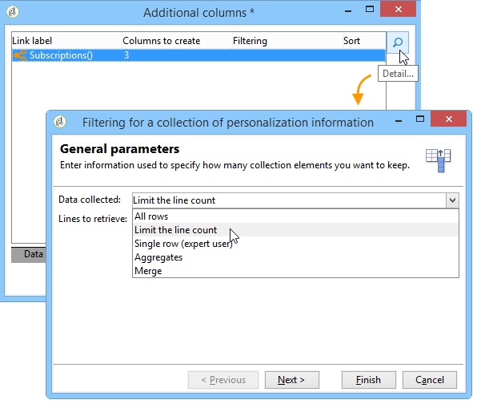
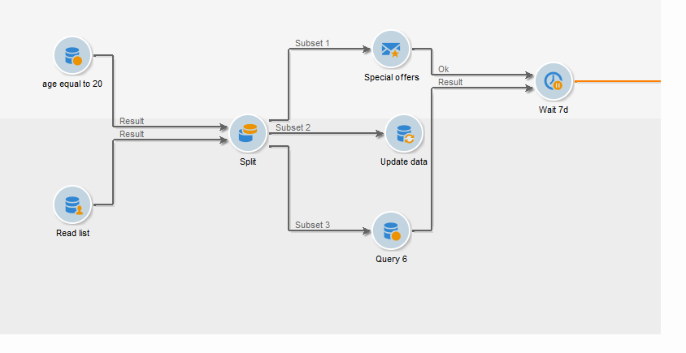

# Target 数据{#targeting-data}

## 创建查询 {#creating-queries}

### 选择数据 {#selecting-data}

**[!UICONTROL Query]**&#x200B;活动允许您选择基本数据来构建目标群体。 有关详细信息，请参阅[创建查询](query.md#creating-a-query)。

您还可以使用以下活动来查询和优化数据库中的数据： [增量查询](incremental-query.md)，[读取列表](read-list.md)。

可以在工作流的整个生命周期中收集要转发和处理的附加数据。 有关详情，请参阅[添加数据](query.md#adding-data)和[编辑其他数据](#editing-additional-data)。

### 编辑其他数据 {#editing-additional-data}

添加其他数据后，您可以对其进行编辑或将其用于优化查询活动中定义的目标。

**[!UICONTROL Edit additional data...]**&#x200B;链接允许您查看添加的数据，并对其进行修改或添加。

要将数据添加到以前定义的输出列，请在可用字段列表中选择该数据。 要创建新的输出列，请单击&#x200B;**[!UICONTROL Add]**&#x200B;图标，然后选择该字段并单击&#x200B;**[!UICONTROL Edit expression]**。

为要添加的字段定义计算模式，例如聚合。

**[!UICONTROL Add a sub-item]**&#x200B;选项允许您将计算数据附加到集合。 这样，您就可以从集合中选择附加数据或定义集合要素的汇总计算。

子元素将显示在其所映射到的集合的子树中。

收藏集显示在&#x200B;**[!UICONTROL Collections]**&#x200B;子选项卡中。 您可以通过单击所选收藏集的&#x200B;**[!UICONTROL Detail]**&#x200B;图标来筛选收集的元素。 过滤器助手允许您选择收集的数据并指定要应用于收集中数据的过滤条件。

### 使用附加数据优化目标 {#refining-the-target-using-additional-data}

利用收集的其他数据，可优化数据库中的数据筛选。 为此，请单击&#x200B;**[!UICONTROL Refine the target using additional data...]**&#x200B;链接：这将允许您对添加的数据进行过度筛选。

### 均匀化数据 {#homogenizing-data}

在&#x200B;**[!UICONTROL Union]**&#x200B;或&#x200B;**[!UICONTROL Intersection]**&#x200B;类型活动中，您可以选择仅保留共享的附加数据，以保持数据一致。 在这种情况下，此活动的临时输出工作表将仅包含在所有集客集中找到的附加数据。

### 与其他数据进行协调 {#reconciliation-with-additional-data}

在数据协调阶段(**[!UICONTROL Union]**、**[!UICONTROL Intersection]**&#x200B;等 活动)，您可以从其他列中选择用于数据协调的列。 要实现此目的，请在所选列上配置协调并指定主集。 然后，选择窗口下方的列中的列，如以下示例所示：

### 创建子集 {#creating-subsets}

**[!UICONTROL Split]**&#x200B;活动允许您根据通过提取查询定义的条件创建子集。 对于每个子集，当您编辑群体的过滤器条件时，将访问标准查询活动，从中可定义目标分段条件。

除了目标数据之外，您还可以仅使用附加数据作为筛选条件将目标分割成多个子集。 如果您已购买&#x200B;**联合数据访问**&#x200B;选项，则还可以使用外部数据。

有关详细信息，请参阅[使用拆分活动创建子集](#creating-subsets-using-the-split-activity)。

## 区段数据 {#segmenting-data}

### 合并多个目标（并集） {#combining-several-targets--union-}

利用并集活动，可将多个活动的结果合并到一个过渡中。 集不必具有同样的性质。

以下数据协调选项可用：

* **[!UICONTROL Keys only]**

  如果输入群体是同质的，则可以使用此选项。

* **[!UICONTROL All columns in common]**

  通过此选项，可根据目标各个群体的共有所有列协调数据。

  Adobe Campaign根据列的名称标识列。 可接受容差阈值：例如，“电子邮件”列可识别为与“@email”列相同。

* **[!UICONTROL A selection of columns]**

  选择此选项可定义要应用数据协调之列的列表。

  首先，选择主集（包含源数据的集），然后选择要用于连接的列。

  

  >[!CAUTION]
  >
  >在数据协调期间，不会为人口去重。

  您可以将群体大小限制为给定数量的记录。 为此，请单击相应的选项并指定要保留的记录数。

  此外，指定集客群体的优先级：窗口的下半部分列出了合并活动的集客过渡，并允许您使用窗口右侧的蓝色箭头对它们进行排序。

  首先，从列表中第一个集客过渡的群体中获取记录，然后，如果尚未达到最大值，则从第二个集客过渡的群体中获取记录，依此类推。

  

### 提取连接数据（交集） {#extracting-joint-data--intersection-}

利用交集，可仅恢复由集客过渡群体共享的行。 此活动应像合并活动一样进行配置。

此外，可以只保留选定的列，或只保留由集客群体共享的列。

在[交集](intersection.md)部分中详细介绍了交集活动。

### 排除群体（排除） {#excluding-a-population--exclusion-}

利用排除活动，可从其他目标群体中排除目标的元素。 此活动的输出定向维度将是主集的输出定向维度。

必要时，可以处理入站表。 事实上，要从另一个维度排除一个目标，必须将该目标返回到与主目标相同的目标维度。为此，请单击&#x200B;**[!UICONTROL Add]**&#x200B;按钮并指定维度更改条件。

数据协调是通过标识符、更改轴或连接执行的。 在[使用来自列表的数据中提供了示例：读取列表](../../platform/using/import-export-workflows.md#using-data-from-a-list--read-list)。

### 使用拆分活动创建子集 {#creating-subsets-using-the-split-activity}

**[!UICONTROL Split]**&#x200B;活动是一个标准活动，通过该活动，可根据需要通过一个或多个筛选维度创建所需数量的集，并可为每个子集生成一个输出过渡或生成唯一过渡。

集客过渡传送的附加数据可在过滤标准中使用。

要配置它，您首先需要选择标准：

1. 在您的工作流中，拖放&#x200B;**[!UICONTROL Split]**&#x200B;活动。
1. 在&#x200B;**[!UICONTROL General]**&#x200B;选项卡中，选择所需的选项： **[!UICONTROL Use data from the target and additional data]**、**[!UICONTROL Use the additional data only]**&#x200B;或&#x200B;**[!UICONTROL Use external data]**。
1. 如果选择了&#x200B;**[!UICONTROL Use data from the target and additional data]**&#x200B;选项，则定向维度允许您使用集客过渡传送的所有数据。

   

   创建子集时，会使用上述过滤参数。

   要定义筛选条件，请选择&#x200B;**[!UICONTROL Add a filtering condition on the inbound population]**&#x200B;选项并单击&#x200B;**[!UICONTROL Edit...]**&#x200B;链接。 然后，指定用于创建此子集的过滤条件。

   

   [本节](cross-channel-delivery-workflow.md)介绍了如何在&#x200B;**[!UICONTROL Split]**&#x200B;活动中使用筛选条件将目标分段为不同群体的示例。

   **[!UICONTROL Label]**&#x200B;字段允许您为新创建的子集提供一个名称，该名称将匹配叫客过渡。

   您还可以为子集分配区段代码以对其进行识别并使用它来定位其群体。

   如有必要，您可以为要创建的每个子集分别更改定位和过滤维度。 为此，请编辑子集的过滤条件并选中&#x200B;**[!UICONTROL Use a specific filtering dimension]**&#x200B;选项。

   

1. 如果选择&#x200B;**[!UICONTROL Use the additional data only]**&#x200B;选项，则仅提供附加数据用于子集过滤。

   

1. 如果启用了&#x200B;**联合数据访问**&#x200B;选项，**[!UICONTROL Use external data]**&#x200B;允许您在已配置的外部数据库中处理数据，或者创建与数据库的新连接。

   

   有关更多信息，根据您的Campaign版本，请参阅以下章节：

   [Campaign v7文档](../../installation/using/about-fda.md)

   [Campaign v8文档](https://experienceleague.adobe.com/docs/campaign/campaign-v8/connect/fda.html?lang=zh-Hans)

然后，我们需要添加新子集：

1. 单击&#x200B;**[!UICONTROL Add]**&#x200B;按钮并定义筛选条件。

   

1. 在活动的&#x200B;**[!UICONTROL General]**&#x200B;选项卡中定义筛选维度（请参阅上文）。默认情况下，它适用于所有子集。

   

1. 如有必要，可以单独更改每个子集的过滤维度。 通过此功能，您可以为所有金卡持有者构建一个组合，一个组合适合所有点击了最新新闻通讯的收件人，第三个组合适合过去30天内进行店内购买的18至25岁人士，所有这些组合均使用相同的拆分活动。 为此，请选择&#x200B;**[!UICONTROL Use a specific filtering dimension]**&#x200B;选项并选择数据筛选上下文。

   

   >[!NOTE]
   >
   >如果您已获得&#x200B;**联合数据访问**&#x200B;选项，则可以根据外部库中的信息创建子集。 为此，请在&#x200B;**[!UICONTROL Targeting dimension]**&#x200B;字段中选择外部表的架构。 有关详细信息，请参阅[访问外部数据库(FDA)](accessing-an-external-database-fda.md)。

创建子集后，默认情况下，拆分活动显示的输出过渡与子集一样多：

可以将所有这些子集组合为一个输出过渡。 在这种情况下，指向相应子集的链接将在段代码中可见，例如。 为此，请选择&#x200B;**[!UICONTROL Generate all subsets in the same table]**&#x200B;选项。

例如，您可以放置单个投放活动，并根据每个收件人集的段代码对投放内容进行个性化：

还可以使用&#x200B;**[!UICONTROL Cells]**&#x200B;活动创建子集。 有关详细信息，请参阅[单元格](cells.md)部分。

### 使用目标数据 {#using-targeted-data}

标识并准备数据后，便可在以下上下文中使用它：

* 您可以在各个工作流阶段中进行数据操作之后更新数据库中的数据。

  有关此内容的详细信息，[更新数据](update-data.md)。

* 您还可以刷新现有列表的内容。

  有关详细信息，请参阅[列表更新](list-update.md)。

* 您可以直接在工作流中准备或开始投放。

  有关详细信息，请参阅[投放](delivery.md)、[投放控制](delivery-control.md)和[连续投放](continuous-delivery.md)。

## 数据管理 {#data-management}

在Adobe Campaign中，数据管理通过提供更高效且灵活的工具，将一系列用于解决复杂定位问题的活动整合在一起。 这样，您就可以使用与合约、订阅、对投放的反应等相关信息，对与联系人的所有通信实施一致的管理。 通过数据管理，您可以在分段操作期间跟踪数据生命周期，特别是：

* 通过包括未在数据集市中建模的数据，简化及优化定位流程（创建新表：根据设定，对每个定位工作流进行本地扩展）。
* 保留和传送缓冲区计算内容，尤其是在目标建构阶段或进行数据库管理时。
* 访问外部数据库（可选）：在定位过程中考虑异构数据库。

为了实施这些操作，Adobe Campaign提供：

* 数据收集活动： [文件传输](file-transfer.md)，[数据加载（文件）](data-loading-file.md)，[数据加载(RDBMS)](data-loading-rdbms.md)，[更新数据](update-data.md)。 收集数据的第一个步骤是准备数据，以便在其他活动中处理这些数据。 为了确保工作流正确执行并提供预期结果，需要监控多个参数。 例如，在导入数据时，此数据的主键(Pkey)对于每个记录都必须是唯一的。
* 目标活动已使用数据管理选项进行了扩充： [查询](query.md)、[联合](union.md)、[交集](intersection.md)、[拆分](split.md)。 这允许您在来自多个不同定向维的数据之间配置并集或交集，只要能够协调数据即可。
* 数据转换活动： [扩充](enrichment.md)，[更改维度](change-dimension.md)。

>[!CAUTION]
>
>当链接两个工作流时，删除源表元素并不意味着删除链接到该元素的所有数据。
>  
>例如，通过工作流删除收件人不会导致删除所有收件人的投放历史记录。 但是，直接在“Recipients”文件夹中删除收件人确实会导致与此收件人关联的所有数据被删除。

### 丰富和修改数据 {#enriching-and-modifying-data}

除了定向维度之外，过滤维度还允许您指定收集数据的性质。 请参阅[定位和筛选维度](building-a-workflow.md#targeting-and-filtering-dimensions)。

识别出的和收集的数据可以被扩充、聚合和操作以优化目标构建。 要执行此操作，除了在[分段数据](#segmenting-data)部分中详细介绍的数据操作活动之外，请使用以下内容：

* **[!UICONTROL Enrichment]**&#x200B;活动允许您暂时向架构添加列，以及向特定元素添加信息。 在活动存储库的[扩充](enrichment.md)部分中对此进行了详细说明。
* 利用&#x200B;**[!UICONTROL Edit schema]**&#x200B;活动，可修改架构的结构。 活动存储库的[编辑架构](edit-schema.md)部分中对此进行了详细说明。
* **[!UICONTROL Change dimension]**&#x200B;活动允许您在目标构建周期中更改定向维度。 在[更改维度](change-dimension.md)部分中有详细介绍。
