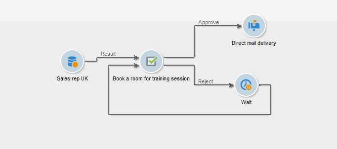

# 任务{#task}

>[!AVAILABILITY]
>
>`:warning:` 此功能仅在Campaign Classicv7中可用。 [了解详情](../../mrm/using/creating-and-managing-tasks.md)

在活动工作流中， **[!UICONTROL Task]** 利用活动，可指定两种方案：第一种方案是任务已完成的情况，第二种方案是任务未完成的情况（如果手动标记为未完成或任务过期）。

有关如何配置和操作任务的详情，请参见 [Campaign Classicv7文档](../../mrm/using/creating-and-managing-tasks.md).

此 **[!UICONTROL Resources]** 选项允许您定义多个操作员以及任务的批准计划。 如果批准人拒绝，这不会导致任务本身被拒绝。
