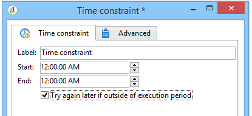

# 时间约束{#time-constraint}

**时间限制**&#x200B;活动允许您推迟或放弃任务的执行。

输入活动的标签，并指定工作流任务必须暂停的时间范围。

选择&#x200B;**[!UICONTROL Try again later if outside of execution period]**&#x200B;选项后，您可以在执行时间范围之外重新启动任务。 如果希望工作流操作在暂停后永久放弃，请取消选择此选项。

