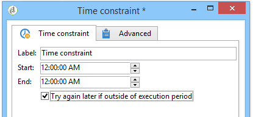

# 时间约束{#time-constraint}

时间 **约束活动** ，允许您推迟执行任务或放弃它。

输入活动的标签，并指定必须暂停工作流任务的时间范围。

选中 **[!UICONTROL Try again later if outside of execution period]** 该选项后，您可以在执行时间范围之外重新开始任务。 如果您希望在暂停工作流操作后将其永久放弃，请取消选择此选项。

