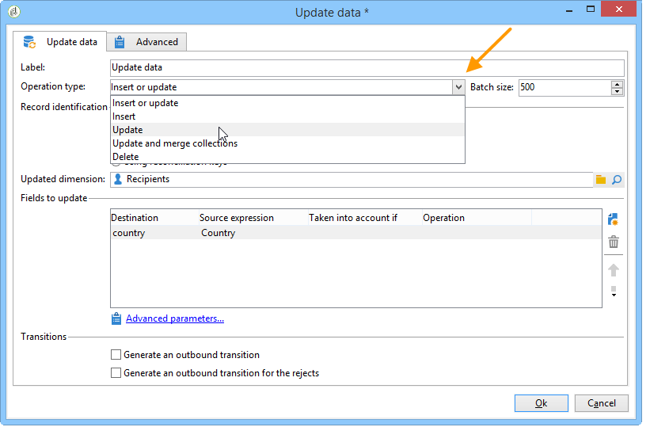

# 更新数据{#update-data}

**更新数据**&#x200B;类型活动执行对数据库中字段的批量更新。

## 操作类型 {#operation-type}

通过&#x200B;**[!UICONTROL Operation type]**&#x200B;字段，可选择要对数据库中的数据执行的进程：

* **[!UICONTROL Insert or update]**:添加数据或更新（如果已添加）。
* **[!UICONTROL Insert]**:仅添加数据。
* **[!UICONTROL Update]**:仅更新数据。
* **[!UICONTROL Update and merge collections]**:更新数据并选择主记录，然后链接链接到此主记录中重复项的元素。然后，可以删除重复项，而无需创建孤立的附加元素。
* **[!UICONTROL Delete]**：删除数据。

利用&#x200B;**[!UICONTROL Batch size]**&#x200B;字段，可选择要更新的集客过渡元素数量。 例如，如果您声明500，则处理的前500条记录将会更新。

## 记录标识 {#record-identification}

指定如何识别数据库中的记录：

* 如果数据条目与现有定向维度相关，请选择&#x200B;**[!UICONTROL By directly using the targeting dimension]**&#x200B;选项，然后在&#x200B;**[!UICONTROL Updated dimension]**&#x200B;字段中选择该选项。

   您可以使用&#x200B;**[!UICONTROL Edit this link]**&#x200B;放大镜按钮显示所选维度的字段。

* 否则，请指定一个或多个链接，这些链接将允许标识数据库中的数据或直接使用协调键值。

## 选择要更新的字段 {#selecting-the-fields-to-be-updated}

使用&#x200B;**[!UICONTROL Automatically associate fields with the same name]**&#x200B;选项，以便Adobe Campaign自动识别要更新的字段。

您还可以使用&#x200B;**[!UICONTROL Insert]**&#x200B;图标手动选择要更新的数据库字段。

选择要更新的所有字段，并根据需要添加条件，具体取决于要执行更新的字段。 要实现此目的，请使用 **[!UICONTROL Taken into account if]** 列。条件会依次应用，并符合列表中的顺序。 使用右侧的箭头更改更新的顺序。

您可以多次使用同一目标字段。

在&#x200B;**[!UICONTROL Insert or update]**&#x200B;操作中，您可以选择要单独或针对每个字段应用的营销活动。 为此，请在&#x200B;**[!UICONTROL Operation]**&#x200B;列中选择所需的值。

**[!UICONTROL modifiedDate]**、**[!UICONTROL modifiedBy]**、**[!UICONTROL createdDate]**&#x200B;和&#x200B;**[!UICONTROL createdBy]**&#x200B;字段在数据更新期间会自动更新，除非在字段更新表中专门配置了它们的管理模式。

只对包含至少一个差异的记录执行记录更新。 如果值相同，则不执行更新。

**[!UICONTROL Advanced parameters]**&#x200B;链接允许您指定其他选项来处理更新数据和管理重复项。 您还可以：

* **[!UICONTROL Disable automatic key management]**.
* **[!UICONTROL Disable audit]**.
* **[!UICONTROL Empty the destination value if the source value is empty (NULL)]**.默认情况下，此选项会自动选中。
* **[!UICONTROL Update all columns with matching names]**.
* 在&#x200B;**[!UICONTROL Enabled if]**&#x200B;字段中指定考虑使用表达式的源元素的条件。
* 指定使用表达式考虑重复项的条件。 如果选中&#x200B;**[!UICONTROL Ignore records which concern the same target]**&#x200B;选项，则仅考虑表达式列表中的第一个参数。

**[!UICONTROL Generate an outbound transition]**

创建将在执行结束时激活的叫客过渡。 更新通常表示定位工作流的结束，因此默认情况下不会激活选项。

**[!UICONTROL Generate an outbound transition for the rejects]**

创建叫客过渡，其中包含更新后未正确处理的记录（例如，如果存在重复项）。 更新通常会标记定向工作流的结尾，因此默认情况下不会激活选项。

## 更新和合并收藏集 {#updating-and-merging-collections}

通过更新数据和合并集合，您可以使用一个或多个辅助记录中的数据来更新记录中包含的数据，以便在需要时仅保留一个。 这些更新由一组规则管理。

>[!NOTE]
>
>此选项还允许您处理来自工作流工作表(targetWorkflow)、投放(targetDelivery)和列表(targetList)的辅助记录的引用。 如果需要，这些链接会显示在您选择字段和收藏集的列表中。

1. 选择&#x200B;**[!UICONTROL Update and merge collections]**&#x200B;操作。

   

1. 选择链接的优先级顺序。 这样可以识别主记录。 可用链接因集客过渡而异。

   

1. 选择要移动到主记录和要更新的字段的集合。

   输入规则，在一个或多个辅助记录被识别后应用于这些记录。 要实现此目的，您可以使用表达式生成器。 有关更多信息，请参阅此](../../platform/using/defining-filter-conditions.md#building-expressions)章节[。例如，通过指定它是所有必须保留的不同记录中最近更新的值。

   然后，输入要考虑规则的条件。

   最后，指定要执行的更新类型。 例如，您可以选择在更新数据后删除辅助记录。

   例如，您可以配置包含异构数据（如收件人的订阅列表）的集合的合并。 使用规则，您还可以从辅助记录订阅创建新的订阅历史记录，甚至将订阅列表从辅助记录移动到主记录。

1. 通过选择&#x200B;**[!UICONTROL Advanced parameters]** > **[!UICONTROL Duplicates]**，指定希望处理次记录的顺序。

   

如果定义的规则适用，则辅助记录的数据将与主记录关联。 根据所选的更新类型，可删除次记录。

## 示例：扩充后更新数据 {#example--update-data-following-an-enrichment}

[步骤2:将扩充数据写入用例的“购买”表](creating-a-summary-list.md#step-2--writing-enriched-data-to-the--purchases--table)部分，其中详细说明了如何创建重新链接列表，以便提供扩充活动后数据更新的示例。

## 输入参数 {#input-parameters}

* tableName
* 模式

每个集客事件必须指定由这些参数定义的目标。
