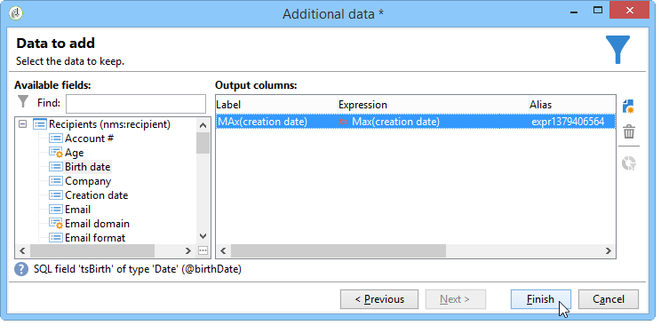

# 使用聚合{#using-aggregates}

此用例详细介绍了如何自动识别添加到数据库的最后收件人。

使用以下过程，将数据库中收件人的创建日期与使用聚合创建收件人的上次已知日期进行比较。 同一天创建的所有收件人也将被选中。

要对收件人执 **行“创建日期= max（创建日期）** ”类型过滤器，必须运行工作流以执行以下步骤：

1. 使用基本查询检索数据库收件人。 有关此步骤的详细信息，请参阅 [创建查询](../../workflow/using/query.md#creating-a-query)。
1. 使用最大（创建日期）聚合函数生成的结果计算创建收件人 **的上次已知日期** 。
1. 将每个收件人链接到聚合函数会生成相同的架构。
1. 通过编辑的架构使用聚合过滤收件人。

## 第1步：计算汇总结果 {#step-1--calculating-the-aggregate-result}

1. 创建查询。 此处，目标是计算数据库中所有收件人的上次已知创建日期。 因此，查询不包含筛选器。
1. Select **[!UICONTROL Add data]**.
1. 在打开的窗口中，选择 **[!UICONTROL Data linked to the filtering dimension]** 然后 **[!UICONTROL Filtering dimension data]**。
1. 在窗 **[!UICONTROL Data to add]** 口中，添加一列，该列计算收件人表中“创 **建日期** ”字段的最大值。 您可以使用表达式编辑器或直 **接在列的字段中输入max(@created)****[!UICONTROL Expression]** 。 然后单击该 **[!UICONTROL Finish]** 按钮。

   

1. 然后， **[!UICONTROL Edit additional data]** 单击 **[!UICONTROL Advanced parameters...]**。 选中该 **[!UICONTROL Disable automatic adding of the primary keys of the targeting dimension]** 选项。

   此选项可确保不会因此显示所有收件人，并且不会保留显式添加的数据。 在这种情况下，它指的是创建收件人的最后一个日期。

   选中该 **[!UICONTROL Remove duplicate rows (DISTINCT)]** 选项。

## 第2步：链接收件人和汇总函数结果 {#step-2--linking-the-recipients-and-the-aggregation-function-result}

要将处理收件人的查询链接到执行聚合函数计算的查询，您必须使用架构编辑活动。

1. 将收件人的查询定义为主集。
1. 在选项卡 **[!UICONTROL Links]** 中，添加一个新链接并在窗口中输入如下打开的信息：

   * 选择与聚合相关的临时架构。 此架构的数据将添加到主集的成员中。
   * 选择 **[!UICONTROL Use a simple join]** 将聚合结果链接到主集合的每个收件人。
   * 最后，指定链接为 **[!UICONTROL Type 11 simple link]**。
   

因此，聚合结果被链接到每个接收者。

## 第3步：使用聚合筛选收件人。 {#step-3--filtering-recipients-using-the-aggregate-}

建立链接后，聚合结果和收件人构成同一临时架构的一部分。 因此，可以在架构上创建过滤器，以比较由聚合函数表示的接收者的创建日期和最后已知的创建日期。 此过滤器使用拆分活动执行。

1. 在选项 **[!UICONTROL General]** 卡中，选择 **收件人** （作为定位维）和编辑架构 **** （作为筛选维）（用于筛选入站过渡架构活动）。
1. 在选项卡 **[!UICONTROL subsets]** 中，选择， **[!UICONTROL Add a filtering condition on the inbound population]** 然后单击 **[!UICONTROL Edit...]**。
1. 使用表达式编辑器，在收件人的创建日期和由聚合计算的创建日期之间添加一个相等标准。

   数据库中的日期类型字段通常保存到毫秒。 因此，您必须将这些内容延长整天，以避免检索仅在毫秒内创建的收件人。

   为此，请使用表达式编 **辑器中提供的ToDate** 函数，该函数将日期和小时数转换为简单日期。

   因此，要用于条件的表达式包括：

   * **[!UICONTROL Expression]**: `toDate([target/@created])`.
   * **[!UICONTROL Value]**: `toDate([datemax/expr####])`其中expr####与聚合函数查询中指定的聚合相关。
   

因此，拆分活动的结果与在上次已知创建日期的同一天创建的收件人有关。

然后，您可以添加其他活动，如列表更新或分发，以丰富您的工作流。
