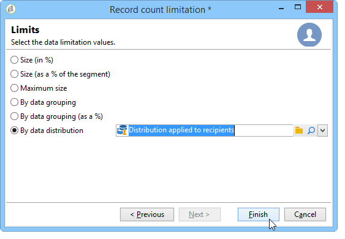
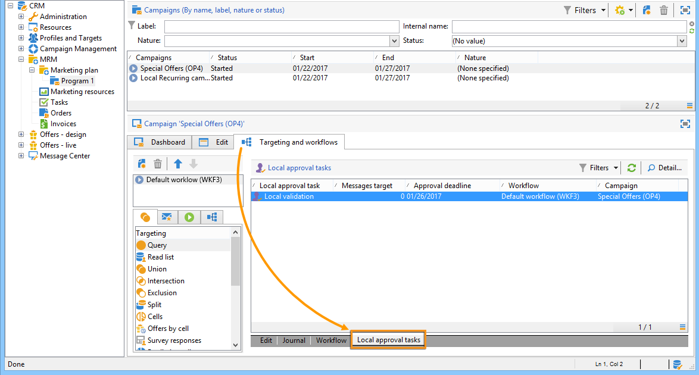
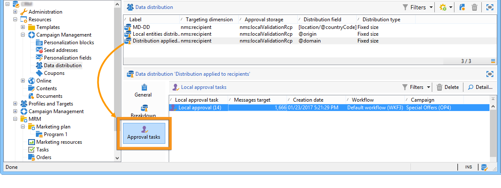

# 使用本地批准活动{#using-the-local-approval-activity}

通过 **[!UICONTROL Local approval]** 集成到定位工作流中的活动，您可以在发送分发之前设置收件人批准流程。

>[!CAUTION]
>
>要使用此功能，您需要购买“分布式营销”模块（即营销活动选项）。 请检查您的许可协议。

要设置此用例，我们创建了以下定位工作流：

本地批准流程的主要步骤是：

1. 由于使用数据分发模型的类型活动，因定位而 **[!UICONTROL Split]** 产生的人口数量可以受到限制。

   

1. 然后， **[!UICONTROL Local approval]** 该活动会接管并向每个本地主管发送通知电子邮件。 活动将暂停，直到每个本地主管批准分配给他们的收件人。

   

1. 在达到批准截止日期后，工作流将再次启动。 在此示例中，活动 **[!UICONTROL Delivery]** 开始，交付被发送到已批准的目标。

   >[!NOTE]
   >
   >到达截止日期后，尚未批准的收件人将被排除在定位之外。

   

1. 几天后，第二个类型的活 **[!UICONTROL Local approval]** 动会向每个本地主管发送通知电子邮件，其中汇总了其联系人（单击、打开等）执行的操作。

   

## 第1步：创建数据分发模板 {#step-1--creating-the-data-distribution-template-}

通过数据分发模板，您可以限制根据数据分组进行定位所导致的人群，同时使您能够将每个值分配给本地主管。 在此示例中，我们将字段定义 **[!UICONTROL Email address domain]** 为分发字段，并为每个本地主管分配了一个域

有关创建数据分发模板的详细信息，请参 [阅限制每个数据分发的子集记录数](../../workflow/using/split.md#limiting-the-number-of-subset-records-per-data-distribution)。

1. 要创建数据分发模板，请转到该节 **[!UICONTROL Resources > Campaign management > Data distribution]** 点并单击 **[!UICONTROL New]**。

   

1. 选择选 **[!UICONTROL General]** 项卡。

   

1. 输入 **[!UICONTROL Label]** 和 **[!UICONTROL Distribution context]**。 在此示例中，我们选择了定位 **[!UICONTROL Recipient]** 架构和字段作 **[!UICONTROL Email domain]** 为分发字段。 收件人列表将按域划分。
1. 在字段 **[!UICONTROL Distribution type]** 中，选择如何在选项卡中表示目标限制 **[!UICONTROL Distribution]** 值。 我们选择了 **[!UICONTROL Percentage]**。
1. 在字段 **[!UICONTROL Approval storage]** 中，输入与正在使用的定位架构匹配的批准的存储架构。 下面我们将使用默认存储架构： **[!UICONTROL Local approval of recipients]**.
1. 然后单击该 **[!UICONTROL Advanced parameters]** 链接。

   

1. 选中 **[!UICONTROL Approve the targeted messages]** 此选项，以便从要批准的收件人列表中预先选择所有收件人。
1. 在字 **[!UICONTROL Delivery label]** 段中，我们保留了默认表达式（交付的计算字符串）。 反馈通知中将使用交付的标准标签。
1. 在该部 **[!UICONTROL Grouping field]** 分中，我们选择了字段 **[!UICONTROL Gender]** 作为分组字段，以在批准和反馈通知中显示收件人。
1. 在部 **[!UICONTROL Edit targeted messages]** 分中，我们选择了Web应 **[!UICONTROL Edit recipients]** 用程序和参 **[!UICONTROL recipientId]** 数。 在批准和反馈通知中，收件人可以单击并指向Web应用程序的URL。 其他URL参数将为 **[!UICONTROL recipientId]**。
1. 然后单击选 **[!UICONTROL Distribution]** 项卡。 对于每个域，输入以下字段：

   

   * **[!UICONTROL Value]**:输入域名的值。
   * **[!UICONTROL Percentage / Fixed]**:对于每个域，输入max。 要将分发发送到的收件人数。 在此示例中，我们希望将交付限制为每个域10%。
   * **[!UICONTROL Label]**:输入要在批准和反馈通知中显示的域的标签。
   * **[!UICONTROL Group or operator]**:选择分配给域的运算符或运算符组。

      >[!CAUTION]
      >
      >确保已为运营商分配了相应的权限。

## 第2步：创建定位工作流 {#step-2--creating-the-targeting-workflow}

要设置此用例，我们创建了以下定位工作流：

添加了以下活动：

* 两 **[!UICONTROL Query]** 次活动，
* 一次 **[!UICONTROL Intersection]** 活动，
* 一次 **[!UICONTROL Split]** 活动，
* 一次 **[!UICONTROL Local approval]** 活动，
* 一次 **[!UICONTROL Delivery]** 活动，
* 一次 **[!UICONTROL Wait]** 活动，
* 第二次 **[!UICONTROL Local approval]** 活动，
* 一个 **[!UICONTROL End]** 活动。

### 查询、交叉和拆分 {#queries--intersection-and-split}

上游定位由两个查询组成，一个交集和一个分割。 通过使用数据分发模板的活动，可以限 **[!UICONTROL Split]** 制由定位产生的人群。

有关配置拆分活动的详细信息，请参阅 [拆分](../../workflow/using/split.md)。 限制每个数据分发的子集记录数 [量中详细介绍了数据分发模板的创建](../../workflow/using/split.md#limiting-the-number-of-subset-records-per-data-distribution)。

如果不希望限制查询中的人口，则不必使用、 **[!UICONTROL Query]**&#x200B;和 **[!UICONTROL Intersection]**&#x200B;活 **[!UICONTROL Split]** 动。 在这种情况下，请完成第一个活动中的数据分发 **[!UICONTROL Local approval]** 模板。

1. 在部分 **[!UICONTROL Record count limitation]** 中，选择选 **[!UICONTROL Limit the selected records]** 项并单击链 **[!UICONTROL Edit]** 接。

   

1. 选择选 **[!UICONTROL Keep only the first records after sorting]** 项并单击 **[!UICONTROL Next]**。

   

1. 在部 **[!UICONTROL Sort columns]** 分中，添加要应用排序的字段。 这里，我们选择了 **[!UICONTROL Email]** 领域。 单击 **[!UICONTROL Next]**.

   

1. 选择选 **[!UICONTROL By data distribution]** 项，选择之前创建的分发模板(请参 [阅步骤1:创建数据分发模板](#step-1--creating-the-data-distribution-template-))，然后单击 **[!UICONTROL Finish]**。

   

在分配模板中，我们选择将人口限制为每个分组值10%，这与工作流中显示的值（340作为输入，34作为输出）一致。

### 批准通知 {#approval-notification}

通过 **[!UICONTROL Local approval]** 该活动，您可以向每个本地主管发送通知。

有关配置活动的更 **[!UICONTROL Local approval]** 多信息，请参阅本 [地批准](../../workflow/using/local-approval.md)。

需要输入以下字段：

1. 在部 **[!UICONTROL Action to execute]** 分中，选择选 **[!UICONTROL Target approval notification]** 项。
1. 在部 **[!UICONTROL Distribution context]** 分中，选择选 **[!UICONTROL Specified in the transition]** 项。

   如果不希望限制目标人群，请选择此处的选项，然 **[!UICONTROL Explicit]** 后输入之前在字段中创建的分发模 **[!UICONTROL Data distribution]** 板。

1. 在部 **[!UICONTROL Notification]** 分中，选择传送模板以及用于通知电子邮件的主题。 在此，我们选择了默认模板： **[!UICONTROL Local approval notification]**.
1. 在部 **[!UICONTROL Approval schedule]** 分中，我们保留了默认的批准截止日期（3天）并添加了提醒。 交货将于批准后3天离开。 在达到批准截止期限后，未获得批准的收件人不会通过定位来考虑这些收件人。

活动向本地主管发送 **[!UICONTROL Local approval]** 的通知电子邮件如下：

### 等待 {#wait}

通过等待活动，您可以推迟将发送交付反馈通知的第二个本地批准活动的开始。 在字 **[!UICONTROL Duration]** 段中，我们输入 **[!UICONTROL 5d]** 了值（5天）。 收件人在发送递送后5天内执行的操作将包括在反馈通知中。

### 反馈通知 {#feedback-notification}

第二个活 **[!UICONTROL Local approval]** 动允许您向每个本地主管发送交付反馈通知。

需要输入以下字段。

1. 在部分 **[!UICONTROL Action to execute]** 中，选择 **[!UICONTROL Delivery feedback report]**。
1. 在部分 **[!UICONTROL Delivery]** 中，选择 **[!UICONTROL Specified in the transition]**。
1. 在部 **[!UICONTROL Notification]** 分中，选择传送模板以及用于通知电子邮件的主题。

到达等待活动中配置的截止期限后，第二个类型活动会向每 **[!UICONTROL Local approval]** 个本地主管发送以下通知电子邮件：

### 管理员的批准跟踪 {#approval-tracking-by-the-administrator}

每次启动本地批准活动时，都会创建批准任务。 管理员可以控制这些批准任务中的每个任务。

转到营销活动的定位工作流，然后单击选 **[!UICONTROL Local approval tasks]** 项卡。

还可以通过数据分发模板的选项卡访问 **[!UICONTROL Approval tasks]** 本地批准任务列表。

选择要监视的任务，然后单击该 **[!UICONTROL Detail]** 按钮。 通过 **[!UICONTROL General]** 本地批准任务的选项卡可以查看有关该任务的信息。 如有必要，您可以更改批准和提醒日期。

此选项卡显示以下信息：

* 任务的标签及其ID
* 使用的分发模板
* 目标消息的数量
* 链接的工作流和营销活动
* 任务计划

任务 **[!UICONTROL Distribution]** 的选项卡允许您查看批准日志、其状态、目标消息数、批准日期以及批准交付的操作员。

选择批准日志，然后单击 **[!UICONTROL Detail]** 按钮以显示详细信息。 本地 **[!UICONTROL General]** 批准日志的选项卡允许您查看一般日志信息。 您还可以更改批准状态。

此选项卡显示以下信息：

* 链接的批准任务
* 批准状态(**[!UICONTROL Approved]** 或 **[!UICONTROL Pending]**)
* 使用的分发模板
* 批准日期和批准日期的当地主管
* 目标和批准的消息数

批准 **[!UICONTROL Targeted]** 日志的选项卡显示目标收件人列表及其批准状态。 您可以根据需要更改此状态。

