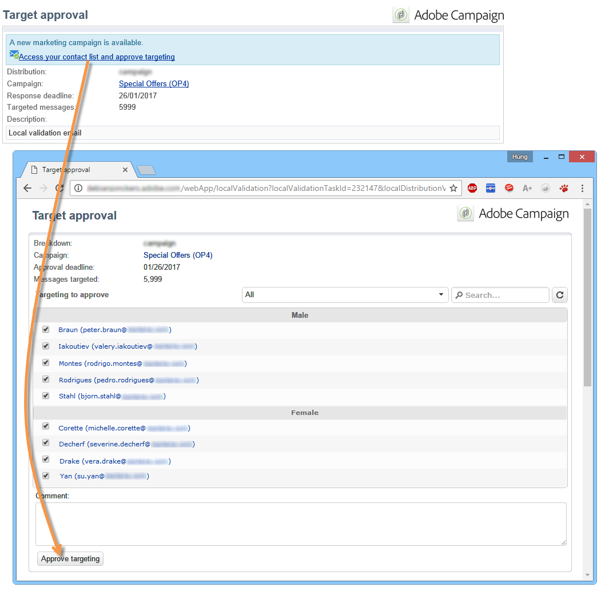

# 使用本地批准活动{#using-the-local-approval-activity}

集成到定位工作流中的&#x200B;**[!UICONTROL Local approval]**&#x200B;活动允许您在发送收件人之前设置投放批准流程。

>[!CAUTION]
>
>要使用此函数，您需要购买分布式营销模块，这是一个活动选项。 请核实您的许可协议。

要设置此用例，我们创建了以下定位工作流：

本地批准流程的主要步骤是：

1. 由于&#x200B;**[!UICONTROL Split]**&#x200B;类型活动使用数据分发模型，因此可以限制由定位产生的人口。

   

1. 然后，**[!UICONTROL Local approval]**&#x200B;活动接管并向每个本地主管发送通知电子邮件。 活动将暂停，直到每个本地主管批准分配给他们的收件人。

   

1. 在达到批准截止日期后，工作流将再次开始。 在此示例中，**[!UICONTROL Delivery]**&#x200B;活动开始和投放将发送给已批准的目标。

   >[!NOTE]
   >
   >到期后，未获批准的收件人将被排除在定位之外。

   

1. 几天后，第二个&#x200B;**[!UICONTROL Local approval]**&#x200B;类型活动向每个本地主管发送通知电子邮件，概述其联系人（单击、打开等）所执行的操作。

   

## 第1步：创建数据分发模板{#step-1--creating-the-data-distribution-template-}

通过数据分配模板，您可以根据数据分组限制由定位产生的人口，同时使您能够将每个值分配给本地主管。 在此示例中，我们将&#x200B;**[!UICONTROL Email address domain]**&#x200B;字段定义为分发字段，并为每个本地主管分配了一个域

有关创建数据分发模板的详细信息，请参阅[限制每个数据分发的子集记录数](../../workflow/using/split.md#limiting-the-number-of-subset-records-per-data-distribution)。

1. 要创建数据分发模板，请转至&#x200B;**[!UICONTROL Resources > Campaign management > Data distribution]**&#x200B;节点，然后单击&#x200B;**[!UICONTROL New]**。

   

1. 选择 **[!UICONTROL General]** 选项卡。

   

1. 输入&#x200B;**[!UICONTROL Label]**&#x200B;和&#x200B;**[!UICONTROL Distribution context]**。 在此示例中，我们选择了&#x200B;**[!UICONTROL Recipient]**&#x200B;定位模式和&#x200B;**[!UICONTROL Email domain]**&#x200B;字段作为分发字段。 收件人列表将按域划分。
1. 在&#x200B;**[!UICONTROL Distribution type]**&#x200B;字段中，选择如何在&#x200B;**[!UICONTROL Distribution]**&#x200B;选项卡中表示目标限制值。 这里，我们选择了&#x200B;**[!UICONTROL Percentage]**。
1. 在&#x200B;**[!UICONTROL Approval storage]**&#x200B;字段中，输入与使用中的目标存储匹配的批准的模式。 下面我们将使用默认的存储模式:**[!UICONTROL Local approval of recipients]**。
1. 然后单击&#x200B;**[!UICONTROL Advanced parameters]**&#x200B;链接。

   

1. 选中&#x200B;**[!UICONTROL Approve the targeted messages]**&#x200B;选项，以便从要批准的收件人列表中预先选择所有收件人。
1. 在&#x200B;**[!UICONTROL Delivery label]**&#x200B;字段中，我们保留了默认表达式(投放的计算字符串)。 反馈通知中将使用投放的标准标签。
1. 在&#x200B;**[!UICONTROL Grouping field]**&#x200B;部分，我们选择&#x200B;**[!UICONTROL Gender]**&#x200B;字段作为分组字段，以在批准和反馈通知中显示收件人。
1. 在&#x200B;**[!UICONTROL Edit targeted messages]**&#x200B;部分，我们选择了&#x200B;**[!UICONTROL Edit recipients]** Web应用程序和&#x200B;**[!UICONTROL recipientId]**&#x200B;参数。 在批准和反馈通知中，收件人可以单击并指向Web应用程序的URL。 其他URL参数将为&#x200B;**[!UICONTROL recipientId]**。
1. 然后单击&#x200B;**[!UICONTROL Distribution]**&#x200B;选项卡。 对于每个域，输入以下字段：

   

   * **[!UICONTROL Value]**:输入域名的值。
   * **[!UICONTROL Percentage / Fixed]**:对于每个域，输入max。要将收件人发送到的投放数。 在此示例中，我们希望将投放限制为每个域10%。
   * **[!UICONTROL Label]**:输入要在批准和反馈通知中显示的域的标签。
   * **[!UICONTROL Group or operator]**:选择分配给域的运算符或操作员组。

      >[!CAUTION]
      >
      >确保已为操作员分配了适当的权限。

## 第2步：创建定位工作流{#step-2--creating-the-targeting-workflow}

要设置此用例，我们创建了以下定位工作流：

添加了以下活动:

* 两个&#x200B;**[!UICONTROL Query]**&#x200B;活动,
* 一个&#x200B;**[!UICONTROL Intersection]**&#x200B;活动,
* 一个&#x200B;**[!UICONTROL Split]**&#x200B;活动,
* 一个&#x200B;**[!UICONTROL Local approval]**&#x200B;活动,
* 一个&#x200B;**[!UICONTROL Delivery]**&#x200B;活动,
* 一个&#x200B;**[!UICONTROL Wait]**&#x200B;活动,
* 第二个&#x200B;**[!UICONTROL Local approval]**&#x200B;活动,
* 一个&#x200B;**[!UICONTROL End]**&#x200B;活动。

### 查询、交叉和拆分{#queries--intersection-and-split}

上游定位由两个查询组成，一个交叉点和一个拆分。 使用&#x200B;**[!UICONTROL Split]**&#x200B;活动，使用数据分发模板，可以限制由定位产生的人口。

有关配置拆分活动的详细信息，请参阅[Split](../../workflow/using/split.md)。 [限制每个数据分发的子集记录数](../../workflow/using/split.md#limiting-the-number-of-subset-records-per-data-distribution)中详细介绍了数据分发模板的创建。

如果您不想限制查询中的人口，则不必使用&#x200B;**[!UICONTROL Query]**、**[!UICONTROL Intersection]**&#x200B;和&#x200B;**[!UICONTROL Split]**&#x200B;活动。 在这种情况下，请在第一个&#x200B;**[!UICONTROL Local approval]**&#x200B;活动中填写数据分发模板。

1. 在&#x200B;**[!UICONTROL Record count limitation]**&#x200B;部分，选择&#x200B;**[!UICONTROL Limit the selected records]**&#x200B;选项并单击&#x200B;**[!UICONTROL Edit]**&#x200B;链接。

   

1. 选择&#x200B;**[!UICONTROL Keep only the first records after sorting]**&#x200B;选项，然后单击&#x200B;**[!UICONTROL Next]**。

   

1. 在&#x200B;**[!UICONTROL Sort columns]**&#x200B;部分中，添加应用排序的字段。 这里，我们选择了&#x200B;**[!UICONTROL Email]**&#x200B;字段。 单击 **[!UICONTROL Next]**.

   

1. 选择&#x200B;**[!UICONTROL By data distribution]**&#x200B;选项，选择之前创建的分发模板(请参阅[步骤1:创建数据分发模板](#step-1--creating-the-data-distribution-template-))，然后单击&#x200B;**[!UICONTROL Finish]**。

   

在分配模板中，我们已选择将填充限制为每分组值10%，这与工作流中显示的值（340作为输入，34作为输出）一致。

### 批准通知{#approval-notification}

**[!UICONTROL Local approval]**&#x200B;活动允许您向每个本地主管发送通知。

有关配置&#x200B;**[!UICONTROL Local approval]**&#x200B;活动的详细信息，请参阅[本地批准](../../workflow/using/local-approval.md)。

需要输入以下字段：

1. 在 **[!UICONTROL Action to execute]** 部分中，选择 **[!UICONTROL Target approval notification]** 选项。
1. 在 **[!UICONTROL Distribution context]** 部分中，选择 **[!UICONTROL Specified in the transition]** 选项。

   如果不想限制目标人口，请在此处选择&#x200B;**[!UICONTROL Explicit]**&#x200B;选项，然后输入之前在&#x200B;**[!UICONTROL Data distribution]**&#x200B;字段中创建的分发模板。

1. 在&#x200B;**[!UICONTROL Notification]**&#x200B;部分，选择投放模板和用于通知电子邮件的主题。 在此，我们选择了默认模板：**[!UICONTROL Local approval notification]**。
1. 在&#x200B;**[!UICONTROL Approval schedule]**&#x200B;部分，我们保留了默认的批准截止日期（3天）并添加了提醒。 投放将在批准开始3天后离境。 一旦达到批准截止日期，未获得批准的收件人就不会通过定位予以考虑。

**[!UICONTROL Local approval]**&#x200B;活动发送给本地主管的通知电子邮件如下：

### 等待 {#wait}

等待活动可以延迟开始将发送投放反馈通知的第二个本地批准活动。 在&#x200B;**[!UICONTROL Duration]**&#x200B;字段中，我们输入了&#x200B;**[!UICONTROL 5d]**&#x200B;值（5天）。 收件人在发送投放后5天内执行的操作将包括在反馈通知中。

### 反馈通知{#feedback-notification}

第二个&#x200B;**[!UICONTROL Local approval]**&#x200B;活动允许您向每个本地主管发送投放反馈通知。

需要输入以下字段。

1. 在&#x200B;**[!UICONTROL Action to execute]**&#x200B;部分，选择&#x200B;**[!UICONTROL Delivery feedback report]**。
1. 在&#x200B;**[!UICONTROL Delivery]**&#x200B;部分，选择&#x200B;**[!UICONTROL Specified in the transition]**。
1. 在&#x200B;**[!UICONTROL Notification]**&#x200B;部分，选择投放模板和用于通知电子邮件的主题。

到达等待活动中配置的截止日期后，第二个&#x200B;**[!UICONTROL Local approval]**&#x200B;类型活动会向每个本地主管发送以下通知电子邮件：

### 管理员{#approval-tracking-by-the-administrator}的批准跟踪

每次本地批准活动开始时，都会创建批准任务。 管理员可以控制这些批准任务。

转到活动的定位工作流，然后单击&#x200B;**[!UICONTROL Local approval tasks]**&#x200B;选项卡。

本地批准任务的列表也可以通过数据分发模板的&#x200B;**[!UICONTROL Approval tasks]**&#x200B;选项卡进行访问。

选择要监视的任务并单击&#x200B;**[!UICONTROL Detail]**&#x200B;按钮。 通过本地批准任务的&#x200B;**[!UICONTROL General]**&#x200B;选项卡，可以视图任务上的信息。 如有必要，您可以更改审批和提醒日期。

此选项卡显示以下信息：

* 任务的标签及其ID
* 使用的分发模板
* 目标消息数
* 链接的工作流和活动
* 任务计划

通过任务的&#x200B;**[!UICONTROL Distribution]**&#x200B;选项卡，您可以视图批准日志、其状态、目标消息数、批准日期以及批准投放的操作员。

选择批准日志并单击&#x200B;**[!UICONTROL Detail]**&#x200B;按钮以显示详细信息。 通过本地批准日志的&#x200B;**[!UICONTROL General]**&#x200B;选项卡，可视图一般日志信息。 您还可以更改审批状态。

此选项卡显示以下信息：

* 链接的审批任务
* 批准状态（**[!UICONTROL Approved]**&#x200B;或&#x200B;**[!UICONTROL Pending]**）
* 使用的分发模板
* 批准的当地主管和批准日期
* 已定位和批准的邮件数

批准日志的&#x200B;**[!UICONTROL Targeted]**&#x200B;选项卡显示目标收件人的列表及其批准状态。 如有必要，您可以更改此状态。

