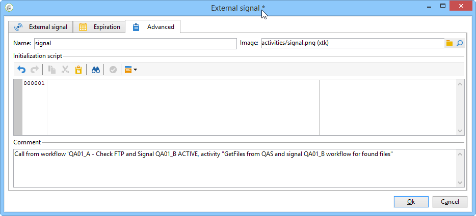

# 工作流最佳实践{#workflow-best-practices}

## 执行和性能 {#execution-and-performance}

下面列出了有关优化活动性能的一般指南，包括适用于工作流的最佳实践。

本节还提供与工作流执行相关的故障排 [除指南](../../production/using/workflow-execution.md)。

### 日志 {#logs}

JavaScript方法是 **[!UICONTROL logInfo()]** 调试工作流的一个极好的解决方案。 它很有用，但必须谨慎使用，尤其是对于经常运行的活动:它会使日志过载，并显着增加日志表的大小。 但您可能还需要更多 **[!UICONTROL logInfo()]**。

还提供两个其他解决方案来帮助您：

* **在两次处决之间保留临时居民的结果**

   此选项在工作流的两个执行之间保留临时表。 它位于工作流属性的选项 **[!UICONTROL General]** 卡中，可用于开发和测试以监控数据和检查结果。 您可以在开发环境中使用此选项，但绝不能在生产环境中使用它。 保留临时表可能导致数据库的大小显着增加，最终达到大小限制。 此外，它还会减缓备份速度。

   只保留上次执行工作流时的工作表。 以前执行的工作表将由每天 **[!UICONTROL cleanup]** 运行的工作流清除。

   >[!CAUTION]
   >
   >在生产工作流中，不得选中此选项。 此选项用于分析结果，仅用于测试目的，因此只能用于开发或分阶段环境。

* **在日志中记录SQL查询**

   此选项在 **[!UICONTROL Execution]** 工作流属性的选项卡中可用，它将记录该工具从不同查询生成的所有SQL活动。 它是查看平台实际执行什么的好方法。 但是，此选项仅应在开发过程中暂时使用，而不应在生产时激活。

在日志不再需要时清除日志。 工作流历史记录不会自动清除：默认情况下，所有消息都保留。 可以通过菜单或单 **[!UICONTROL File > Actions]** 击列表上方工具栏中的“操作”按钮来清除历史记录。 选择清除历史记录。
要了解如何清除日志，请参阅本 [文档](../../workflow/using/starting-a-workflow.md)。

### 工作流计划 {#workflow-planning}

* 尝试在一天中保持稳定的活动级别并避免出现高峰，以防止实例过载。 为此，请在一天中平均分配工作流开始时间。
* 计划数据以隔夜方式加载，以减少资源争用。
* 长工作流可能会对服务器和数据库资源产生潜在影响。 拆分最长工作流以缩短处理时间。
* 要缩短总体运行时间，请用简化、更快的活动取代耗时的活动。
* 避免同时运行20多个工作流。 当同时执行工作流过多时，系统资源会耗尽，变得不稳定。 有关工作流可能无法启动的原因的详细信息，请参阅本 [文](https://helpx.adobe.com/ie/campaign/kb/workflows-not-starting-in-a-campaign-technical-workflows.html)。

### 工作流执行 {#workflow-execution}

最好不要计划每15分钟运行一次以上的工作流，因为它可能会影响整个系统性能并在数据库中创建块。

避免将工作流置于暂停状态。 如果创建临时工作流，请确保它能够正确完成并且不处于状 **[!UICONTROL paused]** 态。 如果暂停，则表示需要保留临时表，从而增加数据库的大小。 在工作流失败或系统暂停工作流时，在工作流属性下分配工作流监管器以发送警报。

要避免工作流处于暂停状态：

* 定期检查工作流，确保没有意外错误。
* 使工作流尽可能简单，例如，将大工作流拆分为多个不同工作流。 您可以使用 **[!UICONTROL External signal]** 活动根据其他工作流的执行触发执行。
* 避免在工作流中流处于打开状态时禁用活动，并导致许多临时表占用大量空间。 不要将活动保 **[!UICONTROL Do not enable]** 留在 **[!UICONTROL Enable but do not execute]** 工作流或状态中。

此外，停止未使用的工作流。 继续运行的工作流会维护与数据库的连接。

在最少情况下，只使用无条件停止。 请勿定期使用此操作。 不对工作流生成的连接执行干净关闭会影响性能。

### 在引擎选项中执行 {#execute-in-the-engine-option}

在窗口 **[!UICONTROL Workflow properties]** 中，从不选中该 **[!UICONTROL Execute in the engine]** 选项。 启用此选项后，工作流将优先处理，所有其他工作流将由工作流引擎停止，直到此完成。

## 工作流属性 {#workflow-properties}

### 工作流文件夹 {#workflow-folders}

Adobe建议您在专用文件夹中创建工作流。

如果工作流影响整个平台(例如，清理进程)，您可以考虑在内置文件夹中添加子文 **[!UICONTROL Technical Workflows]** 件夹。

### 工作流命名 {#workflow-naming}

Adobe 建议为工作流赋予正确的名称和标签，这样工作流没有按照预期的方式执行，可轻松地找到并排除故障：填写工作流的描述字段，在其中加入执行流程的摘要，以便操作员能够轻松理解。

如果工作流是涉及多个工作流的流程的一部分，则在输入标签时可以明确；使用数字是对工作流进行排序的极好方法（按标签）。

例如：

* 001 —— 导入——导入收件人
* 002 —— 导入——导入销售
* 003 —— 导入——导入销售详细信息
* 010 —— 导出——导出投放日志
* 011 —— 出口——出口跟踪日志

### 工作流严重性 {#workflow-severity}

您可以在工作流属性的选项卡中配置工作流的严 **[!UICONTROL Execution]** 重性：

* 正常
* Production
* 关键

在创建工作流时提供此信息将帮助您了解所配置进程的严重性。

此选项对除工作流之外的活动工作流没有功能影响。

活动工作流(作为活动/操作的一部分创建的工作流)在活动具有许多应同时运行的进程时以优先级执行。 根据选项NmsOperation_LimitConcurrency，默认情况下，在活动中只能同时运行10个进程。 例如，如果活动包含25个工作流，则在10个进程的第一个池中执行严重性较高的工作流。

### 工作流监视 {#workflow-monitoring}

应监视在生产工作流上运行的所有计划环境，以便在出错时收到警告。

在工作流属性中，选择一个主管组(默认组 **[!UICONTROL Workflow supervisors]** 或自定义组)。 通过设置电子邮件，确保至少有一个操作员属于此组。

在开始构建工作流之前，请记住定义工作流监管器。 出错时，将通过电子邮件通知他们。 For more on this, refer to [Managing errors](../../workflow/using/monitoring-workflow-execution.md#managing-errors).

定期检查 **[!UICONTROL Monitoring]** 宇宙以视图活动工作流的整体状态。 For more on this, refer to [Instance supervision](../../workflow/using/monitoring-workflow-execution.md#instance-supervision).

Workflow HeatMap使Adobe Campaign平台管理员能够监控实例的负载并相应地规划工作流。 For more on this, refer to [Workflow monitoring](../../workflow/using/heatmap.md).

## 使用活动 {#using-activities}

>[!CAUTION]
>
>您可以在同一工作流中复制和粘贴活动。 但是，我们不建议跨不同的活动复制粘贴工作流。 某些附加到活动(如投放和调度程序)的设置可能会导致在执行目标工作流时发生冲突和出错。 相反，我们建议您 **重复** 工作流。 有关详细信息，请参阅 [复制工作流](../../workflow/using/building-a-workflow.md#duplicating-workflows)。

### 活动名称 {#name-of-the-activity}

在开发工作流时，所有活动都将有一个名称，所有Adobe Campaign对象也一样。 当该工具生成该名称时，我们建议您在配置时使用显式名称对其重命名。 以后这样做的风险在于，它可能会使用另一个先前活动的名称中断工作流。 因此，更新名称是一项困难的工作。

活动名称可在选项卡中找 **[!UICONTROL Advanced]** 到。 不要将其留为 **[!UICONTROL query]**&#x200B;名 **[!UICONTROL query1]**&#x200B;称， **[!UICONTROL query11]**&#x200B;但请为其指定明确的名称，如 **[!UICONTROL querySubscribedRecipients]**。 此名称将显示在日志中，如果适用于SQL日志，这将有助于在配置工作流时调试该工作流。

### 第一个和最后一个活动 {#first-and-last-activities}

* 始终用开始或 **[!UICONTROL Start]** 活动活动您的 **[!UICONTROL Scheduler]** 工作流。 相关时，您还可以使用 **[!UICONTROL External signal]** 活动。
* When building your workflow, only use one **[!UICONTROL Scheduler]** activity per branch. 如果工作流的同一分支具有多个调度程序（相互链接），则要执行的任务数量将呈指数级增长，这将使数据库严重过载。此规则也适用于具有选项卡的所有 **[!UICONTROL Scheduling & History]** 活动。 进一步了 [解计划](../../workflow/using/scheduler.md)。

   

* 为每 **[!UICONTROL End]** 个工作流程使用活动。 这样，Adobe Campaign就可以释放用于工作流内计算的临时空间。 有关此内容的详细信息，请参阅： [开始和结束](../../workflow/using/start-and-end.md)。

### 活动中的Javascript {#javascript-within-an-activity}

在初始化工作流活动时，您可能希望添加JavaScript。 此操作可在活动的 **[!UICONTROL Advanced]** 活动选项卡中完成。

为了更轻松地发现工作流，我们建议在多次标签的开始和结尾处使用活动虚线，如下所示：—我的标签—。

### 信号 {#signal}

大多数时候，你都不知道信号从哪里调用。 为避免此问题，请使用 **[!UICONTROL Comment]** 信号活动 **[!UICONTROL Advanced]** 标签中的字段来文档此活动的信号的预期来源。

## 工作流更新 {#workflow-update}

不应直接更新生产工作流。 除非该流程包含使用模板活动创建工作流，否则应首先在开发环境上测试流程。 验证后，可以在生产上部署和启动工作流。

在开发或分阶段环境(而非生产环境)中执行所有测试。 在这种情况下，无法确保性能。

归档的工作流可以保存在开发或测试平台的“归档”文件夹中，但生产环境应尽可能保持干净。 如果旧工作流处于非活动状态，应从生产环境中删除它们。
