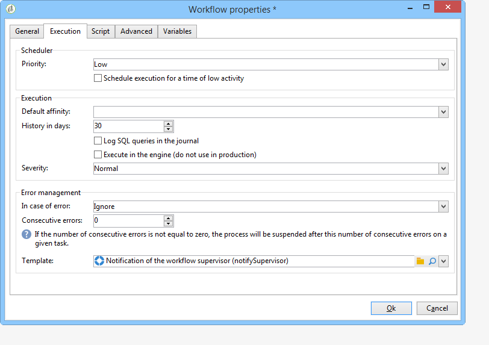

# 工作流属性{#workflow-properties}

## “执行”选项卡 {#execution-tab}

工作 **[!UICONTROL Execution]** 流中窗口 **[!UICONTROL Properties]** 的选项卡分为三个部分：

### 调度程序 {#scheduler}

此部分仅以活动工作流显示。

* **[!UICONTROL Priority]**

   工作流引擎根据此字段中定义的优先级标准处理要执行的工作流。 例如，具有优先级的所 **[!UICONTROL Average]** 有工作流将在具有优先级的之前 **[!UICONTROL Low]** 执行。

* **[!UICONTROL Schedule execution for a time of low activity]**

   此选项将工作流开始延迟到较不繁忙的时段。 某些工作流在数据库引擎的资源方面可能成本高昂。 我们建议将执行时间安排在低活动时（例如在夜间）。 低活动期在技术工作流中 **[!UICONTROL Processes on campaigns]** 定义。

### 执行 {#execution}

* **[!UICONTROL Default affinity]**

   如果您的安装包含多个工作流服务器，请使用此字段选择将执行该工作流的计算机。 如果此字段中定义的值在任何服务器上都不存在，则工作流将保持挂起状态。

   Refer to this [section](../../installation/using/configuring-campaign-server.md#high-availability-workflows-and-affinities).

* **[!UICONTROL History in days]**

   数据库的工作表保留执行(任务、事件、日志)的历史记录。 您可以在此定义要存档此工作流的天数：清除过程将每天删除最旧的存档一次。 如果此字段中的值为零，则永远不会删除存档。

* **[!UICONTROL Log SQL queries in the journal]**

   此功能为高级用户保留。 它涉及包含定位活动(查询、合并、交叉点等)的工作流。 选中此选项后，在工作流执行期间发送到查询库的SQLAdobe Campaign将以显示：这意味着您可以分析查询或诊断问题。

   查询显示在选 **[!UICONTROL SQL logs]** 项卡中，该选项卡添加到工作流(活动工作流除外)和 **[!UICONTROL Properties]** 启用选项时活动。 该选 **[!UICONTROL Audit]** 项卡还包含SQL查询。

   

* **[!UICONTROL Execute in the engine]**

   此选项只能用于调试，不能用于生产。 启用该工作流后，该工作流将优先处理，所有其他工作流将停止，直到此工作流完成。

### Error management {#error-management}

* **[!UICONTROL Troubleshooting]**

   此字段允许您定义在工作流任务有错误时要执行的操作。 有两种可能的选项：

   * **[!UICONTROL Stop the process]**:工作流会自动暂停。 工作流状态将更改为 **[!UICONTROL Failed]**。 问题解决后，使用或按钮重新启动 **[!UICONTROL Start]** 工作 **[!UICONTROL Restart]** 流。
   * **[!UICONTROL Ignore]**:触发错误的任务的状态将更改为， **[!UICONTROL Failed]**&#x200B;但工作流会保留状 **[!UICONTROL Started]** 态。 此配置与重复任务相关：如果分支包含调度程序，则下次执行工作流时，它将正常开始。

* **[!UICONTROL Consecutive errors]**

   在字段中选择值 **[!UICONTROL Ignore]** 后，此字段将 **[!UICONTROL In case of errors]** 可用。 您可以指定在停止进程之前可以忽略的错误数。 到达此编号后，工作流状态将变为 **[!UICONTROL Failed]**。 如果此字段的值为0，则无论出现多少错误，工作流都不会停止。

* **[!UICONTROL Template]**

   此字段允许您选择当工作流主管的状态变为时要发送给其的通知模板 **[!UICONTROL Failed]**。

   如果相关运营商的用户档案有电子邮件地址，则会通过电子邮件通知相关运营商。 要定义工作流监管者，请转 **[!UICONTROL Supervisor(s)]** 到属性（选项卡）**[!UICONTROL General]** 的字段。

   

   默 **[!UICONTROL Notification to a workflow supervisor]** 认模板包含一个链接，用于通过Web访问Adobe Campaign控制台，以便收件人在登录后可以处理该问题。

   要创建个性化模板，请访问 **[!UICONTROL Administration>Campaign management>Technical deliveries and templates]**。

